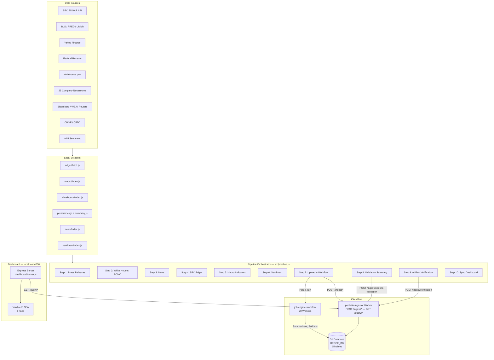

# HF Trading Journal — System Structure

**Last updated**: 2026-03-01
**Status**: Active

This is the **single entry point** for all project documentation. Every doc is linked from here. If it's not linked, it doesn't exist.

---

## System Architecture



---

## Data Flow

```
Company IRs ──► press/index.js ──► AA_press_releases_today.json
                press/summary.js ──► AA_press_summary.json ──────────► POST /ingest/press ──► ALPHA_03_Press

SEC EDGAR ────► edgar/fetch.js ──► edgar_raw_html/ ──► dispatch.js ──► edgar_parsed_json/
                                                    ──► dispatch-cluster.js ──► edgar_clustered_json/
                                  AA_ingestor.js ──► POST /ingest/reports ──► ALPHA_01_Reports + ALPHA_02_Clusters

BLS/FRED/etc ─► macro/index.js ──► macro_summary.json ──────────────► POST /ingest/macro ──► BETA_03_Macro
WH/FOMC ──────► whitehouse/index.js ──► whitehouse_summary.json ────► POST /ingest/whitehouse ──► BETA_02_WH
Bloomberg/etc ► news/index.js ──► news_summary.json ────────────────► POST /ingest/news ──► BETA_01_News
CBOE/CFTC ────► sentiment/index.js ──► sentiment_summary.json ─────► POST /ingest/sentiment ──► BETA_04_Sentiment

                                    Workflow daily_update triggers:
                                    ├─ news-summarizer ──► ALPHA_05_Daily_news
                                    ├─ trend-builder ──► ALPHA_04_Trends
                                    ├─ daily-macro-summarizer ──► BETA_10_Daily_macro
                                    └─ beta-trend-builder ──► BETA_09_Trend

Dashboard ◄── GET /query/all ◄── D1 Database
```

---

## Directory Structure

```
HF/
├── src/                          # Pipeline orchestrator
│   ├── pipeline.js               # Main entry point (10 steps)
│   ├── lib/config.js             # Configuration constants
│   ├── lib/utils.js              # importScript(), runStep()
│   └── steps/                    # One file per pipeline step
│       ├── ingest-press.js
│       ├── ingest-whitehouse.js
│       ├── ingest-news.js
│       ├── ingest-edgar.js
│       ├── ingest-macro.js
│       ├── ingest-sentiment.js
│       ├── upload.js
│       ├── summarize.js
│       ├── verify-facts.js
│       └── sync-dashboard.js
│
├── press/                        # Press release scrapers (25 tickers)
│   ├── index.js                  # Orchestrator + health check
│   ├── summary.js                # AI summarizer (gpt-4.1-mini)
│   ├── feeds/                    # Per-ticker feed scrapers (Puppeteer)
│   └── articles/                 # Per-ticker article extractors (Puppeteer)
│
├── edgar/                        # SEC EDGAR pipeline
│   ├── fetch.js                  # Filing downloader (2-day lookback)
│   ├── dispatch.js               # Routes HTML → parser
│   ├── dispatch-cluster.js       # Routes parsed JSON → clusterer
│   ├── edgar_parsers/            # Per-ticker parsing logic
│   ├── edgar_raw_html/           # Downloaded filing HTML
│   ├── edgar_parsed_json/        # Structured JSON
│   └── edgar_clustered_json/     # Clustered text chunks
│
├── macro/                        # Macroeconomic data
│   ├── index.js                  # Orchestrator
│   └── scraper.js                # API fetchers (BLS, FRED, UMich, Yahoo, Fed)
│
├── whitehouse/                   # White House + FOMC
│   ├── index.js                  # Scraper
│   └── parser.js                 # Article extractor
│
├── news/                         # Financial news (manual download)
│   ├── index.js                  # Parser + AI summarizer
│   ├── BLOOMBERG/files/          # Pre-downloaded HTML
│   ├── WSJ/files/
│   └── REUTERS/files/
│
├── sentiment/                    # Market sentiment
│   └── index.js                  # CBOE, AAII, COT fetchers
│
├── validation/                   # Validation system
│   ├── runner.js                 # Standalone validation runner
│   ├── config.js                 # Tickers, CIKs, URLs, thresholds
│   ├── lib/                      # 6 checker modules + utilities
│   │   ├── sec-checker.js
│   │   ├── macro-checker.js
│   │   ├── sentiment-checker.js
│   │   ├── press-checker.js
│   │   ├── policy-checker.js
│   │   ├── news-checker.js
│   │   ├── ai-validator.js
│   │   ├── sec-ingest-scanner.js
│   │   ├── calendar.js
│   │   └── logger.js
│   └── agents/                   # AI verification agents
│       └── hallucination-checker.js
│
├── dashboard/                    # Web dashboard (D1-only)
│   ├── server.js                 # Express server (port 4200)
│   ├── app.js                    # Frontend logic (vanilla JS)
│   ├── index.html                # HTML structure
│   └── styles.css                # Dark theme styling
│
├── workers/                      # Cloudflare Workers (20)
│   └── portfolio-ingestor/       # Central data API
│       └── src/worker.js         # All /ingest/* and /query/* routes
│
├── data/                         # Local D1 cache (from sync-dashboard)
├── logs/                         # Pipeline run logs
└── docs/                         # Documentation (you are here)
    ├── STRUCTURE.md              # Hub — single entry point (this file)
    ├── core/                     # Conventions, Mistakes, Diary
    ├── features/                 # Per-subsystem docs (pipeline, data-sources, etc.)
    ├── reference/                # DB schema, worker taxonomy, commands
    ├── guidelines/               # Doc guidelines
    └── archive/                  # Superseded docs
```

---

## Documentation Index

### Reference

| Document | Purpose |
|----------|---------|
| **[DATABASE_SCHEMA.md](reference/DATABASE_SCHEMA.md)** | Complete D1 table definitions, indexes, ID generation |
| **[WORKER_TAXONOMY.md](reference/WORKER_TAXONOMY.md)** | 20 Cloudflare Workers: categories, AI models, bindings |
| **[KEY_COMMANDS.md](reference/KEY_COMMANDS.md)** | CLI commands, curl endpoints, workflow actions |

### Features

| Document | Purpose |
|----------|---------|
| **[Pipeline](features/pipeline.md)** | 10-step pipeline orchestration, step I/O, error handling |
| **[Data Sources](features/data-sources.md)** | 6 scrapers: what they fetch, how they parse, output formats |
| **[Validation](features/validation.md)** | 6 checkers + AI hallucination detection, check tiers |
| **[Worker & D1](features/worker-d1.md)** | Worker API reference, all routes, data transformations |
| **[Dashboard](features/dashboard.md)** | 6 tabs, data flow from D1 to UI, auto-refresh mechanism |

### Process & History

| Document | Purpose |
|----------|---------|
| **[Conventions](core/CONVENTIONS.md)** | Naming standards for files, data, models, IDs |
| **[Mistakes](core/MISTAKES.md)** | Solved bugs with root cause and lesson learned |
| **[Diary](core/DIARY.md)** | Chronological development log |

### Guidelines

| Document | Purpose |
|----------|---------|
| **[Doc Guidelines](guidelines/DOC_GUIDELINES.md)** | How to write and organize documentation |

### Archive (Historical)

| Document | Status |
|----------|--------|
| **[ARCHITECTURE.md](archive/ARCHITECTURE.md)** | Superseded by STRUCTURE.md — kept for reference |
| **[PIPELINE.md](archive/PIPELINE.md)** | Superseded by features/pipeline.md |
| **[REFACTORING_PLAN.md](archive/REFACTORING_PLAN.md)** | Completed Feb 2026 — phases 1-8 done |
| **[VALIDATION_SYSTEM_SPEC.md](archive/VALIDATION_SYSTEM_SPEC.md)** | Original spec — phases 1-2 implemented, 3-5 aspirational |

---

## Key Design Decisions

| Decision | Rationale |
|----------|-----------|
| **D1-only dashboard** | No local file fallback — single source of truth, avoids stale data |
| **Deterministic IDs (SHA-256)** | Idempotent upserts — re-running pipeline overwrites, never duplicates |
| **Sequential pipeline** | Simpler error tracing; steps are independent but run in order |
| **Side-effect imports** | Scrapers auto-execute on `import()` — keeps pipeline code minimal |
| **2-day SEC lookback** | Aligned across fetch.js, sec-checker.js, ingest-edgar.js to prevent false mismatches |
| **Score 0-100** | AI verification scores stored as integers, divided by 100 only at display time |
| **Press-only verification** | Only press summaries have paired rawContent for hallucination comparison |
| **FOMC dates hardcoded** | FOMC schedule is public and pre-announced; no API needed |

---

## Environment Variables

| Variable | Source | Used By |
|----------|--------|---------|
| `OPENAI_API_KEY` | OpenAI | Press summarizer, news summarizer, hallucination checker |
| `BLS_KEY` | Bureau of Labor Statistics | macro/scraper.js |
| `FRED_KEY` | Federal Reserve (FRED) | macro/scraper.js |
| `BEA_KEY` | Bureau of Economic Analysis | macro/scraper.js (unused) |
| `POLYGON_KEY` | Polygon.io | macro/scraper.js (unused) |

---

## Portfolio

**25 tickers** tracked across all data sources:

```
AAPL  MSFT  GOOGL  AMZN  NVDA  META  TSLA  BRK.B  JPM  GS
BAC   XOM   CVX    UNH   LLY   JNJ   PG    KO     HD   CAT
BA    INTC  AMD    NFLX  MS
```

---

[Back to Repository Root](../)
