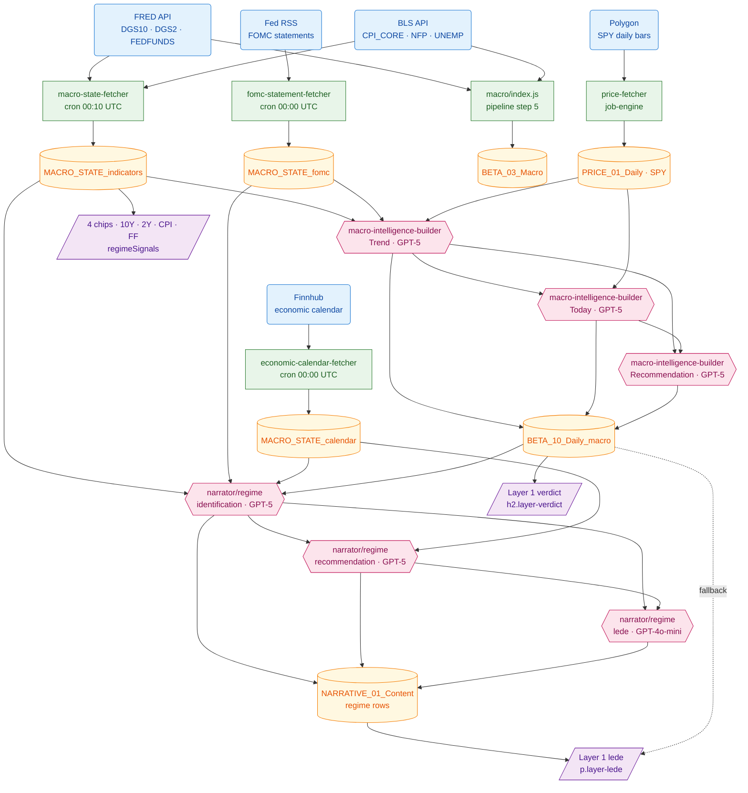
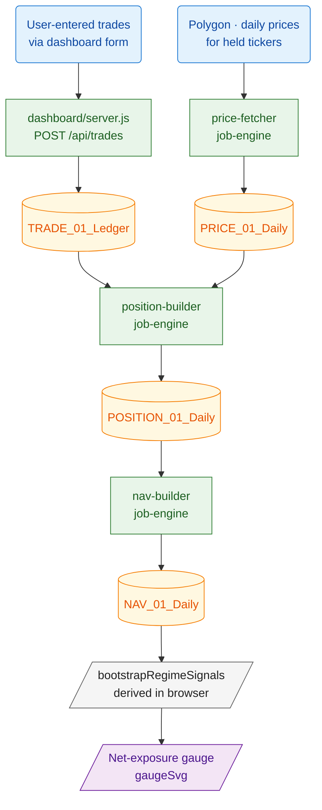
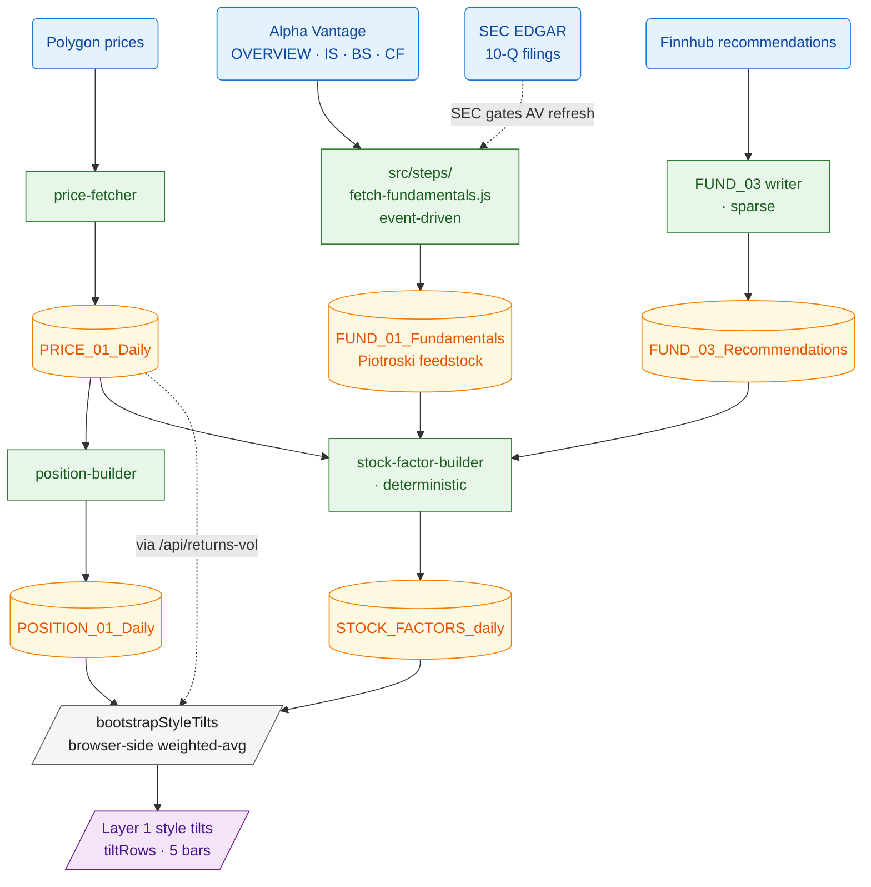
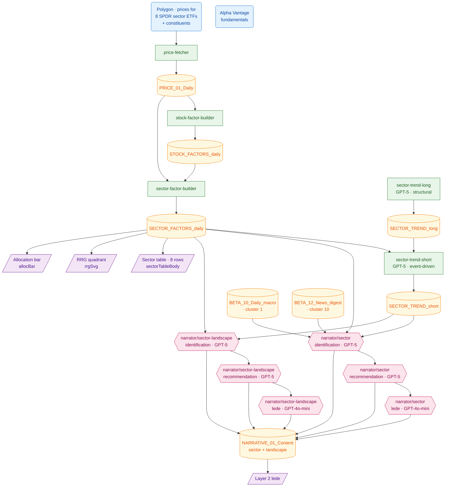
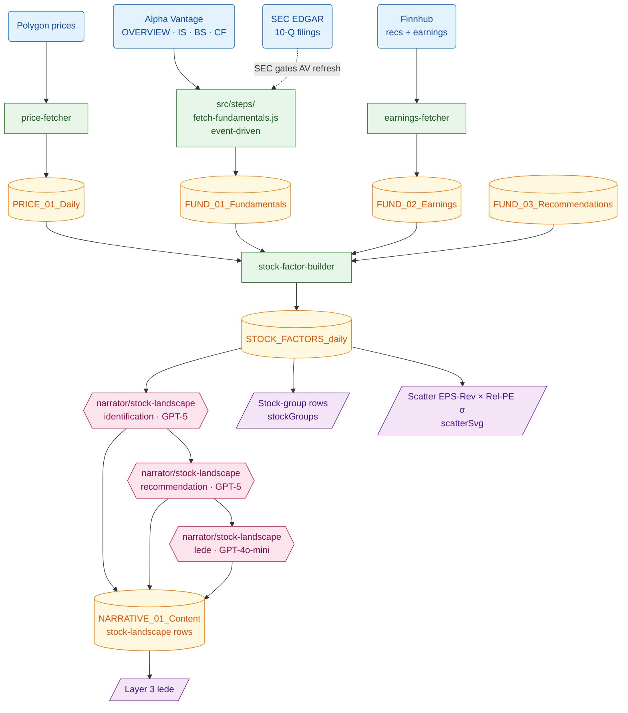
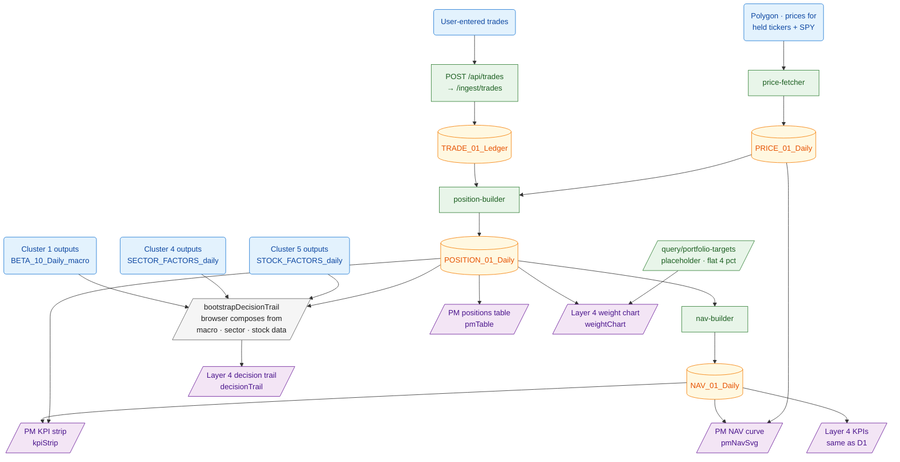
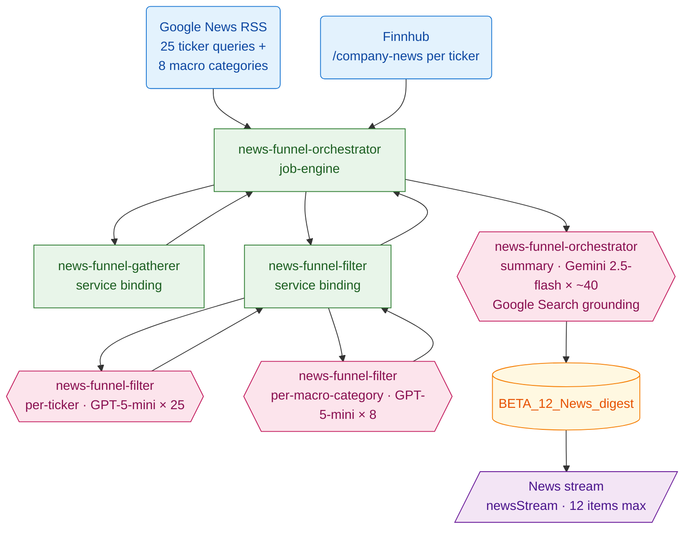
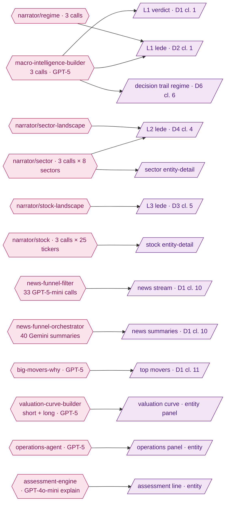

# Hedge Portfolio — Visual Pipeline Atlas

**Companion to** `docs/SYSTEM_REPORT.md`. One Mermaid diagram per dashboard feature, showing the full chain from raw source → code module → D1 table → agent → dashboard field.

## How to render

The diagrams below are written in **Mermaid**. They render automatically in:

- **GitHub** / GitLab web view (just click the file)
- **VS Code** with the *Markdown Preview Mermaid Support* extension
- **Obsidian**, **Typora**, **HackMD**
- **Pandoc** with the `mermaid-filter` (for PDF export)
- The **Mermaid Live Editor** (`mermaid.live`) — paste any single block and export as SVG / PNG

For paper printing: open this file in VS Code's preview, then *Print* → *Save as PDF*. The print stylesheet sized the diagrams correctly.

## Reading conventions

Each cluster diagram has 5 stacked layers, top to bottom:

| Layer | Shape | Color (in renderer) | Meaning |
|---|---|---|---|
| `R<n>` Sources | rounded `(Text)` | blue | External API or feed |
| `C<n>` Code modules | rectangle `[Text]` | green | Node script or Cloudflare Worker that scrapes / writes |
| `T<n>` D1 tables | cylinder `[(Text)]` | yellow | Database tables |
| `A<n>` Agents | hexagon `{{Text}}` | pink (LLM) / grey (deterministic) | Processing agent |
| `D<n>` Dashboard fields | parallelogram `[/Text/]` | purple | Visible thing on screen |

Reference numbering is **local to each cluster** — `R1` in cluster 1 is unrelated to `R1` in cluster 2. Each cluster is self-contained.

---

## Index of clusters

| #  | Feature                                               | Tab            |
|----|------------------------------------------------------|----------------|
| 1  | Regime card — verdict + lede + 4 macro chips          | Portfolio · L1 |
| 2  | Net-exposure gauge                                    | Portfolio · L1 |
| 3  | Style tilts                                           | Portfolio · L1 |
| 4  | Sector table + RRG + allocation bar                   | Portfolio · L2 |
| 5  | Stock shortlist + scatter                             | Portfolio · L3 |
| 6  | Portfolio book — KPIs, NAV, positions, weights, trail | PM · Portfolio |
| 7  | Attribution waterfall                                 | Portfolio · L5 |
| 8  | Calibration + closed trades                           | Portfolio · L5 |
| 9  | Calendar tab                                          | Calendar       |
| 10 | News stream                                           | News           |
| 11 | Top movers                                            | News           |
| 12 | Regime detail — 12-indicator board + events           | Regime detail  |

---

## Cluster 1 · Regime card — verdict + lede + 4 macro chips



| Tag | What |
|---|---|
| R1 | `api.stlouisfed.org/fred/series/observations` |
| R2 | `api.bls.gov/publicAPI/v2/timeseries/data/` |
| R3 | `federalreserve.gov/feeds/press_monetary.xml` |
| R4 | `finnhub.io/api/v1/calendar/economic` |
| R5 | `api.polygon.io/v2/aggs/ticker/SPY/...` |
| C1 | `workers/macro-state-fetcher/src/worker.js` |
| C2 | `workers/fomc-statement-fetcher/src/worker.js` |
| C3 | `workers/economic-calendar-fetcher/src/worker.js` |
| C4 | `workers/price-fetcher/src/worker.js` |
| C5 | `macro/index.js` (invoked by `src/steps/ingest-macro.js`) |
| A1–A3 | `workers/macro-intelligence-builder/src/worker.js` · prompts §6.8 of SYSTEM_REPORT |
| A4 | `workers/narrator/regime/identification.js` · prompt §6.9 |
| A5 | `workers/narrator/regime/recommendation.js` · prompt §6.10 |
| A6 | `workers/narrator/regime/lede.js` · prompt §6.11 |
| D1 | `dashboard/index.html:1663` `<h2 class="layer-verdict">` |
| D2 | `dashboard/index.html:1666` `<p class="layer-lede">` |
| D3 | `dashboard/index.html:1677` `#regimeSignals` (chips) |

---

## Cluster 2 · Net-exposure gauge



| Tag | What |
|---|---|
| C1–C4 | as named in workers/ |
| T1 | `TRADE_01_Ledger` (migration 0025) |
| T3 | `POSITION_01_Daily` (migration 0026) — `qty × close, weight_pct` |
| T4 | `NAV_01_Daily` (migration 0026) — `gross_long, gross_short, net_value` |
| A1 | Browser-side: `(gross_long − gross_short) / net_value × 100`, clamped to `[0, 100]` |
| D1 | `dashboard/index.html:1681` `<svg id="gaugeSvg">` · `app.js renderGauge()` |

**No LLM in this cluster.** Pure arithmetic.

---

## Cluster 3 · Style tilts (Quality, Low vol, Growth, Value, Momentum)



| Tag | What |
|---|---|
| C2 | Smart-fetch: skips ticker if `T2.fiscal_period_ending ≥` SEC's latest 10-Q period |
| C5 | `workers/stock-factor-builder/src/worker.js` — emits 9 factors per ticker |
| A1 | `dashboard/app.js bootstrapStyleTilts()` — weighted average across positions: Quality (Piotroski), Low vol (returns-vol), Growth (eps_rev_4w × 20), Value (−rel_pe_sigma/2), Momentum (mom_12_1) |
| D1 | `dashboard/index.html:1686` `<div id="tiltRows">` · `app.js renderTilts()` |

---

## Cluster 4 · Sector landscape — table, RRG, alloc bar, lede



| Tag | What |
|---|---|
| C3 | `workers/sector-factor-builder/src/worker.js` — emits per-sector regime_fit, earn_momentum, valuation_sigma, rel_strength_13w, rs_ratio, rs_momentum, stance |
| C4–C5 | `sector-trend-long/short` workers · GPT-5 |
| A1–A3 | `workers/narrator/sector/*.js` · per-sector ×8 |
| A4–A6 | `workers/narrator/sector-landscape/*.js` · cross-sector once |
| D1 | sector table, per-column thresholds matched to factor scales (val column inverted: cheap = green) |
| D2 | RRG with dynamic `maxDev` auto-fit |
| D4 | Layer 2 lede overlay (sector-landscape takes priority over per-sector) |

---

## Cluster 5 · Stock shortlist + scatter



| Tag | What |
|---|---|
| C4 | Computes `fwd_pe`, `rel_pe_sigma`, `eps_rev_4w`, `rev_breadth_4w`, `sue`, `mom_12_1`, `rs_vs_sector_3m`, `piotroski_f`, `days_to_catalyst` |
| A1–A3 | `workers/narrator/stock-landscape/*.js` · prompts §6.9 (landscape variant) |
| D1 | `app.js renderStockGroups()` — exact-zero treated as flat (sentinel for missing data) |
| D2 | `app.js renderScatter()` — skips (0,0) sentinel; sector colour fallback when Piotroski null |

**Note:** `narrator/stock` (per-ticker) writes its own rows used by the **stock entity-detail view** when you click a ticker — separate from the Layer 3 grid above.

---

## Cluster 6 · Portfolio book — KPIs · NAV · positions · weights · decision trail

This is the most-shared chain — both the PM tab and Portfolio Layer 4 read it.



| Tag | What |
|---|---|
| C5 | Currently a placeholder — returns flat `target_pct: 4` per ticker until `wealth-distribution` produces real targets |
| A1 | Picks the ticker with the largest `|current − target|` weight gap; composes 4 steps (regime / sector / stock / sizing) from data already fetched |
| D1, D4 | Headers labelled `1d P&L` or `Nd P&L` based on the actual gap between the latest two NAV rows |
| D5 | Auto-fits x-axis from data (no longer hardcoded at 7%) |

---

## Cluster 7 · Attribution waterfall (Layer 5)

```mermaid
flowchart TD
    R1(Polygon · SPY bars):::src
    R2(User trades + held-ticker prices<br/>· drives NAV):::src

    C1[price-fetcher]:::code
    C2[position-builder]:::code
    C3[nav-builder]:::code
    C4[/query/attribution<br/>computed live per request]:::code

    T1[(PRICE_01_Daily · SPY)]:::db
    T2[(POSITION_01_Daily)]:::db
    T3[(NAV_01_Daily)]:::db

    A1[/Proxy attribution<br/>active = portfolioRet − spyRet<br/>split 40 · 30 · 20 · 10/]:::agentDet

    D1[/Layer 5 waterfall<br/>waterfallSvg<br/>4 bars + total in bp/]:::ui

    R1 --> C1 --> T1
    R2 --> C2 --> T2
    T2 --> C3 --> T3
    T1 --> C4
    T3 --> C4
    C4 --> A1 --> D1

    classDef src fill:#e3f2fd,stroke:#1976d2,color:#0d47a1
    classDef code fill:#e8f5e9,stroke:#2e7d32,color:#1b5e20
    classDef db fill:#fff8e1,stroke:#f57c00,color:#e65100
    classDef agentLLM fill:#fce4ec,stroke:#c2185b,color:#880e4f
    classDef agentDet fill:#f5f5f5,stroke:#616161,color:#212121
    classDef ui fill:#f3e5f5,stroke:#6a1b9a,color:#4a148c
```

| Tag | What |
|---|---|
| C4 | `workers/portfolio-ingestor/src/worker.js` — `if (path === "/query/attribution")`. **No worker writes attribution**; computed on every read. |
| A1 | Fixed-split proxy until per-position attribution lands |
| D1 | `app.js renderWaterfall()` · caption now reads "Proxy split (40/30/20/10) until per-position attribution lands" |

---

## Cluster 8 · Calibration + closed trades (Layer 5)

```mermaid
flowchart TD
    R1(User trades · must<br/>include sells for FIFO):::src
    R2(Per-trade conviction<br/>1 to 5 manual):::src

    C1[POST /api/trades<br/>with conviction]:::code
    C2[/query/trades/closed<br/>FIFO lot-match]:::code
    C3[/query/calibration<br/>group by conviction · n≥3]:::code

    T1[(TRADE_01_Ledger<br/>+ conviction column · 0027)]:::db

    D1[/Layer 5 calibration curve<br/>calibSvg/]:::ui
    D2[/Layer 5 closed trades<br/>tradesList/]:::ui

    R1 --> C1 --> T1
    R2 --> C1
    T1 --> C2 --> D2
    T1 --> C3 --> D1

    classDef src fill:#e3f2fd,stroke:#1976d2,color:#0d47a1
    classDef code fill:#e8f5e9,stroke:#2e7d32,color:#1b5e20
    classDef db fill:#fff8e1,stroke:#f57c00,color:#e65100
    classDef agentLLM fill:#fce4ec,stroke:#c2185b,color:#880e4f
    classDef agentDet fill:#f5f5f5,stroke:#616161,color:#212121
    classDef ui fill:#f3e5f5,stroke:#6a1b9a,color:#4a148c
```

| Tag | What |
|---|---|
| C2 | FIFO lot-matching of buys against sells per ticker |
| C3 | Buckets closed trades by conviction (1–5); suppresses bucket if `n < 3` |
| D1 | Always shows expected-prior dashed line; actual dots populate as trades close |
| D2 | Empty-state placeholder when no sells exist |

**Status:** `TRADE_01_Ledger` currently has 25 BUY rows (seed) and zero SELLs. Both panels show empty state — by design.

---

## Cluster 9 · Calendar tab (rolling 6-week event grid)

```mermaid
flowchart TD
    R1(Finnhub · /calendar/economic):::src
    R2(Finnhub · earnings calendar):::src
    R3(Hardcoded FOMC schedule<br/>in dashboard/server.js):::src

    C1[economic-calendar-fetcher<br/>cron 00:00 UTC]:::code
    C2[earnings-fetcher<br/>job-engine]:::code
    C3[/query/earnings-calendar<br/>derives next-earnings/]:::code
    C4[/api/fomc-calendar]:::code
    C5[/api/calendar<br/>proxies /query/calendar/]:::code

    T1[(MACRO_STATE_calendar)]:::db
    T2[(FUND_02_Earnings)]:::db
    T3[(ALPHA_01_Reports<br/>last filing for estimate)]:::db

    A1[/bootstrapCalendar<br/>browser unions 3 sources/]:::agentDet

    D1[/Calendar grid<br/>calendarGrid · 6 weeks/]:::ui

    R1 --> C1 --> T1
    R2 --> C2 --> T2
    T2 --> C3
    T3 --> C3
    R3 --> C4
    T1 --> C5

    C3 --> A1
    C4 --> A1
    C5 --> A1
    A1 --> D1

    classDef src fill:#e3f2fd,stroke:#1976d2,color:#0d47a1
    classDef code fill:#e8f5e9,stroke:#2e7d32,color:#1b5e20
    classDef db fill:#fff8e1,stroke:#f57c00,color:#e65100
    classDef agentLLM fill:#fce4ec,stroke:#c2185b,color:#880e4f
    classDef agentDet fill:#f5f5f5,stroke:#616161,color:#212121
    classDef ui fill:#f3e5f5,stroke:#6a1b9a,color:#4a148c
```

| Tag | What |
|---|---|
| R3 | Static FOMC list in `dashboard/server.js` |
| A1 | `bootstrapCalendar()` filters to `today−14 days … today+28 days`, dedupes |
| D1 | Cells render up to 4 events + impact tag; weekend / today / past styling |

---

## Cluster 10 · News stream



| Tag | What |
|---|---|
| C1–C3 | The 3 chained workers — orchestrator dispatches via service bindings |
| A1 | `filterTickerHeadlines()` · prompt §6.1 of SYSTEM_REPORT |
| A2 | `filterMacroHeadlines()` · prompt §6.2 |
| A3 | Gemini 2.5-flash summary loop · prompt §6.3 |
| T1 | `BETA_12_News_digest` (migration 0008) — `magnitude` is in `[-1, 1]` (granular per the prompt) |
| D1 | `app.js renderNewsStream()` — sorts by `|magnitude|` desc; `mat = round(|mag| × 10)` |

---

## Cluster 11 · Top movers

```mermaid
flowchart TD
    R1(Polygon prices):::src
    R2(News · cluster 10 result):::src
    R3(Press · pipeline step 1):::src

    C1[price-fetcher]:::code
    C2[news-funnel-orchestrator<br/>· cluster 10]:::code
    C3[/ingest/press · pipeline step 1]:::code
    C4[big-movers-why<br/>job-engine]:::code

    T1[(PRICE_01_Daily)]:::db
    T2[(BETA_12_News_digest)]:::db
    T3[(ALPHA_03_Press)]:::db
    T4[(MOVER_EXPLANATIONS_daily)]:::db

    A1{{big-movers-why<br/>· GPT-5 · per mover}}:::agentLLM

    D1[/Top movers<br/>topDrivers · up to 5/]:::ui

    R1 --> C1 --> T1
    R2 --> C2 --> T2
    R3 --> C3 --> T3
    T1 --> C4
    T2 --> C4
    T3 --> C4
    C4 --> A1 --> T4 --> D1

    classDef src fill:#e3f2fd,stroke:#1976d2,color:#0d47a1
    classDef code fill:#e8f5e9,stroke:#2e7d32,color:#1b5e20
    classDef db fill:#fff8e1,stroke:#f57c00,color:#e65100
    classDef agentLLM fill:#fce4ec,stroke:#c2185b,color:#880e4f
    classDef agentDet fill:#f5f5f5,stroke:#616161,color:#212121
    classDef ui fill:#f3e5f5,stroke:#6a1b9a,color:#4a148c
```

| Tag | What |
|---|---|
| C4 | `workers/big-movers-why/src/worker.js` — picks top-5 up + top-5 down by `|move%|`, calls A1 per mover |
| A1 | GPT-5 prompt §6.7 — outputs thesis + bullets grounded in news/press |
| T4 | `MOVER_EXPLANATIONS_daily` (migration 0021) |
| D1 | `app.js renderTopDrivers()` — sorts by `|move_pct|`; renders ticker + move + reason |

---

## Cluster 12 · Regime detail — 12-indicator board + latest events

```mermaid
flowchart TD
    R1(FRED · DGS10 · DGS2 · FEDFUNDS):::src
    R2(BLS · CPI · NFP · UNEMP):::src
    R3(Finnhub · economic calendar):::src

    C1[macro-state-fetcher<br/>cluster 1 reuse]:::code
    C2[economic-calendar-fetcher<br/>cluster 9 reuse]:::code
    C3[/api/indicator-history]:::code
    C4[/api/calendar]:::code

    T1[(MACRO_STATE_indicators)]:::db
    T2[(MACRO_STATE_calendar)]:::db

    A1[/bootstrapMacroIndicators<br/>browser maps T1 → board/]:::agentDet
    A2[/bootstrapCalendar<br/>browser populates events/]:::agentDet

    D1[/12-indicator board<br/>macroIndicators/]:::ui
    D2[/Latest releases + events<br/>regimeLatestEvents/]:::ui

    R1 --> C1 --> T1
    R2 --> C1
    R3 --> C2 --> T2
    T1 --> C3 --> A1 --> D1
    T2 --> C4 --> A2 --> D2

    classDef src fill:#e3f2fd,stroke:#1976d2,color:#0d47a1
    classDef code fill:#e8f5e9,stroke:#2e7d32,color:#1b5e20
    classDef db fill:#fff8e1,stroke:#f57c00,color:#e65100
    classDef agentLLM fill:#fce4ec,stroke:#c2185b,color:#880e4f
    classDef agentDet fill:#f5f5f5,stroke:#616161,color:#212121
    classDef ui fill:#f3e5f5,stroke:#6a1b9a,color:#4a148c
```

| Tag | What |
|---|---|
| A1 | Maps `T1` rows to label set: 10Y, 2Y, derived 2s10s curve, Core CPI, CPI Headline, Fed Funds, NFP, Unemployment |
| A2 | Past 4 + upcoming 4 events sorted chronologically |
| D1 | `macroIndicators` shows 7+ chips with value + Δ + trend |
| D2 | `regimeLatestEvents` — "upcoming" pill on future dates |

---

## Cross-reference 1 · One agent → many dashboard fields

When one LLM agent feeds multiple panels, this tells you everything that breaks if the agent's prompt or output changes.



---

## Cross-reference 2 · One D1 table → many dashboard fields

If a writer worker fails or a table goes stale, this tells you which panels go bad.

| Table | Used in clusters / panels |
|---|---|
| `MACRO_STATE_indicators` | C1 (chips D3), C12 (12-indicator board D1) |
| `MACRO_STATE_calendar` | C9 (grid D1), C12 (events D2) |
| `MACRO_STATE_fomc` | C1 (regime context — input to A1, A4) |
| `BETA_03_Macro` | C1 (regime context); also `/api/macro/{date}` |
| `BETA_10_Daily_macro` | C1 (verdict D1, lede fallback D2), C6 (decision trail D6) |
| `NARRATIVE_01_Content` | C1 D2, C4 D4, C5 D3, regime/sector/stock entity-detail panels |
| `BETA_12_News_digest` | C10 (news stream D1) — also feeds narrators upstream |
| `MOVER_EXPLANATIONS_daily` | C11 (top movers D1) |
| `STOCK_FACTORS_daily` | C3 (style tilts D1), C5 (D1+D2), C6 (decision trail D6) |
| `SECTOR_FACTORS_daily` | C4 (table D1, RRG D2, alloc D3), C6 (decision trail D6) |
| `SECTOR_TREND_long` + `_short` | A1+A4 sector narrators (cluster 4) |
| `TICKER_TREND_long` + `_short` | stock entity-detail; A6 stock narrators |
| `POSITION_01_Daily` | C2 (gauge D1), C3 (tilts), C6 (KPI/positions/weights D1+D3+D5) |
| `NAV_01_Daily` | C2 (gauge D1), C6 (KPI/NAV curve D1+D2+D4), C7 (waterfall input) |
| `TRADE_01_Ledger` | C6 (positions/NAV chain), C8 (closed trades D2) |
| `PRICE_01_Daily` | C2–C11 — used everywhere |
| `FUND_01_Fundamentals` | C3 (Piotroski), C5 (rel_pe_sigma) |
| `FUND_02_Earnings` | C5 (SUE), C9 (calendar earnings dates) |
| `FUND_03_Recommendations` | C3 + C5 (eps_rev_4w, rev_breadth_4w) |
| `ALPHA_03_Press` | C11 (mover ground-truth), narrator/stock |
| `ALPHA_01_Reports` | C9 (last-filing for next-earnings), narrator/stock + ticker-trend-long |
| `BETA_02_WH` | A1+A4 regime narrators |

---

**End of atlas.** Read in conjunction with `docs/SYSTEM_REPORT.md` (prose reference: prompts, schema, gaps).
