# Hedge Portfolio — System Reference

**Subtitle:** Production reference. Where every dashboard number comes from, what every agent does, every prompt verbatim, every term defined.

**Repository:** `/Users/gines/Hedge-Portfolio`
**Snapshot:** commit `8d9a83c` (April 2026)
**Audience:** the operator. Read this to validate that any number on the dashboard is real.

This document supersedes the prior `SYSTEM_REPORT.md` and `SYSTEM_DIAGRAMS.md` files. Everything is here.

---

# Part 0 · How to use this document

The system is one large pipeline. **Raw external data → scraped → stored in D1 → processed by workers (deterministic + LLM) → queried by the dashboard.** Every visible field on the dashboard has a chain.

If a number on the dashboard looks wrong, walk these sections in order:

1. **Part 2 — Visual atlas.** Find the panel's cluster. The Mermaid diagram shows the chain in one shot.
2. **Part 5 — Workers.** Find the worker that wrote the table the panel reads. Confirm its trigger fired.
3. **Part 6 — LLM prompts.** If the worker uses an LLM, read its exact prompt. The output should obey the rules in the prompt.
4. **Part 3 — Origin layer.** If the worker's input was wrong, walk back to the scraper that produced it.
5. **Part 8 — Known gaps.** If a panel renders empty / placeholder / hardcoded, it is probably listed here.
6. **Part 9 — Glossary.** If a term or acronym is unfamiliar, look it up here.

The **diagrams** (Part 2) and the **known gaps** (Part 8) are the two pages that get the most use during validation.

## Rendering Mermaid diagrams

The diagrams in Part 2 are written in **Mermaid**. They render natively in GitHub, VS Code (with the *Markdown Preview Mermaid Support* extension), Obsidian, Typora, HackMD, and Pandoc with `mermaid-filter`. For paper printing: open in VS Code's preview, then *File → Print → Save as PDF*. Or paste any single block into `mermaid.live` and export as SVG/PNG.

## Reading conventions for diagrams

Each cluster diagram has 5 layers. Every node carries a tag:

| Tag prefix | Shape                   | Layer                | Color version | B&W version       |
|------------|-------------------------|----------------------|---------------|-------------------|
| `R<n>`     | rounded `(…)`           | source               | blue          | thin border       |
| `C<n>`     | rectangle `[…]`         | code module          | green         | thick border      |
| `T<n>`     | cylinder `[(…)]`        | D1 table             | yellow        | cylinder shape    |
| `A<n>`     | hexagon `{{…}}`         | LLM agent            | pink          | light grey fill   |
| `A<n>`     | subroutine `[[…]]`      | deterministic agent  | grey          | dashed border     |
| `D<n>`     | parallelogram `[/…/]`   | dashboard field      | purple        | dark grey fill    |

Tag numbering is **local to each cluster** — `R1` in cluster 1 is unrelated to `R1` in cluster 2. Each cluster is self-contained. A reference table directly below each diagram maps every tag to its file path / table / prompt section.

---

# Part 1 · System at a glance

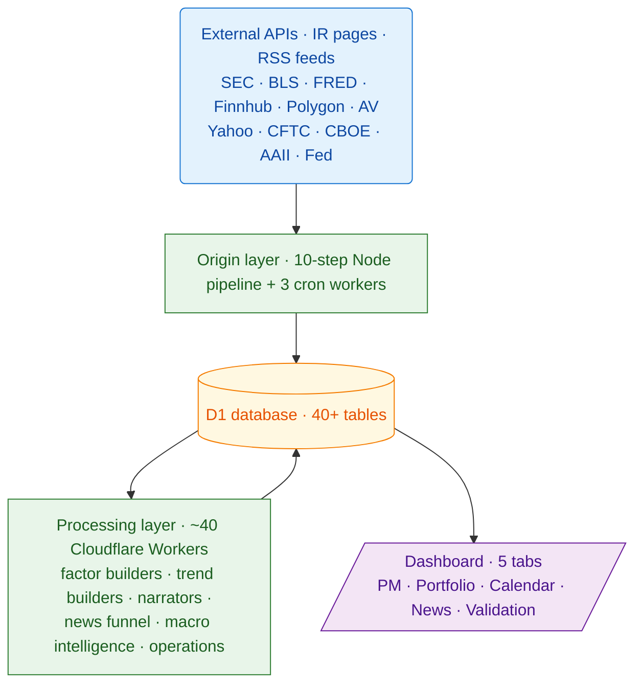
```mermaid
flowchart TD
    EXT(External APIs · IR pages · RSS feeds<br/>SEC · BLS · FRED · Finnhub · Polygon · AV<br/>Yahoo · CFTC · CBOE · AAII · Fed):::src
    ORI[Origin layer · 10-step Node pipeline + 3 cron workers]:::code
    DB[(D1 database · 40+ tables)]:::db
    PROC[Processing layer · ~40 Cloudflare Workers<br/>factor builders · trend builders · narrators ·<br/>news funnel · macro intelligence · operations]:::code
    DASH[/Dashboard · 5 tabs<br/>PM · Portfolio · Calendar · News · Validation/]:::ui

    EXT --> ORI --> DB --> PROC --> DB
    DB --> DASH

    classDef src fill:#e3f2fd,stroke:#1976d2,color:#0d47a1
    classDef code fill:#e8f5e9,stroke:#2e7d32,color:#1b5e20
    classDef db fill:#fff8e1,stroke:#f57c00,color:#e65100
    classDef ui fill:#f3e5f5,stroke:#6a1b9a,color:#4a148c
```

## Cron / cadence summary

| Time (UTC)  | Trigger                              | What happens                                                |
|-------------|--------------------------------------|-------------------------------------------------------------|
| `00:00`     | `economic-calendar-fetcher` cron     | Pulls Finnhub econ calendar → `MACRO_STATE_calendar`        |
| `00:00`     | `fomc-statement-fetcher` cron        | Refreshes FOMC statements → `MACRO_STATE_fomc`              |
| `00:10`     | `macro-state-fetcher` cron           | FRED + BLS → `MACRO_STATE_indicators`                       |
| `01:15`     | `valuation-curve-builder` cron       | Re-runs short-curve LLM if events fired                     |
| `01:30`     | `valuation-curve-builder` cron       | Re-runs long-curve LLM at floor cadence                     |
| `06:00`     | `narrator-dispatcher` safety sweep   | 7-day rebuild floor — re-runs any stale narrator            |
| `*/15 min`  | `narrator-dispatcher` event tick     | Polls source tables, fans out to narrator workers           |
| `22:30`     | `hedge-pipeline.timer` (Linux)       | Local 10-step pipeline — scrapers + ingest + workflow        |

The Linux pipeline at 22:30 fires the bulk of the daily refresh. Cloudflare cron workers cover macro releases (which AV/SEC publish at midnight UTC). The narrator dispatcher's 15-minute tick covers intra-day news + factor changes.

---

# Part 2 · Visual atlas

One Mermaid diagram per dashboard feature, plus a cross-reference at the end.

## Index of clusters

| #  | Feature                                               | Tab            |
|----|------------------------------------------------------|----------------|
| 1  | Regime card — verdict + lede + 4 macro chips          | Portfolio · L1 |
| 2  | Net-exposure gauge                                    | Portfolio · L1 |
| 3  | Style tilts                                           | Portfolio · L1 |
| 4  | Sector table + RRG + allocation bar                   | Portfolio · L2 |
| 5  | Stock shortlist + scatter                             | Portfolio · L3 |
| 6  | Portfolio book — KPIs · NAV · positions · weights · trail | PM · Portfolio |
| 7  | Attribution waterfall                                 | Portfolio · L5 |
| 8  | Calibration + closed trades                           | Portfolio · L5 |
| 9  | Calendar tab                                          | Calendar       |
| 10 | News stream                                           | News           |
| 11 | Top movers                                            | News           |
| 12 | Regime detail — 12-indicator board + events           | Regime detail  |

## Cluster 1 · Regime card — verdict + lede + 4 macro chips

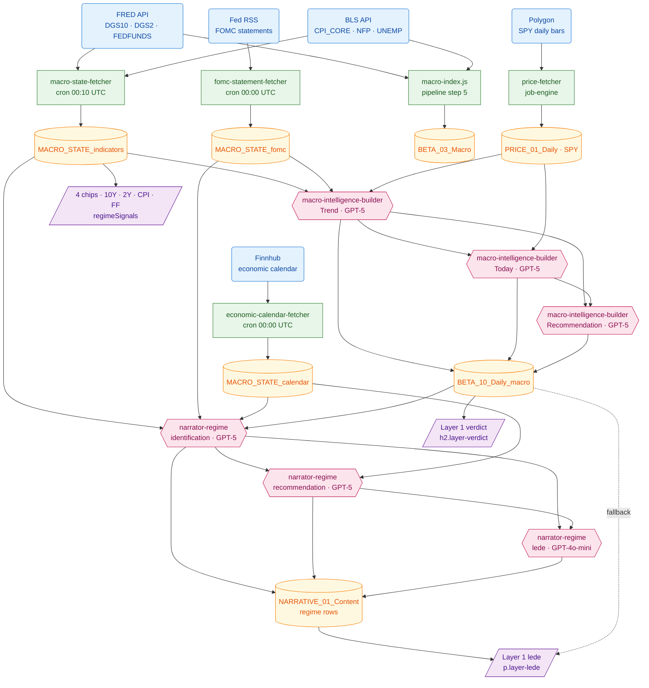
```mermaid
flowchart TD
    R1(FRED API<br/>DGS10 · DGS2 · FEDFUNDS):::src
    R2(BLS API<br/>CPI_CORE · NFP · UNEMP):::src
    R3(Fed RSS<br/>FOMC statements):::src
    R4(Finnhub<br/>economic calendar):::src
    R5(Polygon<br/>SPY daily bars):::src

    C1[macro-state-fetcher<br/>cron 00:10 UTC]:::code
    C2[fomc-statement-fetcher<br/>cron 00:00 UTC]:::code
    C3[economic-calendar-fetcher<br/>cron 00:00 UTC]:::code
    C4[price-fetcher<br/>job-engine]:::code
    C5[macro-index.js<br/>pipeline step 5]:::code

    T1[(MACRO_STATE_indicators)]:::db
    T2[(MACRO_STATE_fomc)]:::db
    T3[(MACRO_STATE_calendar)]:::db
    T4[(BETA_03_Macro)]:::db
    T5[(PRICE_01_Daily · SPY)]:::db

    A1{{macro-intelligence-builder<br/>Trend · GPT-5}}:::agentLLM
    A2{{macro-intelligence-builder<br/>Today · GPT-5}}:::agentLLM
    A3{{macro-intelligence-builder<br/>Recommendation · GPT-5}}:::agentLLM
    A4{{narrator-regime<br/>identification · GPT-5}}:::agentLLM
    A5{{narrator-regime<br/>recommendation · GPT-5}}:::agentLLM
    A6{{narrator-regime<br/>lede · GPT-4o-mini}}:::agentLLM

    T6[(BETA_10_Daily_macro)]:::db
    T7[(NARRATIVE_01_Content<br/>regime rows)]:::db

    D1[/Layer 1 verdict<br/>h2.layer-verdict/]:::ui
    D2[/Layer 1 lede<br/>p.layer-lede/]:::ui
    D3[/4 chips · 10Y · 2Y · CPI · FF<br/>regimeSignals/]:::ui

    R1 --> C1
    R2 --> C1
    R3 --> C2
    R4 --> C3
    R5 --> C4
    R1 --> C5
    R2 --> C5

    C1 --> T1
    C2 --> T2
    C3 --> T3
    C4 --> T5
    C5 --> T4

    T1 --> A1
    T2 --> A1
    T5 --> A1
    A1 --> A2
    T5 --> A2
    A1 --> A3
    A2 --> A3
    A1 --> T6
    A2 --> T6
    A3 --> T6

    T1 --> A4
    T2 --> A4
    T3 --> A4
    T6 --> A4
    A4 --> A5
    T3 --> A5
    A4 --> A6
    A5 --> A6
    A4 --> T7
    A5 --> T7
    A6 --> T7

    T6 --> D1
    T7 --> D2
    T6 -.fallback.-> D2
    T1 --> D3

    classDef src fill:#e3f2fd,stroke:#1976d2,color:#0d47a1
    classDef code fill:#e8f5e9,stroke:#2e7d32,color:#1b5e20
    classDef db fill:#fff8e1,stroke:#f57c00,color:#e65100
    classDef agentLLM fill:#fce4ec,stroke:#c2185b,color:#880e4f
    classDef agentDet fill:#f5f5f5,stroke:#616161,color:#212121
    classDef ui fill:#f3e5f5,stroke:#6a1b9a,color:#4a148c
```

| Tag | What it means |
|---|---|
| R1 | **FRED** — Federal Reserve Economic Data, the St. Louis Fed's free public API. We pull three interest-rate series: **DGS10** (10-year US Treasury yield — the long-term safe rate), **DGS2** (2-year Treasury yield — short-term safe rate), and **FEDFUNDS** (the *effective federal funds rate*, the overnight rate the Fed sets). Together these are the "cost of money" signal that drives regime classification. |
| R2 | **BLS** — US Bureau of Labor Statistics. We pull **CPI_CORE** (Core Consumer Price Index — inflation excluding volatile food and energy), **NFP** (Non-Farm Payrolls — monthly US jobs added), and **UNEMP** (unemployment rate). The "is the labor market healthy and is inflation under control" signal. |
| R3 | **Fed RSS** — an RSS feed the Federal Reserve publishes for monetary-policy press releases. We extract **FOMC** (Federal Open Market Committee) statements: the official text the Fed publishes after each rate-setting meeting (~8 per year). |
| R4 | **Finnhub** — a commercial financial-data API. We use it for the upcoming-economic-events calendar (when the next CPI print, FOMC meeting, or NFP release is scheduled). |
| R5 | **Polygon** — another commercial data API. We use it for daily price bars of **SPY** (the largest S&P 500 ETF — used as the proxy for "the US stock market"). |
| C1 | The **macro-state-fetcher** worker. Runs once a day at 00:10 UTC on Cloudflare. Pulls every series in R1 + R2 and writes the latest values to T1. This is what keeps the regime card's chips fresh every day. |
| C2 | The **fomc-statement-fetcher** worker. Runs at midnight UTC daily. Downloads any new FOMC statement text into T2. |
| C3 | The **economic-calendar-fetcher** worker. Runs at midnight UTC daily. Pulls the next 45 days of scheduled economic releases from Finnhub into T3. |
| C4 | The **price-fetcher** worker. Pulls daily price bars. Used here just for SPY rows; the same worker covers all 25 portfolio tickers and the 8 sector ETFs. |
| C5 | A Node script run during the nightly pipeline (step 5). Re-fetches some FRED/BLS data into T4 for an older summary code path. There is mild redundancy with C1 — flagged in Part 7. |
| T1 | Where every macro indicator value lands. One row per (indicator code, release date). |
| T2 | Where FOMC statement text lands — one row per Fed meeting. |
| T3 | The upcoming-events calendar — date, event code (CPI / NFP / FOMC / etc.), expected value, prior value. |
| T4 | The legacy macro table, used by the older summary code. Same data as T1 in a different shape. |
| T5 | Daily price bars for every ticker. SPY rows are what this cluster uses. |
| A1 | First of three **GPT-5** calls inside `macro-intelligence-builder`. **What it does:** classifies the current regime as one of *bullish · cautious-bullish · neutral · cautious-bearish · bearish*, by reading 8 weeks of macro indicators + recent FOMC text + SPY moves. Picks the time window inside those 8 weeks that best frames the regime, lists 3-5 drivers, gives a confidence score. |
| A2 | Second **GPT-5** call. **What it does:** given A1's regime, reads today's SPY move + today's macro headlines. Explains today's price action and — most importantly — flags whether today's move *contradicts* the regime (the "regime tension" check). |
| A3 | Third **GPT-5** call. **What it does:** turns A1+A2 into an actionable recommendation — *add risk / trim risk / hold / rotate / hedge* — plus three 4-week SPY scenarios (bull/base/bear with probabilities summing to 1) and which sectors to overweight/underweight. |
| A4 | Narrator's regime *identification* stage (**GPT-5**). **What it does:** writes 3-5 bullets explaining what is currently driving the regime, each bullet citing a specific number from the data. Hard rule: bullets that just restate a number without interpretation are rejected. |
| A5 | Narrator's regime *recommendation* stage (**GPT-5**). **What it does:** produces a one-sentence stance ("net 60% long, OW quality, 0.81 conviction, edge vs consensus is X") plus 3-5 forward-looking signposts. Each signpost names a future dated event + a numeric threshold + the action to take if breached. |
| A6 | Narrator's regime *lede* stage (**GPT-4o-mini**). **What it does:** a 3-4 sentence summary, ≤45 words, that opens the regime view on the dashboard. Pulls one number, one diagnosis, one stance, one next trigger. |
| T6 | The daily-macro blob — one row per day, storing A1+A2+A3 output as JSON. |
| T7 | Stores the narrator's identification, recommendation, and lede output. Multi-row per entity (regime, each of 8 sectors, each of 25 tickers, plus the two landscape views). |
| D1 | The big "Late-cycle · cautious-bullish" headline at the top of Layer 1. Pulled from T6's regime classification. If the API call fails, the dashboard shows the static fallback label. |
| D2 | The paragraph below the headline. Explains the regime + what the book is doing. The narrator lede (T7) is the primary source; T6's macro-intelligence summary is a fallback when narrator data is missing. |
| D3 | The four small chips: 10-year yield, 2-year yield, Core CPI, Fed Funds rate. Each chip shows the latest value + a colored direction arrow (rising = red for inflation/rates, green for falling). |

\pagebreak

## Cluster 2 · Net-exposure gauge

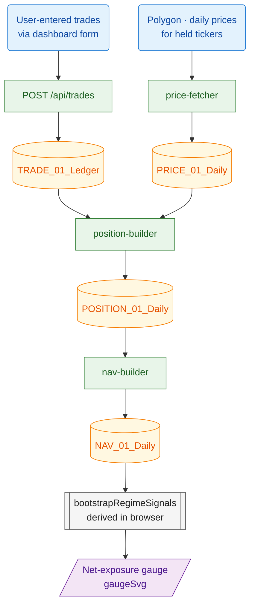
```mermaid
flowchart TD
    R1(User-entered trades<br/>via dashboard form):::src
    R2(Polygon · daily prices<br/>for held tickers):::src

    C1[POST /api/trades]:::code
    C2[price-fetcher]:::code
    C3[position-builder]:::code
    C4[nav-builder]:::code

    T1[(TRADE_01_Ledger)]:::db
    T2[(PRICE_01_Daily)]:::db
    T3[(POSITION_01_Daily)]:::db
    T4[(NAV_01_Daily)]:::db

    A1[[bootstrapRegimeSignals<br/>derived in browser]]:::agentDet

    D1[/Net-exposure gauge<br/>gaugeSvg/]:::ui

    R1 --> C1 --> T1
    R2 --> C2 --> T2
    T1 --> C3
    T2 --> C3
    C3 --> T3 --> C4 --> T4
    T4 --> A1 --> D1

    classDef src fill:#e3f2fd,stroke:#1976d2,color:#0d47a1
    classDef code fill:#e8f5e9,stroke:#2e7d32,color:#1b5e20
    classDef db fill:#fff8e1,stroke:#f57c00,color:#e65100
    classDef agentLLM fill:#fce4ec,stroke:#c2185b,color:#880e4f
    classDef agentDet fill:#f5f5f5,stroke:#616161,color:#212121
    classDef ui fill:#f3e5f5,stroke:#6a1b9a,color:#4a148c
```

| Tag | What it means |
|---|---|
| R1 | **User-entered trades**. You manually log buy/sell trades through the dashboard form (or via the one-shot `seed-trades.js` initialization script). Each trade is ticker + side + quantity + price + date. |
| R2 | **Polygon prices** — the same daily price bars used everywhere — current market price for held tickers. |
| C1 | The browser POSTs to `/api/trades`. The dashboard server forwards to `portfolio-ingestor`'s ingest endpoint, which writes one row to the trade ledger. |
| C2 | **price-fetcher** worker. Pulls today's close for every held ticker. |
| C3 | **position-builder** worker. Replays the trade ledger to compute current quantity per ticker, then multiplies by today's close to get market value, and computes each position's % weight in the book. |
| C4 | **nav-builder** worker. Sums the positions to compute total long exposure, total short, net asset value (NAV), and how much cash is left. |
| T1 | The trade ledger — one row per buy/sell. Append-only. The system never modifies past trades. |
| T2 | Daily price bars (shared with every cluster). |
| T3 | Daily positions table — one row per (ticker, date) with quantity, cost basis, market value, and weight %. Re-derivable from T1 + T2 at any time. |
| T4 | Daily NAV — one row per date with `gross_long`, `gross_short`, `net_value`, `cash`, `leverage`, `day_pnl`. |
| A1 | **Browser-side computation, no LLM.** Reads the latest NAV row, computes `(gross_long − gross_short) ÷ net_value × 100`, clamps to [0, 100]. Above 100 would mean leverage; below 0 would mean net short. |
| D1 | The half-circle gauge at the top of Layer 1. Needle position shows your current **net exposure** to equities. Below 50% = defensive book; near 100% = fully long; above 100% (would require leverage) = aggressive. |

\pagebreak

## Cluster 3 · Style tilts (Quality, Low vol, Growth, Value, Momentum)

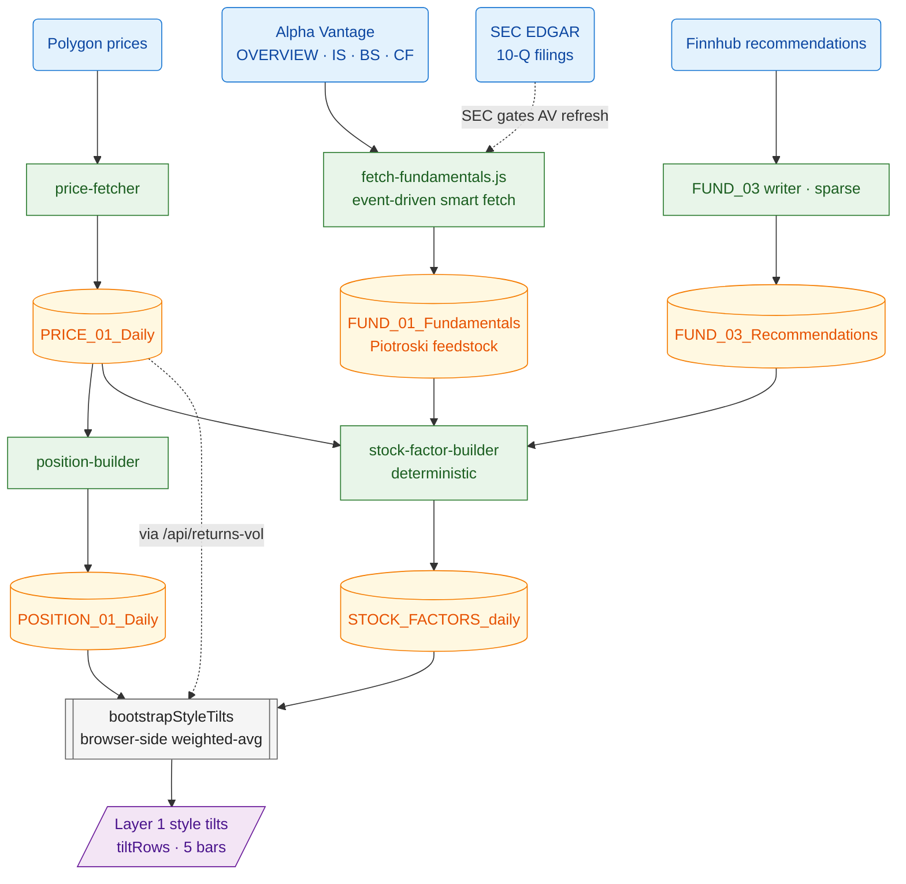
```mermaid
flowchart TD
    R1(Polygon prices):::src
    R2(Alpha Vantage<br/>OVERVIEW · IS · BS · CF):::src
    R3(Finnhub recommendations):::src
    R4(SEC EDGAR<br/>10-Q filings):::src

    C1[price-fetcher]:::code
    C2[fetch-fundamentals.js<br/>event-driven smart fetch]:::code
    C3[FUND_03 writer · sparse]:::code
    C4[position-builder]:::code
    C5[stock-factor-builder<br/>deterministic]:::code

    T1[(PRICE_01_Daily)]:::db
    T2[(FUND_01_Fundamentals<br/>Piotroski feedstock)]:::db
    T3[(FUND_03_Recommendations)]:::db
    T4[(POSITION_01_Daily)]:::db
    T5[(STOCK_FACTORS_daily)]:::db

    A1[[bootstrapStyleTilts<br/>browser-side weighted-avg]]:::agentDet

    D1[/Layer 1 style tilts<br/>tiltRows · 5 bars/]:::ui

    R1 --> C1 --> T1
    R2 --> C2 --> T2
    R3 --> C3 --> T3
    R4 -. SEC gates AV refresh .-> C2

    T1 --> C4 --> T4
    T1 --> C5
    T2 --> C5
    T3 --> C5
    C5 --> T5

    T4 --> A1
    T5 --> A1
    T1 -. via /api/returns-vol .-> A1
    A1 --> D1

    classDef src fill:#e3f2fd,stroke:#1976d2,color:#0d47a1
    classDef code fill:#e8f5e9,stroke:#2e7d32,color:#1b5e20
    classDef db fill:#fff8e1,stroke:#f57c00,color:#e65100
    classDef agentLLM fill:#fce4ec,stroke:#c2185b,color:#880e4f
    classDef agentDet fill:#f5f5f5,stroke:#616161,color:#212121
    classDef ui fill:#f3e5f5,stroke:#6a1b9a,color:#4a148c
```

| Tag | What it means |
|---|---|
| R1 | **Polygon prices**. Used to compute realized volatility per ticker — the input to the **Low-vol** tilt. |
| R2 | **Alpha Vantage** — a commercial API. We pull four endpoints per ticker: *OVERVIEW* (live snapshot — current PE, market cap), *INCOME_STATEMENT* (revenue, gross profit, net income), *BALANCE_SHEET* (assets, debt, shares outstanding), *CASH_FLOW* (operating cash flow — actual cash the business generates). Together these feed the **Piotroski F-score**, a 0-9 financial-health score. |
| R3 | **Finnhub recommendations** — per-ticker analyst recommendation buckets (strong-buy / buy / hold / sell / strong-sell). Used to derive the analyst-revision factor. |
| R4 | **SEC EDGAR 10-Q filings** — the quarterly reports US public companies file with the SEC. Used as a *gate*: we only ask Alpha Vantage for fresh fundamentals when SEC says a new 10-Q has been filed for that ticker. Saves Alpha Vantage API quota. |
| C1 | **price-fetcher** — same as cluster 2. |
| C2 | The fundamentals fetcher (`src/steps/fetch-fundamentals.js`). Smart-fetch logic: only refreshes a ticker's fundamentals when SEC reports a new 10-Q AND ≥2 days have passed (Alpha Vantage indexing lag). |
| C3 | The recommendations writer (currently sparse — refreshes irregularly because Finnhub free-tier limits). |
| C4 | **position-builder** — same as cluster 2. Provides per-ticker weight % needed to weight the tilt. |
| C5 | **stock-factor-builder**. Pure math, no LLM. Reads prices + fundamentals + recommendations and emits 9 deterministic factors per ticker per day (Piotroski F, fwd P/E, eps_rev_4w, mom_12_1, etc). |
| T1 | Daily prices. |
| T2 | Per-ticker fundamentals snapshot — one row per (ticker, date). Stores everything needed to compute Piotroski. |
| T3 | Analyst recommendations history (sparse). |
| T4 | Daily positions (used for weighting the tilt). |
| T5 | Daily stock-factors table — 9 factors per ticker. Read directly by the dashboard. |
| A1 | **Browser-side computation, no LLM.** Takes the 9 stock factors + your current positions + per-ticker volatility, and computes a portfolio-weighted score for each of the 5 style tilts: **Quality** (average Piotroski F-score across positions), **Low vol** (inverse of average daily realized volatility), **Growth** (analyst-revision direction × 20), **Value** (negative of valuation σ ÷ 2 — cheap → positive tilt), **Momentum** (12-month price momentum, t-252 to t-21). |
| D1 | The five horizontal bars at the bottom of Layer 1. Each bar is centered on 0; left-leaning = anti-tilt, right-leaning = pro-tilt. Tells you whether your book is leaning quality, momentum, growth, etc. |

\pagebreak

## Cluster 4 · Sector landscape — table, RRG, alloc bar, lede

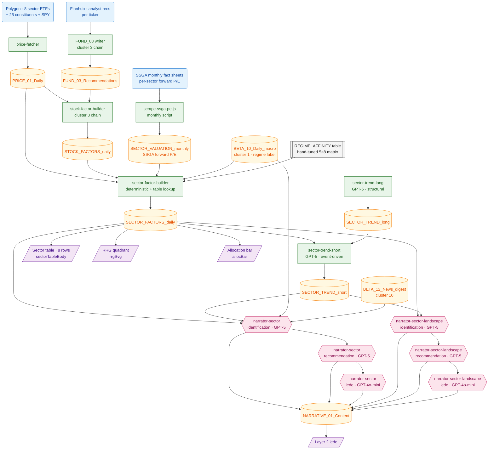
```mermaid
flowchart TD
    R1(Polygon · 8 sector ETFs<br/>+ 25 constituents + SPY):::src
    R2(Finnhub · analyst recs<br/>per ticker):::src
    R3(SSGA monthly fact sheets<br/>per-sector forward P/E):::src

    C1[price-fetcher]:::code
    C2[FUND_03 writer<br/>cluster 3 chain]:::code
    C3[stock-factor-builder<br/>cluster 3 chain]:::code
    C4[scrape-ssga-pe.js<br/>monthly script]:::code
    C5[sector-factor-builder<br/>deterministic + table lookup]:::code
    C6[sector-trend-long<br/>GPT-5 · structural]:::code
    C7[sector-trend-short<br/>GPT-5 · event-driven]:::code

    T1[(PRICE_01_Daily)]:::db
    T2[(FUND_03_Recommendations)]:::db
    T3[(STOCK_FACTORS_daily)]:::db
    T4[(SECTOR_VALUATION_monthly<br/>SSGA forward P/E)]:::db
    T5[(SECTOR_FACTORS_daily)]:::db
    T6[(SECTOR_TREND_long)]:::db
    T7[(SECTOR_TREND_short)]:::db
    T8[(BETA_10_Daily_macro<br/>cluster 1 · regime label)]:::db
    T9[(BETA_12_News_digest<br/>cluster 10)]:::db
    T10[(NARRATIVE_01_Content)]:::db

    K1[[REGIME_AFFINITY table<br/>hand-tuned 5×8 matrix]]:::agentDet

    A1{{narrator-sector<br/>identification · GPT-5}}:::agentLLM
    A2{{narrator-sector<br/>recommendation · GPT-5}}:::agentLLM
    A3{{narrator-sector<br/>lede · GPT-4o-mini}}:::agentLLM
    A4{{narrator-sector-landscape<br/>identification · GPT-5}}:::agentLLM
    A5{{narrator-sector-landscape<br/>recommendation · GPT-5}}:::agentLLM
    A6{{narrator-sector-landscape<br/>lede · GPT-4o-mini}}:::agentLLM

    D1[/Sector table · 8 rows<br/>sectorTableBody/]:::ui
    D2[/RRG quadrant<br/>rrgSvg/]:::ui
    D3[/Allocation bar<br/>allocBar/]:::ui
    D4[/Layer 2 lede/]:::ui

    R1 --> C1 --> T1
    R2 --> C2 --> T2
    R3 --> C4 --> T4

    T1 --> C3 --> T3
    T2 --> C3

    T1 --> C5
    T3 --> C5
    T4 --> C5
    T8 --> C5
    K1 --> C5
    C5 --> T5

    T5 --> C7
    C6 --> T6
    T6 --> C7
    C7 --> T7

    T5 --> A1 --> A2 --> A3
    T7 --> A1
    T8 --> A1
    T9 --> A1
    A1 --> T10
    A2 --> T10
    A3 --> T10

    T5 --> A4 --> A5 --> A6
    T7 --> A4
    A4 --> T10
    A5 --> T10
    A6 --> T10

    T5 --> D1
    T5 --> D2
    T5 --> D3
    T10 --> D4

    classDef src fill:#e3f2fd,stroke:#1976d2,color:#0d47a1
    classDef code fill:#e8f5e9,stroke:#2e7d32,color:#1b5e20
    classDef db fill:#fff8e1,stroke:#f57c00,color:#e65100
    classDef agentLLM fill:#fce4ec,stroke:#c2185b,color:#880e4f
    classDef agentDet fill:#f5f5f5,stroke:#616161,color:#212121
    classDef ui fill:#f3e5f5,stroke:#6a1b9a,color:#4a148c
```

| Tag | What it means |
|---|---|
| R1 | **Polygon prices** for the 8 SPDR sector ETFs (XLK Tech, XLY Discretionary, XLC Communication, XLF Finance, XLE Energy, XLV Healthcare, XLP Staples, XLI Industrial), all 25 portfolio tickers, and SPY. Drives every price-based factor in this cluster: 13-week relative strength, RRG coordinates, breadth above 200-day moving average. |
| R2 | **Finnhub** analyst recommendations — per-ticker bullish/buy/hold/sell/strong-sell counts. The 4-week change in the bullish-recs ratio is what eventually feeds `earn_momentum`. (Note: NOT raw Alpha Vantage fundamentals — sector-level analysis doesn't touch AV directly.) |
| R3 | **SSGA (State Street) monthly fact sheets**. State Street publishes a fact sheet for each SPDR ETF that lists the ETF's weighted-harmonic forward P/E. We scrape those once a month to build a per-sector P/E history. *Why SSGA, not Alpha Vantage:* averaging individual constituents' forward P/E from AV is biased toward mega-caps; SSGA's published number is the actual ETF-weighted P/E. |
| C1 | **price-fetcher** worker. Daily. |
| C2 | The recommendations writer (sparse, currently). Belongs to cluster 3's chain. |
| C3 | **stock-factor-builder** (cluster 3 chain). Reads R1 + R2 to produce per-ticker factors including `eps_rev_4w`. Cluster 4 only consumes the output (T3); it does not run this worker itself. |
| C4 | **`scripts/scrape-ssga-pe.js`** — a manually-run script (no cron yet) that scrapes the latest SSGA fact sheet for each sector ETF and writes the forward P/E into T4. Run it monthly to keep the valuation history alive. |
| C5 | **sector-factor-builder** — the heart of this cluster. Pure math + a table lookup, no LLM. Per sector, computes:<br/>• **regime_fit** = `K1[regime_label][sector]` — pure lookup. The regime_label string comes from T8.<br/>• **earn_momentum** = mean of constituent `eps_rev_4w` from T3.<br/>• **valuation_sigma** = z-score of latest sector forward P/E (from T4) vs trailing 12-month median/stdev. Falls back to a cross-sectional comparison vs other sectors today if T4 has fewer than 3 monthly snapshots.<br/>• **rel_strength_13w** = `sector_ETF_63d_return − SPY_63d_return` (both from T1).<br/>• **rs_ratio** = `100 + 10 × ((rs_raw_today − mean(rs_raw_last_63d)) / stdev(rs_raw_last_63d))`, where `rs_raw_t = sector_close / spy_close`. The classic JdK RRG normalization. (T1 only.)<br/>• **rs_momentum** = `rs_ratio_today − rs_ratio_21_days_ago + 100`. Rises when the rs_ratio is accelerating. (T1 only.)<br/>• **stance_score** = `0.30·FIT + 0.20·EARN + 0.15·VAL + 0.15·RS + 0.10·beat_rate`, with null inputs renormalized.<br/>• **stance** = bucket: `> +0.33` → OW, `< −0.33` → UW, otherwise EW. |
| C6 | **sector-trend-long** worker, GPT-5. Slow structural thesis per sector — refreshed when major sector-relevant events happen, not daily. |
| C7 | **sector-trend-short** worker, GPT-5. Tactical thesis per sector — fires when factors change or every 7 days. |
| T1 | Daily prices for every ticker the cluster needs (8 sector ETFs + 25 stocks + SPY). |
| T2 | Per-ticker analyst-recommendation history. |
| T3 | Per-ticker daily-factors table (cluster 3 output). The `eps_rev_4w` column is the only one this cluster reads. |
| T4 | **Per-sector monthly forward P/E**, scraped from SSGA. The valuation_sigma history. |
| T5 | Per-sector daily-factors table — what the dashboard reads. |
| T6 | Long-term sector thesis (one row per sector). |
| T7 | Short-term sector thesis (one row per sector). |
| T8 | Daily macro blob from cluster 1. Provides the regime label string (`bullish`, `cautious_bullish`, `neutral`, `cautious_bearish`, `bearish`) that drives both the regime_fit lookup AND the narrator gather context. |
| T9 | News digest from cluster 10. Per-sector news context for the narrators. |
| T10 | Narrative content — the narrators' bullet outputs. |
| K1 | **The hardcoded `REGIME_AFFINITY` table** in `workers/sector-factor-builder/src/worker.js:51-58`. A 5-regime × 8-sector matrix of hand-tuned numbers in [-1, +1]. e.g. when regime is `bullish`: Technology = +0.8, ConsDisc = +0.7, Staples = -0.4. When `bearish`: Technology = -0.6, Staples = +0.7. **Important:** these numbers are not learned and not derived from data — they are the system designer's prior on which sectors do well in which regime. Editable as a constant. |
| A1 | Per-sector identification (GPT-5). 3-5 bullets explaining what is happening in *this specific sector*. Each bullet must cite a number from the input data + provide an interpretation. |
| A2 | Per-sector recommendation (GPT-5). Names which constituents to ADD and which to CUT, with conviction and edge-vs-consensus. Hard rule: ≥1 ADD ticker AND ≥1 CUT ticker, both from the sector's actual constituents. |
| A3 | Per-sector lede (GPT-4o-mini). 3-4 line summary at the top of the sector view. |
| A4 | Sector-landscape identification (GPT-5). Comparative bullets across all 8 sectors. Each bullet must reference at least 2 sectors. |
| A5 | Sector-landscape recommendation (GPT-5). Cross-sector rotation calls (rotate from X to Y). |
| A6 | Sector-landscape lede (GPT-4o-mini). The Layer 2 headline. |
| D1 | The 8-row sector table on Layer 2. Columns: regime fit, earnings momentum, valuation σ, relative strength, stance (**OW** Overweight / **EW** Equal-weight / **UW** Underweight). Cell colors are per-column with thresholds matched to each factor's data range; the valuation column is *inverted* — negative σ (cheap) shows green. |
| D2 | The **Relative Rotation Graph (RRG)** — quadrant chart plotting each sector ETF in (rs_ratio × rs_momentum) space, both centered at 100. Quadrants: **Leading** (top-right, both >100), **Improving** (top-left), **Lagging** (bottom-right), **Weakening** (bottom-left). |
| D3 | The horizontal allocation bar — sector weights summing to 100%. |
| D4 | The 1-paragraph lede above Layer 2 — pulls from the sector-landscape narrator (priority) or per-sector narrator (fallback). |

\pagebreak

## Cluster 5 · Stock shortlist + scatter

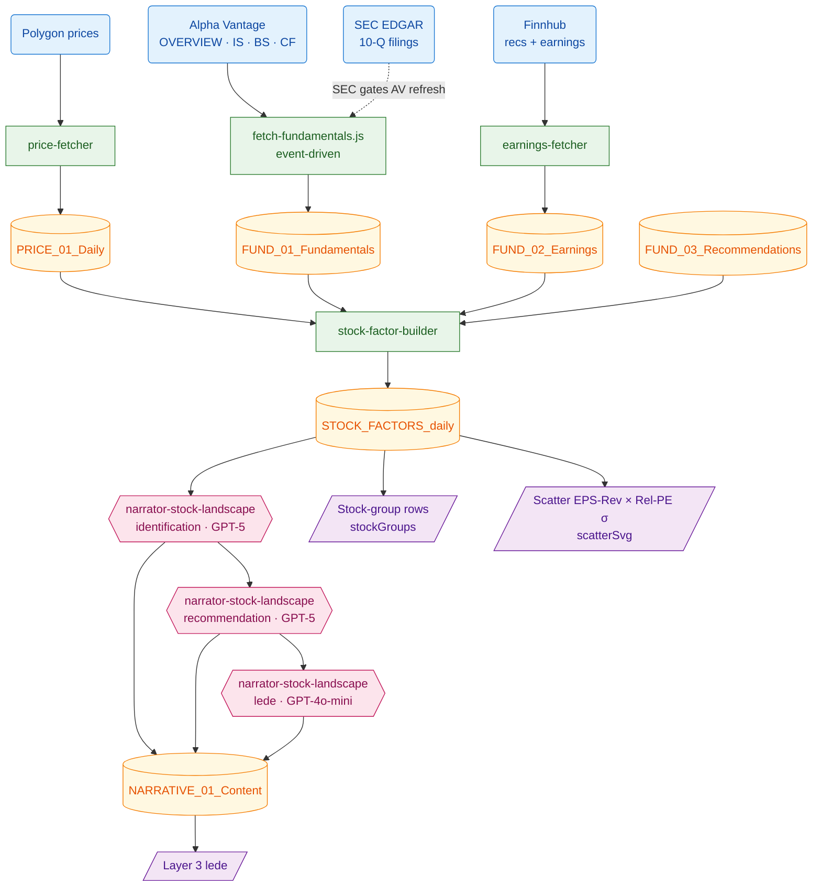
```mermaid
flowchart TD
    R1(Polygon prices):::src
    R2(Alpha Vantage<br/>OVERVIEW · IS · BS · CF):::src
    R3(Finnhub<br/>recs + earnings):::src
    R4(SEC EDGAR<br/>10-Q filings):::src

    C1[price-fetcher]:::code
    C2[fetch-fundamentals.js<br/>event-driven]:::code
    C3[earnings-fetcher]:::code
    C4[stock-factor-builder]:::code

    T1[(PRICE_01_Daily)]:::db
    T2[(FUND_01_Fundamentals)]:::db
    T3[(FUND_02_Earnings)]:::db
    T4[(FUND_03_Recommendations)]:::db
    T5[(STOCK_FACTORS_daily)]:::db
    T6[(NARRATIVE_01_Content)]:::db

    A1{{narrator-stock-landscape<br/>identification · GPT-5}}:::agentLLM
    A2{{narrator-stock-landscape<br/>recommendation · GPT-5}}:::agentLLM
    A3{{narrator-stock-landscape<br/>lede · GPT-4o-mini}}:::agentLLM

    D1[/Stock-group rows<br/>stockGroups/]:::ui
    D2[/Scatter EPS-Rev × Rel-PE σ<br/>scatterSvg/]:::ui
    D3[/Layer 3 lede/]:::ui

    R1 --> C1 --> T1
    R2 --> C2 --> T2
    R3 --> C3 --> T3
    R4 -. SEC gates AV refresh .-> C2

    T1 --> C4
    T2 --> C4
    T3 --> C4
    T4 --> C4
    C4 --> T5

    T5 --> A1 --> A2 --> A3
    A1 --> T6
    A2 --> T6
    A3 --> T6

    T5 --> D1
    T5 --> D2
    T6 --> D3

    classDef src fill:#e3f2fd,stroke:#1976d2,color:#0d47a1
    classDef code fill:#e8f5e9,stroke:#2e7d32,color:#1b5e20
    classDef db fill:#fff8e1,stroke:#f57c00,color:#e65100
    classDef agentLLM fill:#fce4ec,stroke:#c2185b,color:#880e4f
    classDef agentDet fill:#f5f5f5,stroke:#616161,color:#212121
    classDef ui fill:#f3e5f5,stroke:#6a1b9a,color:#4a148c
```

| Tag | What it means |
|---|---|
| R1–R4 | Same sources as cluster 3 — Polygon prices, Alpha Vantage fundamentals, Finnhub recommendations, SEC 10-Q filings (gating refresh). |
| C1–C3 | Same fetchers as cluster 3. |
| C4 | **stock-factor-builder** — same worker as cluster 3. Emits 9 deterministic factors per ticker: **fwd_pe** (forward Price-to-Earnings ratio), **rel_pe_sigma** (cheap/expensive vs sector peers, in σ units; negative = cheap), **eps_rev_4w** (4-week change in analyst-bullish ratio — the EPS-revision proxy), **rev_breadth_4w** (4-week change in net bullish-minus-bearish breadth), **sue** (Standardized Unexpected Earnings — most recent earnings surprise normalized by past surprise volatility), **mom_12_1** (12-month price momentum, skipping the most recent month — the classic Jegadeesh-Titman factor), **rs_vs_sector_3m** (3-month return minus sector-ETF return), **piotroski_f** (0-9 financial-health score), **days_to_catalyst** (days to next earnings — null if overdue). |
| T1–T5 | Same tables as cluster 3. |
| T6 | Narrative content — stores the stock-landscape narrator output. |
| A1 | Stock-landscape identification (**GPT-5**). **What it does:** comparative bullets across all 25 tickers. What separates the top of the shortlist from the bottom? Each bullet must reference at least 2 tickers. |
| A2 | Stock-landscape recommendation (**GPT-5**). **What it does:** which tickers are gaining conviction vs falling. |
| A3 | Stock-landscape lede (**GPT-4o-mini**). |
| D1 | The per-sector stock-group rows on Layer 3. Each row shows a ticker's 9 factors. Exact-zero values render as "flat / no signal" (some upstream tables write 0 as a missing-data sentinel — without this fix the EPS-revision column was a wall of red). |
| D2 | The scatter chart at the bottom of Layer 3. **X-axis:** 4-week analyst-revision direction. **Y-axis:** cheap/expensive vs sector peers (cheap is up). Top-right quadrant = ideal long candidate (improving estimates AND cheap). Sector colors fall back when Piotroski is null. |
| D3 | The Layer 3 lede paragraph. |

**Note:** there's also a per-ticker narrator (`narrator/stock`, ×25) that writes its own rows used by the **stock entity-detail view** when you click on a ticker. Separate from the Layer 3 grid here.

\pagebreak

## Cluster 6 · Portfolio book — KPIs · NAV · positions · weights · decision trail

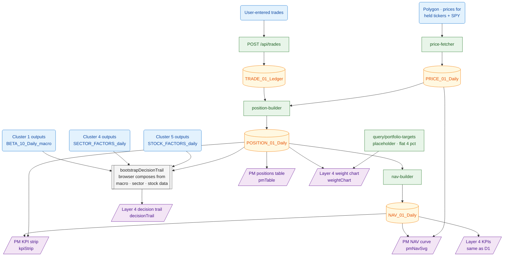
```mermaid
flowchart TD
    R1(User-entered trades):::src
    R2(Polygon · prices for<br/>held tickers + SPY):::src
    R3(Cluster 1 outputs<br/>BETA_10_Daily_macro):::src
    R4(Cluster 4 outputs<br/>SECTOR_FACTORS_daily):::src
    R5(Cluster 5 outputs<br/>STOCK_FACTORS_daily):::src

    C1[POST /api/trades]:::code
    C2[price-fetcher]:::code
    C3[position-builder]:::code
    C4[nav-builder]:::code
    C5[query/portfolio-targets<br/>placeholder · flat 4 pct]:::code

    T1[(TRADE_01_Ledger)]:::db
    T2[(PRICE_01_Daily)]:::db
    T3[(POSITION_01_Daily)]:::db
    T4[(NAV_01_Daily)]:::db

    A1[[bootstrapDecisionTrail<br/>browser composes from<br/>macro · sector · stock data]]:::agentDet

    D1[/PM KPI strip<br/>kpiStrip/]:::ui
    D2[/PM NAV curve<br/>pmNavSvg/]:::ui
    D3[/PM positions table<br/>pmTable/]:::ui
    D4[/Layer 4 KPIs<br/>same as D1/]:::ui
    D5[/Layer 4 weight chart<br/>weightChart/]:::ui
    D6[/Layer 4 decision trail<br/>decisionTrail/]:::ui

    R1 --> C1 --> T1
    R2 --> C2 --> T2
    T1 --> C3
    T2 --> C3
    C3 --> T3
    T3 --> C4 --> T4

    T4 --> D1
    T3 --> D1
    T4 --> D2
    T2 --> D2
    T3 --> D3
    T4 --> D4
    T3 --> D5
    C5 --> D5

    R3 --> A1
    R4 --> A1
    R5 --> A1
    T3 --> A1
    A1 --> D6

    classDef src fill:#e3f2fd,stroke:#1976d2,color:#0d47a1
    classDef code fill:#e8f5e9,stroke:#2e7d32,color:#1b5e20
    classDef db fill:#fff8e1,stroke:#f57c00,color:#e65100
    classDef agentLLM fill:#fce4ec,stroke:#c2185b,color:#880e4f
    classDef agentDet fill:#f5f5f5,stroke:#616161,color:#212121
    classDef ui fill:#f3e5f5,stroke:#6a1b9a,color:#4a148c
```

| Tag | What it means |
|---|---|
| R1 | User-entered trades (same as cluster 2). |
| R2 | **Polygon prices** for held tickers + **SPY** (the S&P 500 ETF, used as the benchmark line on the NAV chart). |
| R3-R5 | Outputs from clusters 1, 4, 5 — the macro/sector/stock data the *decision trail* uses to compose its 4-step explanation. |
| C1 | POST `/api/trades` → ingestor (same as cluster 2). |
| C2 | **price-fetcher**. |
| C3 | **position-builder**. |
| C4 | **nav-builder**. |
| C5 | The `/query/portfolio-targets` endpoint. **Currently a placeholder** — returns a flat 4% target per ticker. The real target source (the `wealth-distribution` worker) hasn't been wired in yet. So the weight chart shows everything as "should be 4%" today. |
| T1 | Trade ledger. |
| T2 | Daily prices. |
| T3 | Daily positions. |
| T4 | Daily NAV. |
| A1 | **Browser-side composition, no LLM.** Picks the ticker with the largest gap between current weight and target weight (so the most-overweight or most-underweight name). Composes a 4-step explanation: (1) what the regime is, (2) why this sector matters in that regime, (3) where this ticker stands on key factors, (4) the implied buy/trim sizing action. |
| D1 | The KPI strip at the top of the **PM tab**: Net Exposure, Gross Exposure, Position count, Cash %, period P&L, NAV total. |
| D2 | The NAV curve on the PM tab — your portfolio value over time, plotted alongside SPY normalized to start at the same level. Visualizes whether you're beating or trailing the market. |
| D3 | The full positions table on the PM tab — every holding with quantity, cost basis, market price, market value, weight, unrealized P&L %, period P&L %, days held. |
| D4 | The same KPI strip, repeated at the top of Portfolio Layer 4 — same data, different tab. |
| D5 | The weight chart on Layer 4 — each ticker shown as (current dot → target dot) with a connecting line. Auto-fits the x-axis if any weight exceeds 7%. |
| D6 | The 4-step decision trail on Layer 4. Tells you *"we picked LLY because the regime favors quality, healthcare scores well in this regime, LLY's factor mix is strong, so we'd add 1.5%"*. |

**Pill labels** ("1d P&L" vs "Nd P&L"): the dashboard reads the actual gap in days between the two latest NAV rows and labels honestly. If your pipeline ran daily, both labels say "1d". If it ran 7 days ago, both say "7d". Without this honesty you'd think a 7-day return was a 1-day return.

\pagebreak

## Cluster 7 · Attribution waterfall (Layer 5)

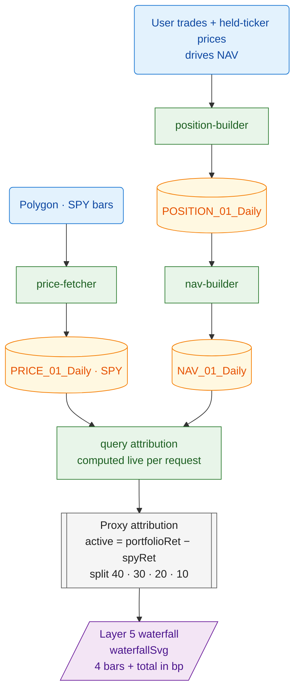
```mermaid
flowchart TD
    R1(Polygon · SPY bars):::src
    R2(User trades + held-ticker prices<br/>drives NAV):::src

    C1[price-fetcher]:::code
    C2[position-builder]:::code
    C3[nav-builder]:::code
    C4[query attribution<br/>computed live per request]:::code

    T1[(PRICE_01_Daily · SPY)]:::db
    T2[(POSITION_01_Daily)]:::db
    T3[(NAV_01_Daily)]:::db

    A1[[Proxy attribution<br/>active = portfolioRet − spyRet<br/>split 40 · 30 · 20 · 10]]:::agentDet

    D1[/Layer 5 waterfall<br/>waterfallSvg<br/>4 bars + total in bp/]:::ui

    R1 --> C1 --> T1
    R2 --> C2 --> T2
    T2 --> C3 --> T3
    T1 --> C4
    T3 --> C4
    C4 --> A1 --> D1

    classDef src fill:#e3f2fd,stroke:#1976d2,color:#0d47a1
    classDef code fill:#e8f5e9,stroke:#2e7d32,color:#1b5e20
    classDef db fill:#fff8e1,stroke:#f57c00,color:#e65100
    classDef agentLLM fill:#fce4ec,stroke:#c2185b,color:#880e4f
    classDef agentDet fill:#f5f5f5,stroke:#616161,color:#212121
    classDef ui fill:#f3e5f5,stroke:#6a1b9a,color:#4a148c
```

| Tag | What it means |
|---|---|
| R1 | **Polygon SPY bars** — daily price of SPY (S&P 500 ETF), used as the benchmark for "what would the market have given me?" |
| R2 | User trades + held-ticker prices — drive your portfolio's NAV. |
| C1-C3 | **price-fetcher**, **position-builder**, **nav-builder** (same chain as cluster 6). |
| C4 | The `/query/attribution` endpoint inside `portfolio-ingestor`. **Computed live on every request — no worker writes attribution to a table.** Reads each consecutive pair of NAV rows, computes the *active return* (your portfolio's return minus SPY's return for that period), and splits it across four buckets. |
| T1 | Daily prices (SPY rows). |
| T2 | Daily positions. |
| T3 | Daily NAV. |
| A1 | **Proxy attribution, no LLM.** The 40/30/20/10 split across (Regime call / Sector tilt / Stock picks / Sizing) is *fixed* — it's not real attribution. Real attribution requires per-position-per-day P&L tables, which don't exist yet. The current proxy is a placeholder. The dashboard chart caption says so explicitly. |
| D1 | The waterfall chart on Layer 5. Four bars stack to a total in **basis points** (1 bp = 0.01%). Bar order: Regime → Sector → Stock → Sizing → Total. The italicized caption under the chart reads "Proxy split (40/30/20/10) until per-position attribution lands" — so you know not to trust the split as real signal yet. |

\pagebreak

## Cluster 8 · Calibration + closed trades (Layer 5)

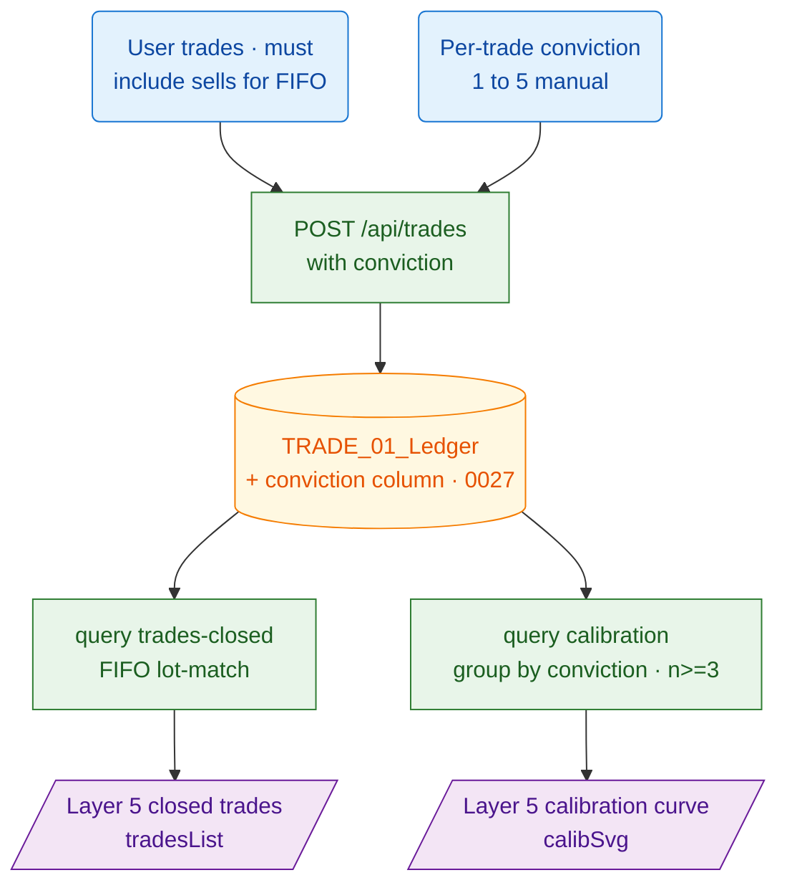
```mermaid
flowchart TD
    R1(User trades · must<br/>include sells for FIFO):::src
    R2(Per-trade conviction<br/>1 to 5 manual):::src

    C1[POST /api/trades<br/>with conviction]:::code
    C2[query trades-closed<br/>FIFO lot-match]:::code
    C3[query calibration<br/>group by conviction · n>=3]:::code

    T1[(TRADE_01_Ledger<br/>+ conviction column · 0027)]:::db

    D1[/Layer 5 calibration curve<br/>calibSvg/]:::ui
    D2[/Layer 5 closed trades<br/>tradesList/]:::ui

    R1 --> C1 --> T1
    R2 --> C1
    T1 --> C2 --> D2
    T1 --> C3 --> D1

    classDef src fill:#e3f2fd,stroke:#1976d2,color:#0d47a1
    classDef code fill:#e8f5e9,stroke:#2e7d32,color:#1b5e20
    classDef db fill:#fff8e1,stroke:#f57c00,color:#e65100
    classDef agentLLM fill:#fce4ec,stroke:#c2185b,color:#880e4f
    classDef agentDet fill:#f5f5f5,stroke:#616161,color:#212121
    classDef ui fill:#f3e5f5,stroke:#6a1b9a,color:#4a148c
```

| Tag | What it means |
|---|---|
| R1 | User-entered trades — must include sells, since the system needs both legs to compute realized P&L. |
| R2 | Per-trade **conviction** (1-5). You enter this when logging a trade. Higher number = stronger belief. The whole point of calibration is to compare *predicted* hit-rate (from conviction) against *actual* hit-rate. |
| C1 | POST `/api/trades` with conviction. |
| C2 | The `/query/trades/closed` endpoint. **FIFO lot-matching** (First-In-First-Out): each sell is matched against the *oldest* unsold buy of that same ticker, producing one closed-trade row with realized P&L %. This is the standard accounting method for tracking trade outcomes. |
| C3 | The `/query/calibration` endpoint. Buckets all closed trades by conviction level (1, 2, 3, 4, 5). For each bucket, computes the actual hit rate (% of trades that closed positive). Suppresses any bucket with fewer than 3 trades — too few to draw a conclusion. |
| T1 | The trade ledger (with the conviction column added in migration 0027). |
| D1 | The calibration scatter on Layer 5. **Dashed line** = expected hit rate per conviction level (~20% for conv 1, ~80% for conv 5 — based on prior). **Filled dots** = actual hit rate, drawn only when you have ≥3 closed trades in that bucket. Tells you whether your conviction is well-calibrated to outcomes. |
| D2 | The closed-trades list on Layer 5. Empty placeholder until you log sells. |

**Status today:** the trade ledger currently has 25 BUY rows (from `seed-trades.js` initialization) and zero SELLs. Both panels show empty state — that's correct, by design. They'll populate as you log sells.

\pagebreak

## Cluster 9 · Calendar tab (rolling 6-week event grid)

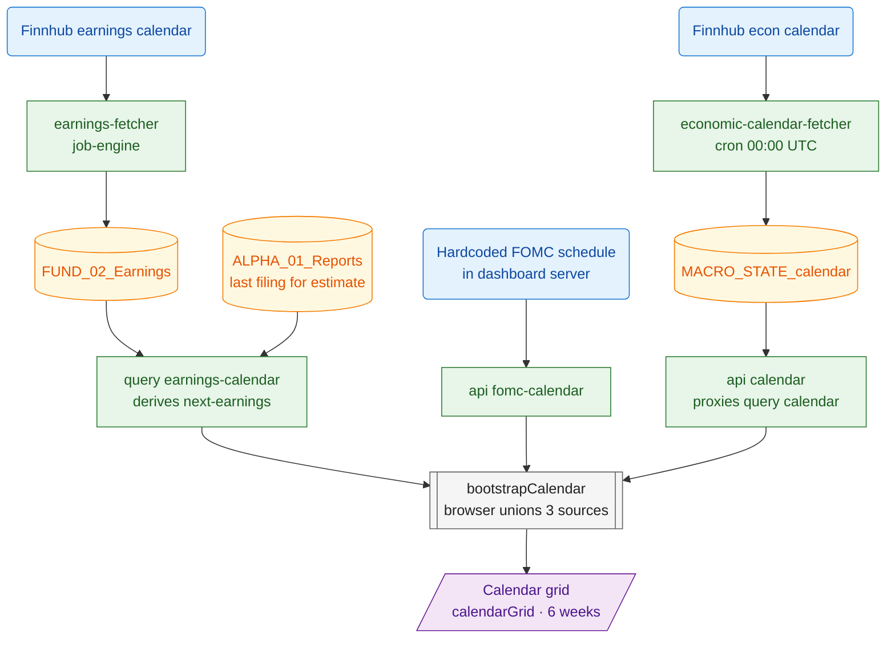
```mermaid
flowchart TD
    R1(Finnhub econ calendar):::src
    R2(Finnhub earnings calendar):::src
    R3(Hardcoded FOMC schedule<br/>in dashboard server):::src

    C1[economic-calendar-fetcher<br/>cron 00:00 UTC]:::code
    C2[earnings-fetcher<br/>job-engine]:::code
    C3[query earnings-calendar<br/>derives next-earnings]:::code
    C4[api fomc-calendar]:::code
    C5[api calendar<br/>proxies query calendar]:::code

    T1[(MACRO_STATE_calendar)]:::db
    T2[(FUND_02_Earnings)]:::db
    T3[(ALPHA_01_Reports<br/>last filing for estimate)]:::db

    A1[[bootstrapCalendar<br/>browser unions 3 sources]]:::agentDet

    D1[/Calendar grid<br/>calendarGrid · 6 weeks/]:::ui

    R1 --> C1 --> T1
    R2 --> C2 --> T2
    T2 --> C3
    T3 --> C3
    R3 --> C4
    T1 --> C5

    C3 --> A1
    C4 --> A1
    C5 --> A1
    A1 --> D1

    classDef src fill:#e3f2fd,stroke:#1976d2,color:#0d47a1
    classDef code fill:#e8f5e9,stroke:#2e7d32,color:#1b5e20
    classDef db fill:#fff8e1,stroke:#f57c00,color:#e65100
    classDef agentLLM fill:#fce4ec,stroke:#c2185b,color:#880e4f
    classDef agentDet fill:#f5f5f5,stroke:#616161,color:#212121
    classDef ui fill:#f3e5f5,stroke:#6a1b9a,color:#4a148c
```

| Tag | What it means |
|---|---|
| R1 | **Finnhub economic calendar** — the upcoming-releases API. Includes scheduled prints of CPI, NFP, PMI (Purchasing Managers' Index), GDP, retail sales, and other macro data. |
| R2 | **Finnhub earnings calendar** — per-ticker next-earnings date. We have this for ~25 of our portfolio tickers. |
| R3 | A **hardcoded list of FOMC meeting dates** kept in `dashboard/server.js`. The Fed publishes its meeting schedule a year in advance so we just embed it directly. Updated manually each year. |
| C1 | The **economic-calendar-fetcher** worker (cron 00:00 UTC daily). Pulls R1 into T1. |
| C2 | The **earnings-fetcher** worker. Pulls R2 into T2. |
| C3 | The dashboard endpoint that derives the next-earnings date per ticker from T2 + the last-filing-date heuristic in T3 (in case Finnhub doesn't have it scheduled). |
| C4 | The dashboard endpoint that returns the hardcoded FOMC list (R3). |
| C5 | The dashboard endpoint that proxies the economic-calendar query to portfolio-ingestor. |
| T1 | Economic calendar table — one row per (event date, event code, country). |
| T2 | Earnings table — historical earnings prints per ticker. |
| T3 | SEC filings table — used to estimate next-earnings dates when Finnhub data is missing. |
| A1 | **Browser-side, no LLM.** Unions the three calendar sources (earnings + FOMC + macro events), filters to today−14 days through today+28 days (~6 weeks total), dedupes overlapping items, and lays them out on a Mon-Sun grid. |
| D1 | The 6-week calendar grid on the **Calendar tab**. Each cell shows up to 4 events for that day, with an impact tag (high / medium / low). Today is highlighted; weekends are shaded; past days are dimmed. |

\pagebreak

## Cluster 10 · News stream

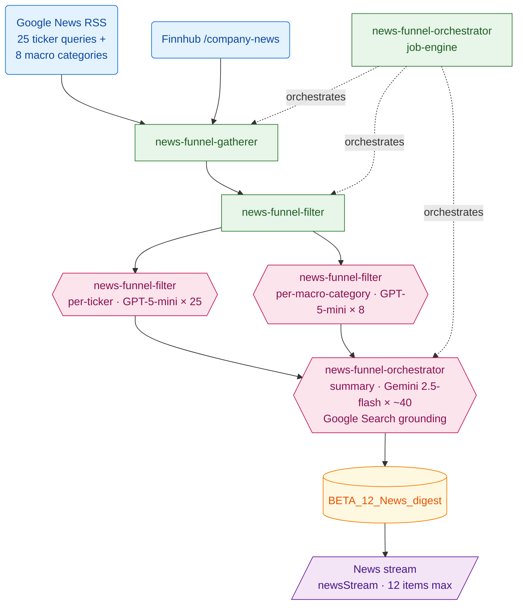
```mermaid
flowchart TD
    R1(Google News RSS<br/>25 ticker queries +<br/>8 macro categories):::src
    R2(Finnhub /company-news):::src

    C1[news-funnel-orchestrator<br/>job-engine]:::code
    C2[news-funnel-gatherer]:::code
    C3[news-funnel-filter]:::code

    A1{{news-funnel-filter<br/>per-ticker · GPT-5-mini × 25}}:::agentLLM
    A2{{news-funnel-filter<br/>per-macro-category · GPT-5-mini × 8}}:::agentLLM
    A3{{news-funnel-orchestrator<br/>summary · Gemini 2.5-flash × ~40<br/>Google Search grounding}}:::agentLLM

    T1[(BETA_12_News_digest)]:::db

    D1[/News stream<br/>newsStream · 12 items max/]:::ui

    R1 --> C2
    R2 --> C2
    C2 --> C3
    C3 --> A1
    C3 --> A2
    A1 --> A3
    A2 --> A3
    A3 --> T1
    T1 --> D1

    C1 -.orchestrates.-> C2
    C1 -.orchestrates.-> C3
    C1 -.orchestrates.-> A3

    classDef src fill:#e3f2fd,stroke:#1976d2,color:#0d47a1
    classDef code fill:#e8f5e9,stroke:#2e7d32,color:#1b5e20
    classDef db fill:#fff8e1,stroke:#f57c00,color:#e65100
    classDef agentLLM fill:#fce4ec,stroke:#c2185b,color:#880e4f
    classDef agentDet fill:#f5f5f5,stroke:#616161,color:#212121
    classDef ui fill:#f3e5f5,stroke:#6a1b9a,color:#4a148c
```

| Tag | What it means |
|---|---|
| R1 | **Google News RSS** feeds — public RSS endpoints. We make 33 parallel queries: one per ticker (25), and one per macro category (8 categories: Fed/rates, geopolitics, energy, regulation, M&A, AI/tech, healthcare, banks). |
| R2 | **Finnhub /company-news** — per-ticker financial news. Supplements R1 with finance-specific sources (Reuters, Bloomberg syndication, etc). |
| C1 | The **news-funnel-orchestrator** worker. The top-level coordinator that runs the 3-stage pipeline. Dispatches C2 → C3 → A3 in sequence. |
| C2 | The **news-funnel-gatherer** worker. Collects raw headlines from R1+R2, dedupes by title hash, returns the list to the orchestrator. |
| C3 | The **news-funnel-filter** worker. Receives the deduped list and fans out 33 parallel LLM calls to filter for relevance (A1 + A2). |
| A1 | **GPT-5-mini**, 25 calls per run (one per ticker). **What it does:** from the gathered ticker headlines, picks the 1-4 most market-relevant ones. Assigns a sentiment (bullish/bearish/neutral) and a granular magnitude (0.05 trivial → 1.00 exceptional). The prompt explicitly forbids defaulting to ±0.5 — it requires specific values like 0.35 or 0.78 — to prevent the LLM from getting lazy and returning binary scores. |
| A2 | **GPT-5-mini**, 8 calls per run (one per macro category). Picks the 1-2 most-impactful headlines per category, with the same sentiment + magnitude scheme. |
| A3 | **Gemini 2.5-flash with Google Search grounding**, ~40 summary calls per run. **What it does:** for each filtered headline, generates a 2-3 sentence factual summary. The Google Search tool lets Gemini look up additional context if needed (so the summary isn't limited to the headline itself). |
| T1 | The **news digest** table — one row per (date, type, ticker/category, rank). Stores title, summary, source, sentiment, magnitude. |
| D1 | The news stream on the **News tab**. Top 12 items by absolute magnitude. Each item shows title, sentiment chip (positive/negative/neutral), source, and a **materiality pill** (0-10 = `round(|magnitude| × 10)`). |

\pagebreak

## Cluster 11 · Top movers

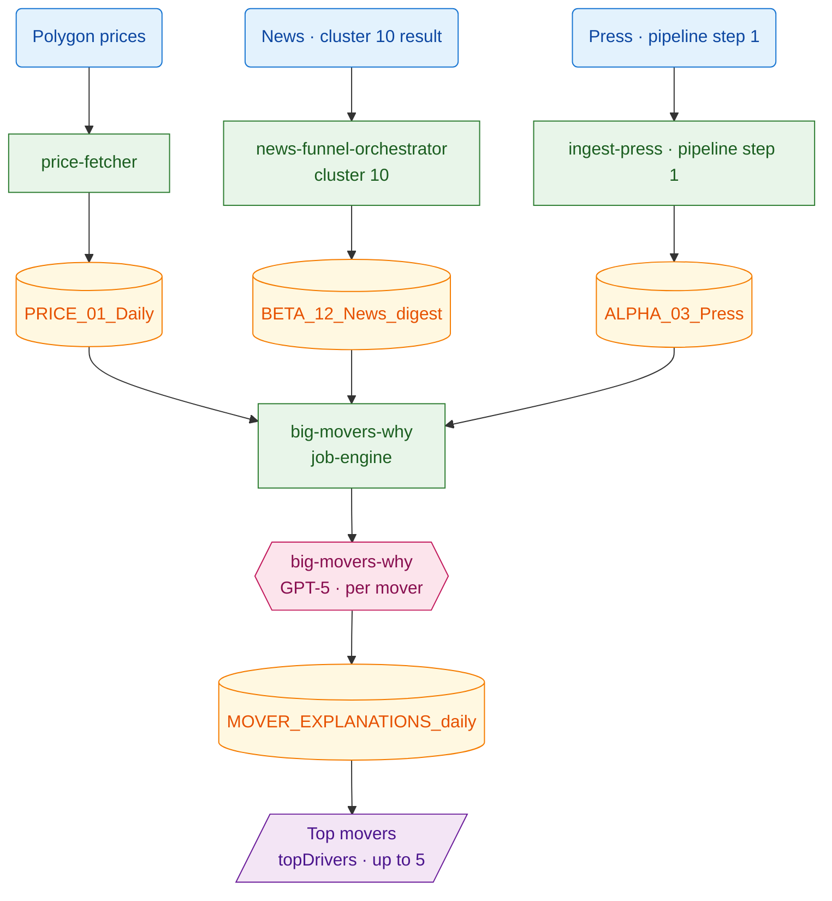
```mermaid
flowchart TD
    R1(Polygon prices):::src
    R2(News · cluster 10 result):::src
    R3(Press · pipeline step 1):::src

    C1[price-fetcher]:::code
    C2[news-funnel-orchestrator<br/>cluster 10]:::code
    C3[ingest-press · pipeline step 1]:::code
    C4[big-movers-why<br/>job-engine]:::code

    T1[(PRICE_01_Daily)]:::db
    T2[(BETA_12_News_digest)]:::db
    T3[(ALPHA_03_Press)]:::db
    T4[(MOVER_EXPLANATIONS_daily)]:::db

    A1{{big-movers-why<br/>GPT-5 · per mover}}:::agentLLM

    D1[/Top movers<br/>topDrivers · up to 5/]:::ui

    R1 --> C1 --> T1
    R2 --> C2 --> T2
    R3 --> C3 --> T3
    T1 --> C4
    T2 --> C4
    T3 --> C4
    C4 --> A1 --> T4 --> D1

    classDef src fill:#e3f2fd,stroke:#1976d2,color:#0d47a1
    classDef code fill:#e8f5e9,stroke:#2e7d32,color:#1b5e20
    classDef db fill:#fff8e1,stroke:#f57c00,color:#e65100
    classDef agentLLM fill:#fce4ec,stroke:#c2185b,color:#880e4f
    classDef agentDet fill:#f5f5f5,stroke:#616161,color:#212121
    classDef ui fill:#f3e5f5,stroke:#6a1b9a,color:#4a148c
```

| Tag | What it means |
|---|---|
| R1 | **Polygon prices** — needed to compute today's % move per ticker. |
| R2 | **News digest** from cluster 10 — the per-ticker headlines that explain the move. |
| R3 | **Press releases** from pipeline step 1 — additional ground-truth context (e.g. an earnings press release explains a 10% earnings-day move). |
| C1 | **price-fetcher**. |
| C2 | **news-funnel-orchestrator** (cluster 10's pipeline). |
| C3 | The press scrapers (pipeline step 1). |
| C4 | The **big-movers-why** worker. Picks the top 5 up-movers and top 5 down-movers by absolute % move. For each one, calls A1. |
| T1 | Daily prices. |
| T2 | News digest. |
| T3 | Press releases. |
| T4 | The mover-explanations table — one row per (date, ticker) explaining why it moved. |
| A1 | **GPT-5**, one call per mover. **What it does:** produces a one-sentence thesis + 2-4 bullets explaining why this stock moved today, grounded in the day's headlines and recent press. **Important:** if no news explains the move, the prompt explicitly asks the model to *say so* ("likely broad market / sector flows") rather than invent a reason. Anti-hallucination rule. |
| D1 | The "Top Drivers" panel on the **News tab**. Up to 5 rows: ticker + % move + one-sentence reason. Sorted by absolute move size. |

\pagebreak

## Cluster 12 · Regime detail — 12-indicator board + latest events

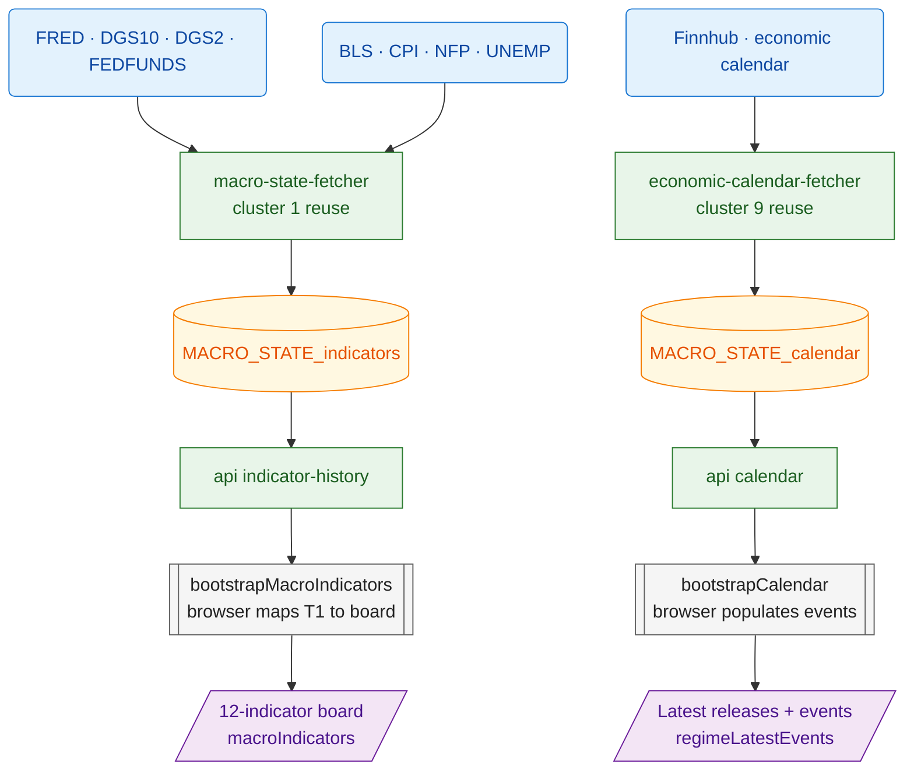
```mermaid
flowchart TD
    R1(FRED · DGS10 · DGS2 · FEDFUNDS):::src
    R2(BLS · CPI · NFP · UNEMP):::src
    R3(Finnhub · economic calendar):::src

    C1[macro-state-fetcher<br/>cluster 1 reuse]:::code
    C2[economic-calendar-fetcher<br/>cluster 9 reuse]:::code
    C3[api indicator-history]:::code
    C4[api calendar]:::code

    T1[(MACRO_STATE_indicators)]:::db
    T2[(MACRO_STATE_calendar)]:::db

    A1[[bootstrapMacroIndicators<br/>browser maps T1 to board]]:::agentDet
    A2[[bootstrapCalendar<br/>browser populates events]]:::agentDet

    D1[/12-indicator board<br/>macroIndicators/]:::ui
    D2[/Latest releases + events<br/>regimeLatestEvents/]:::ui

    R1 --> C1 --> T1
    R2 --> C1
    R3 --> C2 --> T2
    T1 --> C3 --> A1 --> D1
    T2 --> C4 --> A2 --> D2

    classDef src fill:#e3f2fd,stroke:#1976d2,color:#0d47a1
    classDef code fill:#e8f5e9,stroke:#2e7d32,color:#1b5e20
    classDef db fill:#fff8e1,stroke:#f57c00,color:#e65100
    classDef agentLLM fill:#fce4ec,stroke:#c2185b,color:#880e4f
    classDef agentDet fill:#f5f5f5,stroke:#616161,color:#212121
    classDef ui fill:#f3e5f5,stroke:#6a1b9a,color:#4a148c
```

| Tag | What it means |
|---|---|
| R1 | **FRED** macro indicators — same source as cluster 1. **DGS10** = 10-year US Treasury yield. **DGS2** = 2-year yield. **FEDFUNDS** = the federal funds rate (the Fed's policy rate). |
| R2 | **BLS** macro indicators — same source as cluster 1. **CPI** = Consumer Price Index (inflation). **NFP** = Non-Farm Payrolls (monthly jobs report). **UNEMP** = unemployment rate. |
| R3 | **Finnhub economic calendar** — upcoming macro releases, same source as cluster 9. |
| C1 | The **macro-state-fetcher** worker — same as cluster 1, reused (no duplication). |
| C2 | The **economic-calendar-fetcher** worker — same as cluster 9, reused. |
| C3 | The dashboard endpoint that returns the latest reading per indicator code (used here to populate the 12-chip board). |
| C4 | The dashboard endpoint that proxies the calendar query (same as cluster 9). |
| T1 | Indicator history table (same as cluster 1's T1). |
| T2 | Economic calendar table (same as cluster 9's T1). |
| A1 | **Browser-side, no LLM.** Maps the indicator history rows into the macro-board labels and computes the **derived 2s10s curve** (10Y yield minus 2Y yield, expressed in basis points — when this goes negative the curve is "inverted", historically a recession warning). For each chip: latest value, change vs prior reading, trend direction (up/flat/down). |
| A2 | **Browser-side, no LLM.** Sorts the calendar events chronologically; picks the 4 most-recent past + 4 closest upcoming. |
| D1 | The **12-indicator board** that you see when you click "Open full regime analysis" on Layer 1. Compact grid of macro chips: 10Y, 2Y, 2s10s curve (derived), Core CPI, CPI Headline, Fed Funds, NFP, Unemployment, plus a few empty slots reserved for future indicators (HY spread, DXY, oil, gold, VIX) once their data sources are wired. |
| D2 | The "Latest releases & upcoming events" mini-list directly below the indicator board. Past events on top, future events with an "upcoming" pill below. |

\pagebreak

## Cross-reference 1 · One agent → many dashboard fields

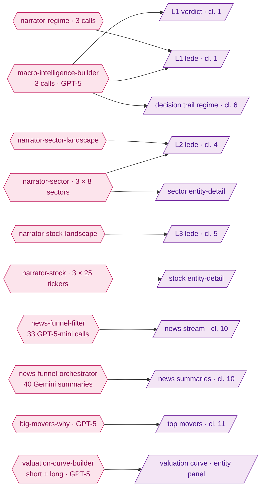
```mermaid
flowchart LR
    A1{{macro-intelligence-builder<br/>3 calls · GPT-5}}:::agentLLM
    A2{{narrator-regime · 3 calls}}:::agentLLM
    A3{{narrator-sector · 3 × 8 sectors}}:::agentLLM
    A4{{narrator-sector-landscape}}:::agentLLM
    A5{{narrator-stock-landscape}}:::agentLLM
    A6{{narrator-stock · 3 × 25 tickers}}:::agentLLM
    A7{{news-funnel-filter<br/>33 GPT-5-mini calls}}:::agentLLM
    A8{{news-funnel-orchestrator<br/>40 Gemini summaries}}:::agentLLM
    A9{{big-movers-why · GPT-5}}:::agentLLM
    A10{{valuation-curve-builder<br/>short + long · GPT-5}}:::agentLLM

    L1V[/L1 verdict · cl. 1/]:::ui
    L1L[/L1 lede · cl. 1/]:::ui
    L1T[/decision trail regime · cl. 6/]:::ui
    L2L[/L2 lede · cl. 4/]:::ui
    L3L[/L3 lede · cl. 5/]:::ui
    SED[/sector entity-detail/]:::ui
    STD[/stock entity-detail/]:::ui
    NS[/news stream · cl. 10/]:::ui
    NSU[/news summaries · cl. 10/]:::ui
    TM[/top movers · cl. 11/]:::ui
    VC[/valuation curve · entity panel/]:::ui

    A1 --> L1V
    A1 --> L1L
    A1 --> L1T
    A2 --> L1L
    A3 --> L2L
    A3 --> SED
    A4 --> L2L
    A5 --> L3L
    A6 --> STD
    A7 --> NS
    A8 --> NSU
    A9 --> TM
    A10 --> VC

    classDef agentLLM fill:#fce4ec,stroke:#c2185b,color:#880e4f
    classDef ui fill:#f3e5f5,stroke:#6a1b9a,color:#4a148c
```

## Cross-reference 2 · D1 table → consumers

| Table | Used in clusters / panels |
|---|---|
| `MACRO_STATE_indicators` | Cl 1 (chips D3), Cl 12 (12-indicator board D1) |
| `MACRO_STATE_calendar` | Cl 9 (grid D1), Cl 12 (events D2) |
| `MACRO_STATE_fomc` | Cl 1 (regime context — input to A1, A4) |
| `BETA_03_Macro` | Cl 1 (regime context); also `/api/macro/{date}` |
| `BETA_10_Daily_macro` | Cl 1 (verdict D1, lede fallback D2), Cl 6 (decision trail D6) |
| `NARRATIVE_01_Content` | Cl 1 D2, Cl 4 D4, Cl 5 D3, regime/sector/stock entity-detail panels |
| `BETA_12_News_digest` | Cl 10 (news stream D1) — also feeds narrators upstream |
| `MOVER_EXPLANATIONS_daily` | Cl 11 (top movers D1) |
| `STOCK_FACTORS_daily` | Cl 3 (style tilts D1), Cl 5 (D1+D2), Cl 6 (decision trail D6) |
| `SECTOR_FACTORS_daily` | Cl 4 (table D1, RRG D2, alloc D3), Cl 6 (decision trail D6) |
| `SECTOR_TREND_long` + `_short` | A1+A4 sector narrators (Cl 4) |
| `TICKER_TREND_long` + `_short` | stock entity-detail; A6 stock narrators |
| `POSITION_01_Daily` | Cl 2 (gauge D1), Cl 3 (tilts), Cl 6 (KPI/positions/weights) |
| `NAV_01_Daily` | Cl 2 (gauge), Cl 6 (KPI/NAV curve), Cl 7 (waterfall input) |
| `TRADE_01_Ledger` | Cl 6 (positions/NAV chain), Cl 8 (closed trades D2) |
| `PRICE_01_Daily` | Cl 2–11 — used everywhere |
| `FUND_01_Fundamentals` | Cl 3 (Piotroski), Cl 5 (rel_pe_sigma) |
| `FUND_02_Earnings` | Cl 5 (SUE), Cl 9 (calendar earnings dates) |
| `FUND_03_Recommendations` | Cl 3 + Cl 5 (eps_rev_4w, rev_breadth_4w) |
| `ALPHA_03_Press` | Cl 11 (mover ground-truth), narrator/stock |
| `ALPHA_01_Reports` | Cl 9 (last-filing for next-earnings), narrator/stock + ticker-trend-long |
| `BETA_02_WH` | A1+A4 regime narrators |

\pagebreak

# Part 3 · Origin layer

## 3.1 The 10-step Node pipeline (`src/pipeline.js`)

Run via `node src/pipeline.js` on the Linux server, fired by `hedge-pipeline.timer` at 22:30 UTC.

| #  | Step                    | Inputs                                          | Output                                              | LLM    |
|----|-------------------------|-------------------------------------------------|-----------------------------------------------------|--------|
| 1  | `ingest-press`          | 24 IR newsroom pages via Puppeteer              | `press/AA_press_summary.json` → `/ingest/press`     | Y      |
| 2  | `ingest-whitehouse`     | whitehouse.gov RSS + FOMC RSS                   | `whitehouse_summary.json` → `/ingest/whitehouse`    | Y      |
| 3  | `ingest-news`           | (no-op stub; real work server-side)             | logs handoff to `news-funnel-orchestrator`         | n/a    |
| 4  | `ingest-edgar`          | SEC EDGAR submissions API → HTML downloads     | `edgar_clustered_json/*.json` → `/ingest/reports`   | N      |
| 5  | `ingest-macro`          | BLS, FRED, UMich, Yahoo, Fed RSS                | `macro_summary.json` → `/ingest/macro`              | N      |
| 6  | `ingest-sentiment`      | AAII live + MHTML fallback, CFTC, CBOE          | `sentiment_summary.json` → `/ingest/sentiment`      | N      |
| 7  | `upload`                | the JSON files above + fundamentals             | POSTs `/ingest/*` + triggers workflow                | N      |
| 7b | `fetch-fundamentals`    | Alpha Vantage OVERVIEW (daily) + IS/BS/CF       | `/ingest/fundamentals`                              | N      |
| 8  | `summarize`             | validation results from steps 1–7               | `dashboard_<date>.json` → `/ingest/pipeline-validation` | N |
| 9  | `verify-facts`          | `press/AA_press_summary.json`                   | `/ingest/verification`                              | Y      |
| 10 | `sync-dashboard`        | polls workflow + queries D1                     | local cache JSON                                    | N      |

LLM steps: 1 (press summary, GPT-4o-mini), 2 (WH summary, GPT-4o-mini), 9 (hallucination check, GPT-4o-mini). All other LLM work happens server-side in Cloudflare Workers.

## 3.2 Standalone scrapers

| Module               | Tickers / Coverage             | Source                                               | Output                                          |
|----------------------|--------------------------------|------------------------------------------------------|-------------------------------------------------|
| `press/`             | 24 (TSLA excluded)             | Per-ticker IR Puppeteer crawlers                     | `AA_press_summary.json`                         |
| `edgar/`             | 25 incl. TSLA                  | SEC EDGAR submissions API + HTML archives            | `edgar_clustered_json/*.json`                   |
| `macro/`             | n/a (economy-wide)             | BLS, FRED, UMich, Yahoo VIX, Fed RSS                 | `macro_summary.json`                            |
| `sentiment/`         | n/a (broad market)             | AAII, CFTC COT (E-mini S&P/NQ), CBOE put/call        | `sentiment_summary.json`                        |
| `whitehouse/`        | n/a (policy)                   | whitehouse.gov RSS + per-article HTML                | `whitehouse_summary.json`                       |
| `news/index.js`      | dead — replaced server-side    | (none — kept for manual backfill only)               |                                                 |

**TSLA press gap:** Tesla newsroom is anti-bot-protected; Puppeteer is blocked. SEC and fundamentals coverage are unaffected.

\pagebreak

# Part 4 · Database (D1)

Single Cloudflare D1 database `portfolio-db`. Worker `portfolio-ingestor` is the single writer for raw scraped tables; other workers write directly via D1 binding.

## 4.1 Raw tables (written by scrapers via `/ingest/*`)

| Table                          | Writer                                          | Reader(s)                                              |
|--------------------------------|-------------------------------------------------|--------------------------------------------------------|
| `ALPHA_03_Press`               | step 1 → `/ingest/press`                        | narrator/stock, dashboard `/api/press/{date}`          |
| `ALPHA_01_Reports`             | step 4 → `/ingest/reports` (AA_ingestor.js)     | ticker-trend-long, valuation-curve-builder, narrator   |
| `BETA_02_WH`                   | step 2 → `/ingest/whitehouse`                   | narrator/regime, dashboard                             |
| `BETA_03_Macro`                | step 5 → `/ingest/macro`                        | macro-intelligence-builder, dashboard                  |
| `BETA_04_Sentiment`            | step 6 → `/ingest/sentiment`                    | dashboard `/api/sentiment/{date}`                       |
| `FUND_01_Fundamentals`         | step 7b → `/ingest/fundamentals`                | stock-factor-builder, valuation-curve-builder          |
| `FUND_02_Earnings`             | earnings-fetcher worker                         | stock-factor-builder, ticker-trend-long, narrator/stock |
| `FUND_03_Recommendations`      | (no recurring writer — sparse)                  | stock-factor-builder                                   |
| `PRICE_01_Daily`               | price-fetcher worker                            | factor builders, position-builder, valuation-curve     |
| `MACRO_STATE_indicators`       | macro-state-fetcher (00:10 UTC)                 | narrator/regime, dashboard `/api/indicator-history`     |
| `MACRO_STATE_calendar`         | economic-calendar-fetcher (00:00 UTC)           | narrator/* gather modules, dashboard `/api/calendar`    |
| `MACRO_STATE_fomc`             | fomc-statement-fetcher (00:00 UTC)              | narrator/regime, macro-intelligence-builder            |
| `BETA_12_News_digest`          | news-funnel-orchestrator                        | narrator/*, dashboard `/api/news-digest/{date}`         |

## 4.2 Derived tables (deterministic)

| Table                          | Writer                                  | Reader(s)                                             |
|--------------------------------|-----------------------------------------|-------------------------------------------------------|
| `STOCK_FACTORS_daily`          | stock-factor-builder                    | dashboard `/api/stock-factors`, narrator/stock        |
| `SECTOR_FACTORS_daily`         | sector-factor-builder                   | dashboard `/api/sector-factors`, narrator/sector      |
| `POSITION_01_Daily`            | position-builder                        | dashboard `/api/positions`, nav-builder               |
| `NAV_01_Daily`                 | nav-builder                             | dashboard `/api/nav`, attribution computation        |
| `TRADE_01_Ledger`              | dashboard `POST /api/trades`            | position-builder, nav-builder, dashboard              |
| `MOVER_EXPLANATIONS_daily`     | big-movers-why                          | dashboard `/api/movers`                               |
| `SIGNAL_01_Assessment`         | assessment-engine                       | narrator/stock, dashboard `/api/portfolio-signals`    |
| `SIGNAL_HISTORY_daily`         | signal-history-builder                  | ticker-trend-short, narrator/stock                    |
| `SIGNAL_03_ValuationCurve_*`   | valuation-curve-builder                 | dashboard valuation-curve panels                      |

## 4.3 LLM-narrative tables

| Table                          | Writer                                | Purpose                                                         |
|--------------------------------|---------------------------------------|-----------------------------------------------------------------|
| `BETA_10_Daily_macro`          | macro-intelligence-builder            | Daily macro blob — trend, today, recommendation, scenarios, sector_tilt |
| `TICKER_TREND_long`            | ticker-trend-long                     | Per-ticker fundamental thesis (refreshed on new 10-Q)           |
| `TICKER_TREND_short`           | ticker-trend-short                    | Per-ticker tactical thesis (event-triggered)                    |
| `SECTOR_TREND_long`            | sector-trend-long                     | Per-sector structural thesis                                    |
| `SECTOR_TREND_short`           | sector-trend-short                    | Per-sector tactical thesis                                      |
| `NARRATIVE_01_Content`         | narrator workers                      | Multi-row per entity: current_reading, identification, recommendation, lede |
| `OPERATION_01_Signals`         | operations-agent                      | Trade suggestions per sector                                    |

## 4.4 Audit / orphans

- `PIPELINE_VALIDATION` — step 8 writes; dashboard Validation tab reads (mostly mockup)
- `GAMMA_01_Verification` — step 9 writes; available for future audit UI
- `ALPHA_04_Trends` — orphan-write (`/ingest/trends`); decommissioned chain leftover

\pagebreak

# Part 5 · Processing layer (workers)

40+ workers grouped by family.

## 5.1 Ingestion / storage

| Worker | Trigger | Reads | Writes | LLM | Purpose |
|---|---|---|---|---|---|
| `portfolio-ingestor` | HTTP `/ingest/*` + `/query/*` | n/a | every raw-scraped table | No | Single ingest endpoint; serves dashboard `/api/*` queries |

## 5.2 Fetchers

| Worker | Trigger | External source | Writes |
|---|---|---|---|
| `price-fetcher` | job-engine | Polygon.io | `PRICE_01_Daily` |
| `earnings-fetcher` | job-engine | Finnhub | `FUND_02_Earnings` |
| `economic-calendar-fetcher` | cron `0 0 * * *` | Finnhub econ calendar | `MACRO_STATE_calendar` |
| `fomc-statement-fetcher` | cron `0 0 * * *` | Federal Reserve | `MACRO_STATE_fomc` |
| `macro-state-fetcher` | cron `10 0 * * *` | FRED + BLS | `MACRO_STATE_indicators` |

## 5.3 Factor builders (deterministic)

| Worker | Reads | Writes |
|---|---|---|
| `stock-factor-builder` | PRICE_01_Daily, FUND_01/02/03 | STOCK_FACTORS_daily |
| `sector-factor-builder` | PRICE_01_Daily, STOCK_FACTORS_daily, sector ETF prices | SECTOR_FACTORS_daily |
| `position-builder` | TRADE_01_Ledger, PRICE_01_Daily | POSITION_01_Daily |
| `nav-builder` | POSITION_01_Daily, TRADE_01_Ledger | NAV_01_Daily |
| `signal-history-builder` | BETA_12_News_digest, FUND_02_Earnings, PRICE_01_Daily | SIGNAL_HISTORY_daily |
| `event-attribution-engine` | PRICE_01_Daily, SIGNAL_01_Assessment, BETA_10_Daily_macro | event-attribution rows |

## 5.4 News funnel

| Worker | Reads | Writes | LLM |
|---|---|---|---|
| `news-funnel-orchestrator` | gatherer + filter (service binds) | BETA_12_News_digest | Gemini 2.5 Flash (~40 summaries with Google Search grounding) |
| `news-funnel-gatherer` | Google News RSS + Finnhub | (returns JSON) | No |
| `news-funnel-filter` | (orchestrator-supplied JSON) | (returns JSON) | GPT-5-mini · 33 parallel calls (25 tickers + 8 macro categories) |

## 5.5 Trend & narrative builders (LLM)

| Worker | Trigger | Reads | Writes | LLM |
|---|---|---|---|---|
| `ticker-trend-long` | HTTP /build | filings + earnings + fundamentals | TICKER_TREND_long | GPT-5 |
| `ticker-trend-short` | event-triggered | TICKER_TREND_long, news, price, press | TICKER_TREND_short | GPT-5 |
| `sector-trend-long` | HTTP /build | sector filings + earnings | SECTOR_TREND_long | GPT-5 |
| `sector-trend-short` | event-triggered | SECTOR_FACTORS_daily, ticker trends, macro | SECTOR_TREND_short | GPT-5 |
| `macro-intelligence-builder` | HTTP /build | 8w MACRO_STATE + SPY | BETA_10_Daily_macro | GPT-5 ×3 |
| `valuation-curve-builder` | cron + event | filings, earnings, price, news, baseline | SIGNAL_03_ValuationCurve_* | GPT-5 |
| `big-movers-why` | job-engine | PRICE_01_Daily, BETA_12_News_digest | MOVER_EXPLANATIONS_daily | GPT-5 |
| `assessment-engine` | job-engine | factors + news | SIGNAL_01_Assessment | GPT-4o-mini (explanation only) |
| `operations-agent` | event-triggered | sector + ticker trends, macro | OPERATION_01_Signals | GPT-5 |
| `consensus-validator` | event-triggered | TICKER_TREND_short | external-grounding rows | Gemini 2.5 Flash + Google Search |

## 5.6 Narrators (8 sub-workers)

| Sub-worker | Trigger | LLM | Output |
|---|---|---|---|
| `dispatcher` | cron `*/15 * * * *` + `0 6 * * *` | none | NARRATIVE_02_Triggers log |
| `regime` | called by dispatcher | GPT-5 ×2 + GPT-4o-mini ×1 | 4 rows in NARRATIVE_01_Content |
| `sector` | per-sector ×8 | GPT-5 ×2 + GPT-4o-mini ×1 | 4 rows × 8 sectors |
| `sector-landscape` | once | same | 4 rows |
| `stock` | per-ticker ×25 | same | 4 rows × 25 tickers |
| `stock-landscape` | once | same | 4 rows |
| `lede` | called by entity narrators | GPT-4o-mini | top-of-page summary |

## 5.7 Workflow orchestration

| Worker | Trigger | Purpose |
|---|---|---|
| `job-engine-workflow` | HTTP `/run` (Durable Object workflow) | Calls fetchers, factor builders, signals/news in waves |
| `news-funnel-orchestrator` | HTTP /run-news-funnel | 3-stage news pipeline |
| `narrator-dispatcher` | cron + HTTP | Polls source-table changes, fans out to narrators |

## 5.8 Reporting (LLM, used by `report-orchestrator` — not yet on a schedule)

| Worker | LLM (likely) | Purpose |
|---|---|---|
| `report-orchestrator` | (orchestrator) | Coordinates QK report pipeline |
| `qk-structure-builder` | GPT-5 | Splits 10-K/10-Q into structured sections |
| `qk-summarizer` | GPT-5 | Per-section summaries |
| `qk-report-summarizer` | GPT-5 | Final investor-facing narrative |
| `8k-summarizer` | GPT-5 / 4o-mini | Material 8-K event extraction |
| `form4-summarizer` | GPT-4o-mini | Insider-transaction summary |
| `macro-summarizer` | GPT-5 | Investor-summary version of macro state |
| `sentiment-summarizer` | GPT-5 / 4o-mini | Aggregated sentiment summary |
| `gen-orchestrator`, `gen-builder` | GPT-5 | Generic LLM generation utility |
| `beta-trend-orchestrator`, `beta-trend-builder` | GPT-5 | Experimental ticker-trend variant |

\pagebreak

# Part 6 · LLM prompts (verbatim)

`{VARIABLE}` placeholders show interpolations. The text below is **what the model receives**.

## 6.1 News-funnel filter — per-ticker

`workers/news-funnel-filter/src/worker.js` · GPT-5-mini · 25 calls per run

System: `You are an equity analyst selecting the most market-moving headlines for a specific US stock. Output JSON only.`

User:
```
TICKER: {TICKER}
TODAY: {TODAY}
HEADLINES: {COMPACT_HEADLINE_LIST}

TASK: Pick the 1 to 4 most market-relevant headlines for {TICKER}.

RULES:
- Pick 1 minimum (even on slow days, pick the best available).
- Pick up to 4 ONLY if multiple genuinely material events happened (rare).
- Prefer today's news. Older news only if high frequency (3+).
- Focus on: earnings, product launches, M&A, regulatory, executive changes,
  lawsuits, guidance, analyst actions.
- IGNORE: generic conferences, SEO content, irrelevant geographies, opinions.
- Do not invent headlines. Use EXACT titles from the list.

MAGNITUDE — be granular, not categorical. Sign matches sentiment.
  0.05 - 0.20 = trivial (analyst tweak, minor color)
  0.25 - 0.45 = mild
  0.50 - 0.70 = moderate (clear meaningful event)
  0.75 - 0.90 = strong (earnings beat/miss with raised/cut guide, major M&A)
  0.91 - 1.00 = exceptional (existential — accounting fraud, takeover, recall)
  Pick a SPECIFIC value, not a bucket midpoint. Avoid defaulting to ±0.5.

OUTPUT (strict JSON, no markdown):
{ "headlines": [{ "rank":1, "title":"...", "source":"...", "date":"YYYY-MM-DD",
                  "frequency":1, "relevance":"...",
                  "sentiment":"bullish|bearish|neutral",
                  "magnitude":-1.0..1.0 }] }
```

## 6.2 News-funnel filter — per-macro-category

Same file · GPT-5-mini · 8 calls per run · same magnitude scale as 6.1.

User:
```
CATEGORY: {CATEGORY_LABEL} ({CATEGORY_ID})
TODAY: {TODAY}
HEADLINES: {COMPACT_HEADLINE_LIST}

TASK: Pick the 1 to 2 most impactful headlines in this category.

RULES:
- Headlines that would meaningfully move indices, sectors, or stocks.
- Prefer today's news. Older news only if high frequency (3+) or unresolved.
- IGNORE: local politics with no US impact, routine diplomacy, opinion pieces.
- Think: how does this affect tech, pharma, oil/energy, banks, consumer, industrial?

(magnitude scale identical to 6.1, but bands relabelled for macro)

OUTPUT: { "headlines": [...] }
```

## 6.3 News-funnel orchestrator — Gemini summary

`workers/news-funnel-orchestrator/src/worker.js` · Gemini 2.5 Flash with Google Search grounding · ~40 calls per run.

```
Summarize the following news in 2-3 sentences. {CONTEXT_LINE} Be factual and concise.
Headline: {SEARCH_QUERY}
Date: {ITEM_DATE}
```

`{CONTEXT_LINE}` for ticker headlines = `Focus on market impact for {TICKER} stock.`
For macro = `Focus on how this affects US equity markets, specifically these sectors: tech, pharma, oil/energy, banks, consumer, industrial.`

## 6.4 Press summary

`press/summary.js` · GPT-4o-mini · per press release.

```
Analyze the following press release. Output JSON ONLY, no commentary.

TASK 1: Write a short factual summary (plain English, no opinions, no spin,
no analysis — just key facts).

TASK 2: Classify the EVENT TYPE (not the tone):
- "sentiment": one of "bullish", "bearish", "neutral"
- "magnitude": 0.0 to 1.0, how material this event is for shareholders

CRITICAL RULES:
- IGNORE the press release's tone. Companies always spin positively.
- Judge the underlying EVENT, not the wording.
- "Layoffs", "restructuring", "guidance cut", "product recall", "SEC investigation"
  → bearish (regardless of positive spin).
- "Earnings beat", "new major contract", "FDA approval", "flagship product launch",
  "large buyback" → bullish.
- "Minor product update", "routine leadership appointment", "conference attendance"
  → neutral with low magnitude.
- Magnitude reflects market impact: 0.1 = routine, 0.5 = notable, 0.9 = very material.

OUTPUT (strict JSON, no markdown):
{ "summary":"...", "sentiment":"bullish|bearish|neutral", "magnitude":0.0 }

TEXT: {RAW_PRESS_TEXT}
```

## 6.5 White House summary

`whitehouse/index.js` · GPT-4o-mini.

```
Summarize this White House press release in plain, neutral, factual English.
No opinions. No speculation. Only key facts.

TEXT: {ARTICLE_TEXT}
```

## 6.6 Hallucination checker

`validation/agents/hallucination-checker.js` · GPT-4o-mini · per press summary in step 9.

```
You are a fact-checking agent. Compare the SUMMARY against the SOURCE CONTENT.

SOURCE CONTENT: """ {TRUNCATED_SOURCE} """
SUMMARY: """ {SUMMARY} """

Respond with ONLY valid JSON (no markdown):
{ "hasHallucinations": true/false,
  "score": 0-100,
  "verifiedFacts": [{ "fact":"...", "evidence":"..." }],
  "issues":         [{ "claim":"...", "problem":"..." }],
  "analysis": "..." }

Always populate verifiedFacts with the key claims you checked, even when there
are no hallucinations.
```

## 6.7 Big-movers-why

`workers/big-movers-why/src/worker.js` · GPT-5 · top-5 up + top-5 down per day.

```
You are a senior equity analyst. Explain why {TICKER} moved {ARROW}{PCT}% today
({DATE}). Ground the explanation in the ticker-specific news and press below.

TICKER: {TICKER}
MOVE: {MOVE_PCT}%  (direction: {DIRECTION}, rank #{RANK})
DATE: {DATE}
TODAY'S HEADLINES: {HEADLINES_BLOCK}
RECENT PRESS: {PRESS_BLOCK}

TASK
Output EXACTLY this JSON — no markdown, no prose outside:
{ "thesis":"one sentence: the single reason this stock moved today",
  "headline":"the single most relevant headline title from the list above (or empty)",
  "bullets":[{"text":"short bullet","bias":"bull|bear|neutral"}] }

RULES
- thesis < 25 words, concrete
- bullets: 2-4 items, sorted by explanatory power, each < 20 words
- Ground in headlines/press above. If NO news explains the move, say so
  (e.g. "No material news — likely broad market / sector flows").
- DO NOT invent events.
```

## 6.8 Macro-intelligence — three sequential GPT-5 calls

**Call A · Trend (8-week regime):**

```
You are a senior macro analyst. Read the 8-week macro state below and output a
STRUCTURED JSON verdict on the current market regime.
{TREND_INPUT_TEXT}

TASK
Identify the regime driving markets across the last 8 weeks. CHOOSE the time
window inside those 8 weeks that best frames the current regime ... The window
you pick MUST be justified by a specific event or shift visible in the data.

Output EXACTLY:
{ "regime":"bullish|cautious_bullish|neutral|cautious_bearish|bearish",
  "window_start":"YYYY-MM-DD","window_end":"YYYY-MM-DD","window_rationale":"...",
  "drivers":[{"text":"...","bias":"..."}],
  "narrative":[{"text":"...","bias":"..."}],
  "sp500_direction":{"p_up":0.0,"p_flat":0.0,"p_down":0.0},
  "confidence":0.0 }

RULES
- Base every conclusion on the data above. Do not invent numbers.
- p_up + p_flat + p_down must sum to 1.0.
- drivers + narrative: 3-5 items each, sorted by impact.
- If data is sparse, pick "neutral" and say so in window_rationale.
```

**Call B · Today (consistency check):**

```
Yesterday's regime verdict is below. Today's SPY move and headlines follow.
Explain today, and explicitly flag whether today challenges the regime.

REGIME VERDICT: {TREND_JSON}
TODAY: {TODAY}, SPY open {SPY_OPEN}, close {SPY_CLOSE}, intraday {SPY_MOVE_PCT}%
TOP MACRO HEADLINES TODAY: {TODAY_HEADLINES_TEXT}

Output EXACTLY:
{ "spy_move_pct":..., "spy_direction":"up|down|flat",
  "drivers":[...], "narrative":[...],
  "regime_tension":"none|mild|strong",
  "tension_note":"only if regime_tension != none",
  "confidence":0.0 }

RULES
- regime_tension: "none" = consistent; "mild" = opposite sign < 0.75%;
  "strong" = opposite sign and >= 0.75%.
- A +1% day in a bearish regime is "strong". A +0.2% day in a bearish regime is "none".
```

**Call C · Recommendation + scenarios + sector tilt:**

```
Now produce an actionable recommendation, three-scenario outlook, and sector tilt.

REGIME VERDICT: {TREND_JSON}
TODAY CONTEXT: {TODAY_OUT_JSON}
MARKET REFERENCE: SPY {CURRENT_SPY}, horizon 4 weeks from {TODAY}

Output EXACTLY:
{ "recommendation":{
    "headline":"< 12 words","action":"add_risk|trim_risk|hold|rotate|hedge",
    "confidence":"low|medium|high",
    "bullets":[...] },
  "scenarios":{ "horizon_weeks":4, "current_spy":...,
    "bull":{"probability":0.0,"target_spy":0.0,"thesis":"..."},
    "base":{...},
    "bear":{...} },
  "sector_tilt":{ "overweight":[...], "underweight":[...] } }

RULES
- recommendation.bullets: 3-5 sorted by importance.
- Allowed sector names (case-sensitive): Technology, ConsDisc, Communication,
  Finance, Energy, Healthcare, Staples, Industrial.
- DO NOT generate an economic calendar — that lives in MACRO_STATE_calendar
  and is read directly by narrator gatherers.
- bull > base > bear targets in a bullish regime; probabilities sum to 1.0.
```

## 6.9 Narrator family — identification (cross-entity pattern)

The five entity-narrator workers (regime, sector, sector-landscape, stock, stock-landscape) share an identification skeleton: produce 3-5 bullets with `headline`, `number`, `event`, `interpretation`, `source`. All identification prompts enforce:

```
1. Every number cited MUST appear verbatim in the DATA block. Do not invent.
2. Bullets that fail the comparison/scope rule are dropped.
3. The INTERPRETATION field is MANDATORY. Bullets that only restate the number
   will be rejected.
4. Return missing_factors: concrete signals that would change your read but
   are not in the input.

Output:
{ "bullets":[{ "headline":"...", "number":"...", "event":"...",
    "interpretation":"...", "source":{"table":"...","id":"..."} }],
  "missing_factors":["..."] }
```

The differences:
- **regime**: bullets are macro drivers; sources from MACRO_STATE_indicators, FOMC, news.
- **sector**: single-sector deep-read; tickers must be from `input.constituents`.
- **sector-landscape**: comparative — bullets must reference at least 2 sectors.
- **stock**: per-ticker long-term diagnosis; only this ticker's data.
- **stock-landscape**: comparative — bullets must reference at least 2 tickers.

## 6.10 Narrator family — recommendation (regime + sector)

**Regime:**

```
Given the regime identification + economic calendar + current book positioning,
produce a crisp stance and forward-looking signposts.

stance (one sentence): must contain
  - net exposure (%, or "long"/"neutral"/"short")
  - key tilts (sectors, factors, duration)
  - conviction score [0–1]
  - edge vs. consensus: what the market is pricing vs. what we think

signposts (3-5): trigger, threshold (numeric), dated_event (from calendar OR
  future ISO date), action (specific, not "reassess").

RULES (HARD)
1. Dated events must come from the economic_calendar input or be ISO dates > {as_of}.
2. Do NOT invent numbers or events.
3. Stance MUST include explicit edge-vs-consensus.
4. No hedging prose. This is a trade sheet.

{ "stance":"...", "signposts":[{...}] }
```

**Sector** adds: stance must name at least one ADD ticker AND one CUT ticker, both from `input.constituents`. Tickers outside the sector forbidden.

## 6.11 Narrator family — lede (3-4 line summary)

GPT-4o-mini, all entity narrators:

```
You are writing the 3–4 line opening summary of a daily {SCOPE} note.

STRICT RULES
1. Lead with the single most telling number from the note.
2. One sentence of diagnosis (pull from identification top bullet).
3. One sentence of stance (pull from recommendation).
4. End with the next dated test / trigger (pull from recommendation signposts).
5. Max 45 words. No preamble. No hedging. No adjectives.
6. Do NOT introduce any number not already in the note.

CURRENT READING: {currentReading.text}
IDENTIFICATION (top bullet): {bullet1}
RECOMMENDATION STANCE: {recommendation.stance}
NEXT SIGNPOST: {signpost1}

Output: plain text, no JSON, no quotes. Just the 3–4 line summary.
```

Sector lede adds: name ≥1 ADD and ≥1 CUT ticker; stay inside the sector. Stock lede stays inside the ticker.

## 6.12 Ticker-trend long

`workers/ticker-trend-long/src/worker.js` · GPT-5 · refreshed when a new 10-Q lands.

```
You are a senior equity analyst. Build a long-term trend for {TICKER} ({SECTOR})
from its 4 latest SEC filings, 4 latest quarterly earnings, and current
fundamentals. This trend is the SLOW baseline — it changes only when new reports
or earnings land, not when daily news moves the stock.

FILINGS (chronological): {REPORTS_BLOCK}
EARNINGS HISTORY:        {EARNINGS_BLOCK}
FUNDAMENTALS:            {FUND_BLOCK}

Output EXACTLY:
{ "regime":"bullish|cautious_bullish|neutral|cautious_bearish|bearish",
  "score":-1.0..1.0,
  "thesis":"one sentence",
  "drivers":[...], "narrative":[...] }

RULES
- regime = long-horizon conviction, fundamentals-driven (NOT recent price).
- score: bullish > 0.4, cautious_bullish 0.1..0.4, neutral -0.1..0.1, etc.
- drivers + narrative: 3-5 items each.
- Do NOT reference daily news or current price.
```

## 6.13 Valuation-curve — short and long (GPT-5 both)

**Short** (price-blind):

```
You are a buy-side analyst producing a SHORT-TERM fair value for {TICKER}.

THE STOCK PRICE IS INTENTIONALLY NOT PROVIDED. Do not estimate or infer it.
Derive fair value strictly from fundamental anchors + the recent event stack.

ANCHORS: sector, fwd_eps, peer-median P/E, naive peer anchor, eps_rev_4w, breadth.
BASELINE: long-term fair value (reviewed {BASELINE_DATE}): ${BASELINE_FAIR}
RECENT EVENTS (last 7d, empty sections are genuinely empty): news + press

RULES
1. short_fair_value MUST be a single $ number. No range.
2. If event stack is empty, short_fair_value MUST equal baseline.
3. contributing_events must reference event ids from the lists above.

Output:
{ "short_fair_value":0.00, "baseline_fair_value":{BASELINE},
  "rationale_short":"...",
  "contributing_events":[{"event_type":"news|press|revision","event_id":"...","delta_pct":0.0,"reason":"..."}] }
```

**Long** (price-aware, anchor-constrained):

```
You are a senior equity analyst producing a LONG-TERM fair value for {TICKER}.
This is a structural review. The valuation will set the baseline for all
tactical short-term valuations until the next review.

FUNDAMENTAL ANCHORS:   sector, fwd_eps, peer-median P/E, rel_pe_sigma,
                       margins, eps_rev_4w
MACRO/SECTOR CONTEXT:  current regime, sector alignment, recent FOMC
STRUCTURAL EVENTS:     earnings prints, SEC filings
PREVIOUS REVIEW:       {PREVIOUS_REVIEW_BLOCK}
MARKET PRICE (deviation narrative ONLY — DO NOT COPY): ${MARKET_PRICE}

RULES
1. long_fair_value MUST be derived from fundamentals + events. DO NOT anchor
   on market price. If your answer rubber-bands to within 2% of market price
   without explicit justification, you're doing it wrong.
2. If long_fair_value lands within 2% of market, "would_change_mind_if" MUST
   name specific triggers that would separate you from market consensus.
3. Ground every piece of rationale in a cited event id or indicator.
4. Frozen until the next structural event or 60 days pass.

Output:
{ "long_fair_value":0.00, "rationale":"2-3 sentences",
  "key_events_cited":["..."], "deviation_narrative":"...",
  "would_change_mind_if":["...","..."] }
```

## 6.14 Operations agent

`workers/operations-agent/src/worker.js` · GPT-5 · per sector when sector-trend changes.

```
You are a senior portfolio manager at a hedge fund. Generate suggested
OPERATIONS for the {SECTOR} sector based on the ticker-level trends and macro
context below.

MACRO CONTEXT: regime, window, drivers
SECTOR TICKER TRENDS: {TICKER_BLOCK}
PREVIOUS OPERATIONS (for stability): {PREVIOUS_OPS_BLOCK}

Output:
{ "operations":[{ "action":"buy|sell|short", "ticker":"SYM",
    "action_counter":"short|sell|buy|null",
    "counter_ticker":"SYM or SPY|null",
    "risk":"low|medium|high",
    "thesis":"...", "bullets":[...] }],
  "sector_view":"...",
  "changes_from_previous":"..." }

RULES
- 1-4 operations per sector. Quality over quantity.
- Each can be: simple long, market-paired (X / short Y in sector), or hedged
  vs SPY.
- "sell" means close an existing long, NOT short-sell.
- Stability: if previous operations still hold, KEEP THEM.
- It is LEGITIMATE to have zero operations.
```

## 6.15 Assessment engine — explanation only

`workers/assessment-engine/src/worker.js` · GPT-4o-mini. The composite score is **deterministic math**; this prompt only generates the 2-sentence explanation.

```
Given these factor scores for {TICKER}:
{FACTOR_LINES}
Composite score: {COMPOSITE_SCORE}

Write exactly 2 sentences explaining what is driving this stock. Focus on the
strongest factors. Do not invent any numbers not listed above. Do not add
caveats or disclaimers.
```

## 6.16 Consensus validator

`workers/consensus-validator/src/worker.js` · Gemini 2.5 Flash with Google Search grounding · fired when `TICKER_TREND_short` flips conviction. Asks the model to actively search for counter-narratives that contradict the internal trend, returning evidence + a confidence delta. Anti-confirmation-bias gate.

\pagebreak

# Part 7 · Known gaps, dead code, accepted mockups

## 7.1 Conceptual gaps (data does not exist anywhere)

| Item                              | What's missing                                                  |
|-----------------------------------|-----------------------------------------------------------------|
| Validation tab — Anomalies log    | No anomaly detector worker. UI shows hardcoded examples.        |
| Validation tab — Monthly check    | No monthly-cadence orchestrator. UI shows hardcoded checklist.  |
| Validation tab — Feed status      | Could be wired to PIPELINE_VALIDATION, not done yet.            |
| `SECTOR_FACTORS_daily.flow_5d`    | ETF inflow source doesn't exist. Column always NULL.            |
| Real `portfolio-targets`          | `wealth-distribution` returns flat 4% per ticker placeholder.    |
| TSLA press releases               | Tesla newsroom anti-bot. Press never lands.                     |

## 7.2 Latent / event-driven holes (will fill over time)

| Item                              | When it fills                                                   |
|-----------------------------------|-----------------------------------------------------------------|
| `piotroski_f` — 22/25 null today  | Smart-fetch back-fills as 10-Qs land + AV indexes them; ~5 nights |
| `eps_rev_4w` / `rev_breadth_4w` zeroes | Fill when analyst-recs data refreshes for those tickers     |
| `short_pct_float` — all 25 null   | Yahoo blocks Cloudflare worker egress; permanent until alt source |
| Calibration actuals — all null    | Populates as trades close; needs realized P&L                   |
| `DATA.releases` — hardcoded       | Used in indicator-detail "Most recent release" section          |

## 7.3 Orphans / dead code

| Item                              | Status                                                          |
|-----------------------------------|-----------------------------------------------------------------|
| `news/index.js`                   | Local script, never called. Real news work is server-side.     |
| `ALPHA_04_Trends`                 | `/ingest/trends` writes; nothing reads. Decommissioned chain.   |
| `dashboard/archive/`              | Old "research-brief" UI; superseded.                            |
| `workers/probability-curve-builder/` | Wired but not yet invoked. Future.                          |

## 7.4 Robustness watchlist

| Item                                                          | Severity |
|---------------------------------------------------------------|----------|
| `macro-state-fetcher` lacks per-series try/catch              | medium   |
| `news-funnel-filter` magnitude calibration                    | low — recent prompt fix in place |
| `fomc-statement-fetcher` and `economic-calendar-fetcher` both at 00:00 UTC | low — different tables, Cloudflare serializes |
| Layer 5 waterfall split is a fixed proxy                      | medium — caption flags it |

\pagebreak

# Part 8 · Glossary

Plain-language definitions of every acronym, technical term, and pipeline-specific concept used in this document and the dashboard. Grouped by category.

## 8.1 Regulators, sources, and standards

| Term | Meaning |
|---|---|
| **SEC** | US Securities and Exchange Commission. Regulator. Hosts EDGAR (the filings database) at `data.sec.gov`. |
| **EDGAR** | The SEC's electronic filing system. We pull `/submissions/CIK{cik}.json` for filing dates and accession numbers. |
| **CIK** | Central Index Key. The 10-digit identifier SEC assigns each registered company. AAPL = `0000320193`. |
| **10-K** | Annual report a US public company files with the SEC. Audited financials, management discussion, risk factors. |
| **10-Q** | Quarterly report. Less detail than 10-K, unaudited, filed 3× per year (Q4 numbers come out in the 10-K). |
| **8-K** | Material-event report — anything that would materially affect the company between regular reports (major contracts, executive changes, mergers). |
| **Form 4** | Insider transaction report. Filed by officers, directors, and 10%+ owners when they buy or sell company stock. |
| **FOMC** | Federal Open Market Committee. The Fed's monetary-policy committee. Sets interest rates ~8 times a year. |
| **Federal Reserve / Fed** | The US central bank. Publishes rate decisions and statements via RSS feeds we scrape. |
| **FRED** | Federal Reserve Economic Data. Free public API at `api.stlouisfed.org` for treasury yields, Fed funds rate, etc. |
| **BLS** | US Bureau of Labor Statistics. Free API for CPI, employment, PPI, etc. |
| **BEA** | US Bureau of Economic Analysis. GDP, personal income, etc. |
| **CFTC** | Commodity Futures Trading Commission. Publishes the Commitments of Traders (COT) report on futures positions. |
| **CBOE** | Chicago Board Options Exchange. Source of put/call ratios and the VIX. |
| **AAII** | American Association of Individual Investors. Publishes the AAII Sentiment Survey (retail bullish/bearish/neutral percentages). |
| **UMich** | University of Michigan Consumer Sentiment Index. Monthly survey. |
| **Polygon / Alpha Vantage / Finnhub / Yahoo Finance** | Commercial / freemium financial-data APIs. We use each for different things (prices, fundamentals, earnings, recommendations). |
| **RSS** | Really Simple Syndication. XML feed format used by news sites and the Fed. |

## 8.2 Macro indicators

| Term | Meaning |
|---|---|
| **CPI** | Consumer Price Index. Core CPI excludes food and energy; Headline CPI is the all-items number. Reported monthly. |
| **PPI** | Producer Price Index. Wholesale-level inflation. |
| **NFP** | Non-Farm Payrolls. Monthly US jobs report (number of jobs added). |
| **UNEMP** | Unemployment rate. |
| **DGS10** / **DGS2** | FRED codes for the 10-year and 2-year US Treasury yields. |
| **FEDFUNDS** | Effective Federal Funds Rate. The benchmark short-term US interest rate. |
| **PCE** | Personal Consumption Expenditures price index. The Fed's preferred inflation gauge. |
| **GDP** | Gross Domestic Product. Total output of an economy. |
| **VIX** | "Fear gauge". Implied volatility of S&P 500 options over the next 30 days. High VIX = panic. |
| **DXY** | US Dollar Index. Strength of the USD vs a basket of major currencies. |
| **HY spread** | High-yield (junk-bond) spread over Treasuries. Wider = credit stress; tighter = risk-on. |
| **2s10s curve** | Difference between 10-year and 2-year yields. Inverted (negative) historically precedes recessions. |
| **Beige Book** | Anecdotal Fed report on regional economic conditions. |
| **JOLTS** | Job Openings and Labor Turnover Survey. |
| **ISM** | Institute for Supply Management. Publishes manufacturing and services PMIs. |
| **PMI** | Purchasing Managers' Index. Survey-based; >50 = expansion. |

## 8.3 Portfolio / trading terms

| Term | Meaning |
|---|---|
| **Long / Short** | Long = own the stock, profit if price rises. Short = borrow & sell, profit if price falls. |
| **NAV** | Net Asset Value. Total portfolio value (positions + cash). |
| **Gross exposure** | Sum of absolute values of long + short positions. |
| **Net exposure** | Long − Short, expressed as % of NAV. 100% = fully invested long. |
| **Leverage** | Gross exposure ÷ NAV. >1 means borrowed money. |
| **OW / EW / UW** | Overweight / Equal-weight / Underweight. Stance vs benchmark allocation. |
| **Tilt** | Bias toward a factor (Quality, Growth, Value, Momentum, Low-vol). |
| **Conviction** | 1–5 self-rating of how strongly you believe in a trade. |
| **Hedge** | Position that offsets risk on another. e.g. long XOM + short SPY = bet XOM beats market. |
| **Drawdown** | Peak-to-trough decline. Max DD = worst peak-to-trough loss in the period. |
| **Basis points / bp** | 1 bp = 0.01%. A 100 bp move = 1%. |
| **Active return** | Portfolio return minus benchmark return (e.g., NAV change minus SPY change). |
| **FIFO lot-matching** | First-In-First-Out method to match sells against earlier buys when computing realized P&L per closed trade. |
| **Calibration** | Hit-rate by conviction bucket. "How often do my conviction-5 trades actually win?" |
| **SPY** | The largest S&P 500 ETF. Standard benchmark for US equity exposure. |
| **Sector ETF** | XLK (Tech), XLY (Discretionary), XLC (Communication), XLF (Finance), XLE (Energy), XLV (Healthcare), XLP (Staples), XLI (Industrial). SPDR series. |

## 8.4 Equity factors (used in Layer 2/3)

| Term | Meaning |
|---|---|
| **fwd P/E** | Forward Price-to-Earnings ratio. Stock price ÷ next-12-months expected EPS. Lower = cheaper. |
| **Peer-median P/E** | Median forward P/E across the 25-ticker portfolio's same-sector peers. |
| **rel_pe_sigma** | Z-score of a ticker's fwd P/E vs its sector peers' median, in σ units. Negative = cheap, positive = expensive. |
| **EPS** | Earnings Per Share. Net income divided by shares outstanding. |
| **eps_rev_4w** | 4-week change in the bullish-recommendation ratio (proxy for analyst EPS revisions). Live values typically ±0.02 (=±2pp). |
| **rev_breadth_4w** | 4-week change in (bullish − bearish) recommendation ratio. Direction confirmation for revisions. |
| **SUE** | Standardized Unexpected Earnings. (Actual EPS − consensus estimate) ÷ σ of last 8 surprises. |
| **mom_12_1** | Jegadeesh-Titman 12-1 momentum: return from 12 months ago to 1 month ago, skipping the most recent month (avoids short-term reversal noise). |
| **rs_vs_sector_3m** | 3-month relative strength vs the ticker's sector ETF. Positive = outperforming sector. |
| **rs_ratio / rs_momentum** | Inputs to the Relative Rotation Graph. Both centered at 100. |
| **Piotroski F-score** | 0–9 financial-health score (Joseph Piotroski, 2000). Sum of 9 binary fundamental signals: ROA>0, CFO>0, ΔROA>0, CFO>NI, Δleverage<0, Δcurrent ratio>0, no share issuance, Δgross margin>0, Δasset turnover>0. **8–9 = strong, 0–2 = weak.** |
| **ROA** | Return on Assets. Net income ÷ total assets. |
| **CFO** | Cash Flow from Operations. Cash generated by the core business (vs reported earnings, which can be inflated by accounting choices). |
| **Net Income / NI** | Bottom-line profit. Revenue − all expenses including taxes. |
| **Asset turnover** | Revenue ÷ total assets. Higher = more revenue per dollar of assets. |
| **Gross margin** | (Revenue − Cost of Goods Sold) ÷ Revenue. Pricing power proxy. |
| **Current ratio** | Current assets ÷ current liabilities. Short-term liquidity health. |
| **Operating margin** | Operating income ÷ revenue. Operational profitability. |
| **days_to_catalyst** | Days until the ticker's next earnings report (estimate). |
| **short_pct_float** | % of a stock's free float that is sold short. High short interest = bearish positioning. |
| **valuation_sigma** | Sector-level analog of rel_pe_sigma. Negative = sector cheap vs history. |
| **regime_fit** | Sector-level score for how well a sector fits the current macro regime (−1..+1). |
| **earn_momentum** | Sector-level change in aggregated earnings revisions. |
| **rel_strength_13w** | 13-week relative strength of a sector vs the broad market. |
| **stance / stance_score** | Sector OW/EW/UW classification, derived from a weighted sum of `regime_fit + earn_momentum + valuation_sigma + rel_strength_13w`. |

## 8.5 Diagrams / charts

| Term | Meaning |
|---|---|
| **RRG (Relative Rotation Graph)** | Plot of sector ETFs in (rs_ratio × rs_momentum) space, both centered at 100. Quadrants: **Leading** (top-right, both >100), **Improving** (top-left, ratio<100, momentum>100), **Lagging** (bottom-right), **Weakening** (bottom-left). |
| **Scatter (Layer 3)** | Per-stock plot: x = `eps_rev_4w` (analyst momentum), y = `rel_pe_sigma` (cheapness — inverted axis so cheap = top). The "ideal long" zone is upper-right (cheap + improving estimates). |
| **Waterfall (Layer 5)** | Bar chart attributing total return to components (Regime / Sector / Stock / Sizing). Currently a fixed-proxy split; see Part 7. |
| **Calibration curve** | Expected hit rate (dashed) vs realized hit rate (filled dots) per conviction bucket. Empty until trades close. |
| **NAV curve** | Portfolio value over time, plotted against SPY benchmark normalized to start at the same level. |
| **Allocation bar** | Horizontal stacked bar of sector weights summing to 100%. |
| **Drawdown chart** | Time-series of peak-to-current decline. |
| **Gauge** | Half-circle showing net exposure 0–100%. |
| **Decision trail** | 4-step explanation of why the system is suggesting a particular trade (Regime → Sector → Stock → Sizing). |

## 8.6 Pipeline / system terms

| Term | Meaning |
|---|---|
| **Pipeline** | The sequence of scrape → process → store → display steps. Run by `src/pipeline.js` nightly. |
| **Cron** | Scheduled task. `0 0 * * *` = run at midnight UTC daily. |
| **Idempotent** | Running the same operation twice gives the same result. We use this to avoid re-fetching data already on disk. |
| **Smart-fetch** | Event-driven fetcher. Skips refresh if upstream data hasn't changed. Used for fundamentals (only re-fetch when SEC has a new 10-Q). |
| **Cluster (in this doc)** | A group of related dashboard panels sharing a data origin. There are 12. |
| **Service binding** | Cloudflare Worker → Worker direct call. Used in narrator dispatcher and news funnel. |
| **D1** | Cloudflare's serverless SQLite database. Where every persisted table lives. |
| **Wrangler** | Cloudflare's CLI for deploying Workers and managing D1. |
| **Workflow** | Cloudflare Durable-Object orchestration primitive. `job-engine-workflow` is one. |
| **Tunnel** | Cloudflare Tunnel — exposes a service running on the Linux box to the public internet without opening firewall ports. |
| **Stability gate** | Pre-LLM check inside narrator workers. If source data hasn't changed enough vs prior run, skip the LLM call. |
| **Sentinel value** | A value that means "no data" rather than its literal numeric meaning. Some upstream tables write `0` as a sentinel; the dashboard now treats exact-zero on revision factors as "missing". |

## 8.7 LLM-pipeline-specific terms

| Term | Meaning |
|---|---|
| **Narrator** | Family of workers that produce human-readable analysis: regime, sector, sector-landscape, stock, stock-landscape, plus a lede-only worker. All write to `NARRATIVE_01_Content`. |
| **Identification (narrator stage 1)** | Bullets describing **what is happening** in this entity right now, with citations. |
| **Recommendation (narrator stage 2)** | Stance + signposts. **What to do** + **what would change the call**. |
| **Lede (narrator stage 3)** | 3–4 line opening summary of the entity's note. The headline that appears on the dashboard. |
| **Drivers** | Bullets of forces pushing markets/stocks in a direction (with bias bull/bear/neutral). |
| **Signposts** | Forward-looking events with thresholds and actions. "If CPI > 3.5%, trim duration." |
| **Trend (long vs short)** | Per-ticker or per-sector thesis. Long = fundamentals-only, refreshed at filings (slow baseline). Short = tactical, event-driven, 7-day floor. |
| **Regime** | Macro state classifier output of `macro-intelligence-builder`. One of: bullish / cautious_bullish / neutral / cautious_bearish / bearish. |
| **Regime tension** | Today's market move vs the prevailing regime. "Strong" tension = market moving against the regime by ≥0.75%. |
| **Sentiment / magnitude** | Sentiment ∈ {bullish, bearish, neutral}; magnitude ∈ [-1, +1] (sign matches sentiment, abs value scales 0.05 trivial → 1.0 exceptional). |
| **Materiality** | How much an event matters to share price. The press summarizer outputs a 0–1 magnitude score; the dashboard converts to 0–10 mat-pill. |
| **Hallucination check** | Step 9 of the pipeline. Compares each press summary's claims against the source text via GPT-4o-mini. |

## 8.8 LLM models used

| Model | Provider | Cost tier | Where used |
|---|---|---|---|
| **GPT-5** | OpenAI | high | Macro-intelligence (×3), narrator identification + recommendation (×5 entities), ticker/sector trend long+short, big-movers-why, valuation-curve, operations-agent |
| **GPT-5-mini** | OpenAI | mid | News-funnel-filter (33 calls per run) |
| **GPT-4o-mini** | OpenAI | low | Press summary, white-house summary, narrator lede (3 entities), assessment-engine explanation, hallucination check |
| **Gemini 2.5 Flash** | Google | mid · with Google Search grounding | News-funnel-orchestrator summaries (~40 per run), consensus-validator |

## 8.9 Currency, units, and notation

| Notation | Meaning |
|---|---|
| **bp** | Basis point. 1 bp = 0.01%. |
| **σ / sigma** | Standard deviation. Used in z-scores (rel_pe_sigma, valuation_sigma). |
| **Δ / delta** | Change. ΔROA = current-year ROA minus prior-year ROA. |
| **YoY** | Year-over-year. Compare to same period one year earlier (e.g., Q1-2026 vs Q1-2025). |
| **QoQ** | Quarter-over-quarter. Compare consecutive quarters. |
| **MoM** | Month-over-month. |
| **TTM** | Trailing twelve months. Sum of last 4 quarters. |
| **Fwd / Forward** | Looking ahead — typically next 12 months of estimates. |
| **NTM** | Next twelve months (same as Forward). |
| **K / k** | Thousands. NFP printed in thousands. |
| **M / mn** | Millions. |
| **B / bn** | Billions. |

\pagebreak

# Part 9 · File index

```
src/pipeline.js                          10-step Node orchestrator
src/steps/*.js                           one per pipeline step
press/, edgar/, macro/, sentiment/       scrapers
whitehouse/                              policy + FOMC
workers/portfolio-ingestor/              D1 ingest + query proxy
workers/<family>-builder/                deterministic factor / narrative writers
workers/narrator/<entity>/               LLM narrators (regime, sector, stock, ...)
workers/news-funnel-*/                   3-stage news pipeline
workers/macro-intelligence-builder/      3-call macro regime
workers/valuation-curve-builder/         dual-mode fair-value
workers/big-movers-why/                  daily mover explanations
workers/operations-agent/                trade suggestions per sector
workers/assessment-engine/               composite score + 2-sentence explainer
workers/event-attribution-engine/        macro/sector/company classification
workers/{position|nav|wealth-distribution}-builder  portfolio composition
dashboard/server.js                      Express proxy → portfolio-ingestor
dashboard/app.js                         frontend renderers + bootstrappers
dashboard/index.html                     5 tabs + entity detail view
docs/SYSTEM_REFERENCE.md                 this document — single source of truth
docs/STRUCTURE.md                        repo architecture + dead-code log
```

## What this document does NOT cover

- Wrangler / Cloudflare deploy details (see `wrangler.jsonc` per worker).
- Per-line code semantics (this is functional, not implementation).
- The Linux server's systemd configuration (see `/etc/systemd/system/hedge-pipeline.*` on hedge-server).
- Cloudflare Tunnel routing (the public dashboard URL is served by `cloudflared` running on the Linux server).

---

**End of reference.** Generated against repo at commit `8d9a83c`. Re-generate this document when the worker topology changes (new workers, new prompts, new tables) — it is the load-bearing source of truth for trust audits.
