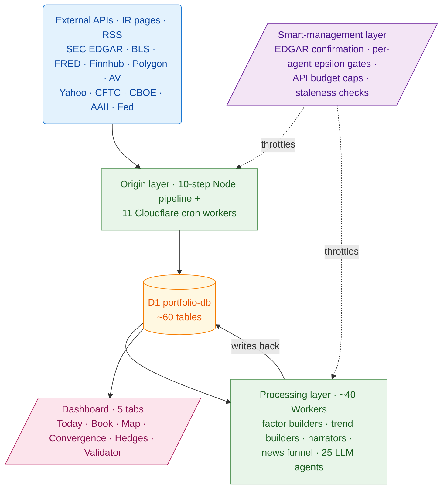
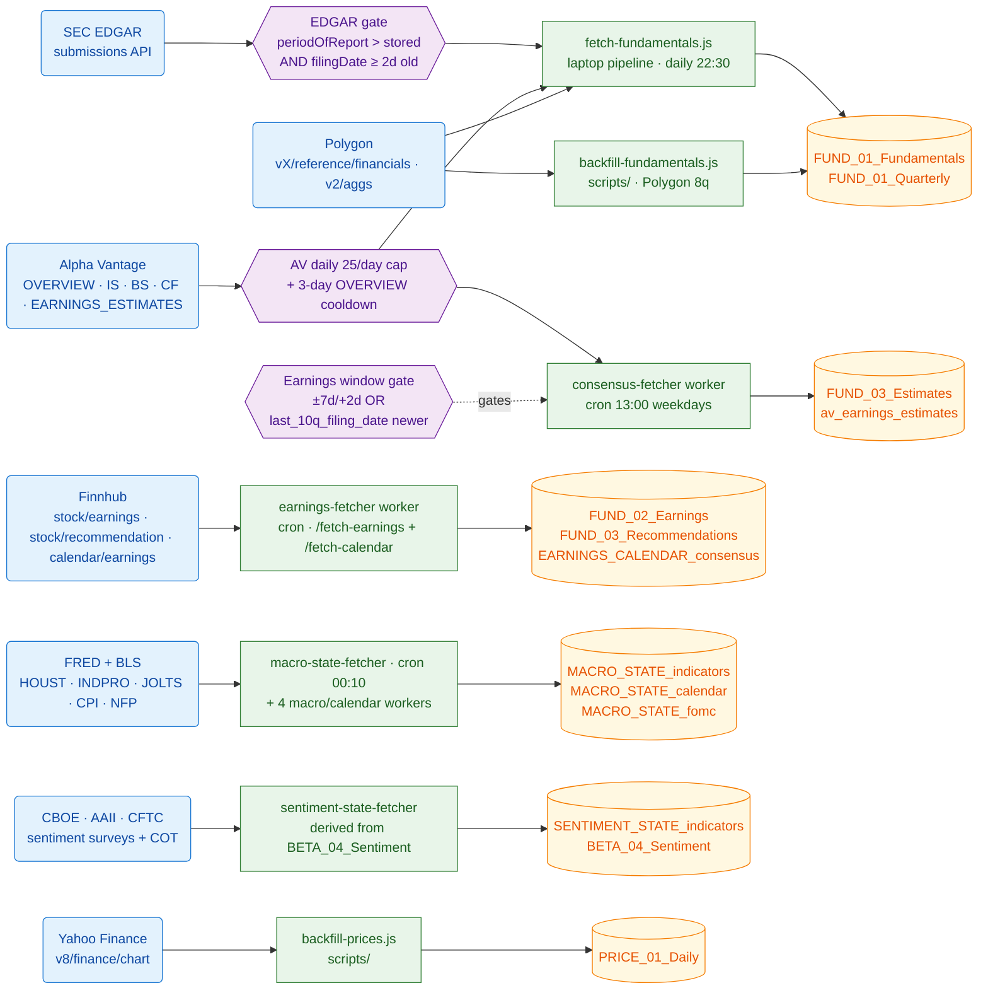
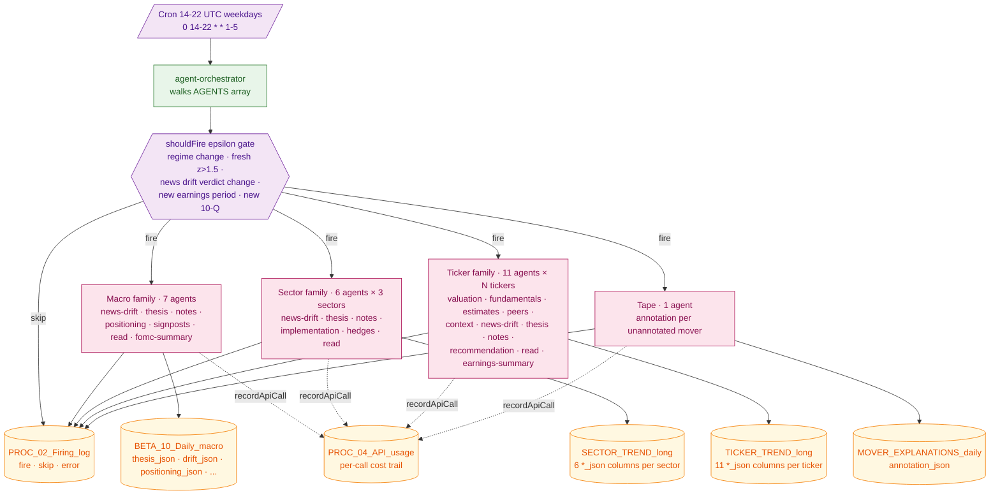
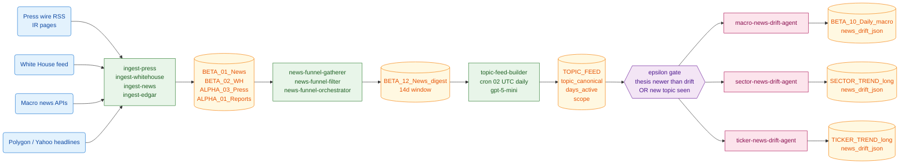
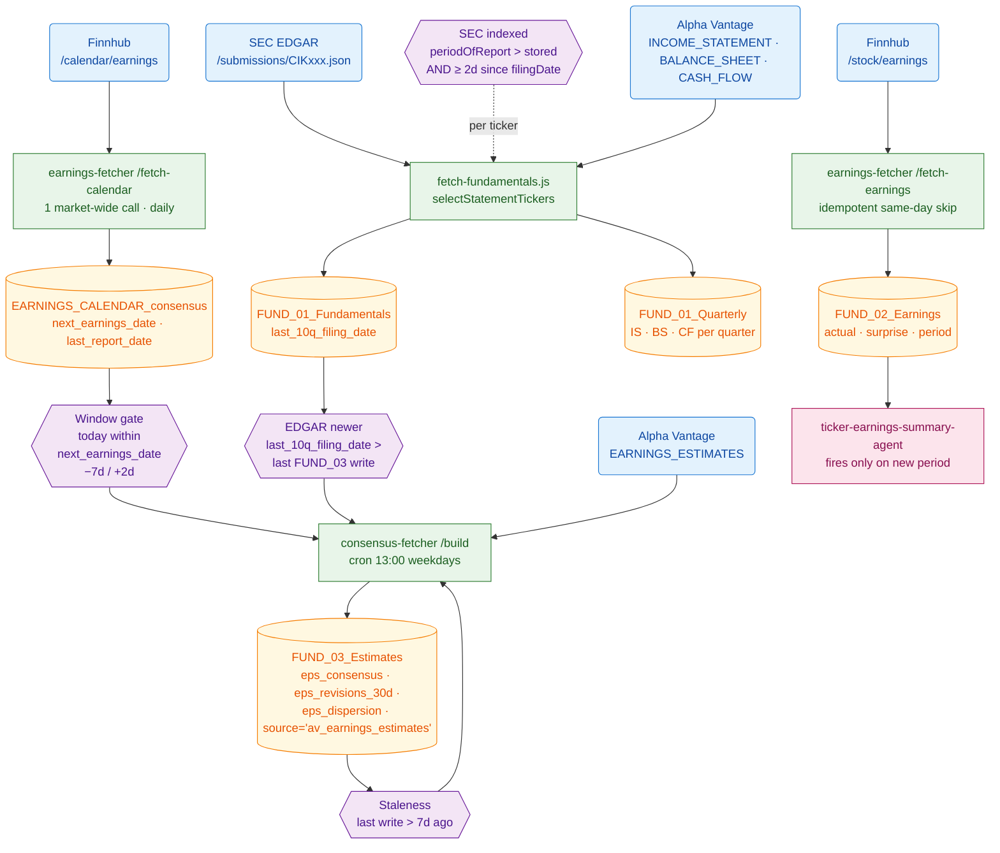
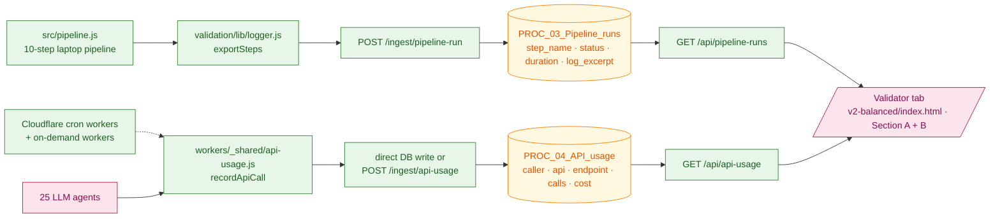

# Hedge Portfolio — System Reference (v2)

**Subtitle:** Production reference. How the data flows from external sources to the dashboard, what every agent does, every standard prompt verbatim, every term defined.

**Repository:** `/Users/gines/Hedge-Portfolio`
**Snapshot:** 2026-05-06 — post MS-6 (historical-init), MS-7 (validator tab), and the bug-hunt sprint.
**Audience:** the operator. Read this to validate any number, gate, or LLM output that lands on the dashboard.

This document supersedes `SYSTEM_REFERENCE.md` (April 2026). It reflects the 25-agent fan-out, the EDGAR-confirmation triggers, and the Validator tab.

---

# Part 0 · How to use this document

The system is one large pipeline. **Raw external data → ingested → stored in D1 → processed by ~40 Cloudflare Workers (deterministic + LLM) → queried by the dashboard.** Every visible field has a chain.

If a number on the dashboard looks wrong, walk these in order:

1. **Part 1 — System map.** Find which pipeline produced the field.
2. **Part 2 — Pipeline diagrams.** Trace the flow. Each diagram fits on one A4 page so you can scan it without zooming.
3. **Part 3 — Cron schedule.** Confirm the relevant trigger fired today.
4. **Part 4 — Triggers & gates.** Smart gating means a worker may have *correctly* skipped. Check whether its gate engaged.
5. **Part 5 — Agent prompts.** If the field came from an LLM, read the verbatim prompt to verify the output obeys the rules.
6. **Part 6 — Validator tab + observability.** If the cron silently failed, this is where you'll see it.
7. **Part 7 — Glossary.**

The cron schedule (Part 3) and the gates (Part 4) are the two pages that get the most use during incident triage.

## Reading conventions for diagrams

Every node in a Mermaid diagram has a tag prefix:

| Tag | Shape           | Layer                       |
|-----|-----------------|------------------------------|
| `R` | rounded         | external source / API        |
| `C` | rectangle       | code module / worker         |
| `T` | cylinder        | D1 table                     |
| `A` | hexagon         | LLM agent                    |
| `G` | parallelogram   | gate / smart-management check |
| `D` | parallelogram   | dashboard surface            |

Tag numbering is **local to each diagram**.

---

# Part 1 · System at a glance



Three things distinguish the post-MS-6 system from the April snapshot:

1. **25 LLM agents** (7 macro · 6 sector · 11 ticker · 1 tape) writing structured JSON into `BETA_10_Daily_macro`, `SECTOR_TREND_long`, and `TICKER_TREND_long`. Each agent has a `shouldFire()` epsilon gate so it only burns OpenAI credits on real signal change.
2. **EDGAR-confirmation triggers** — AV statement endpoints (IS/BS/CF) AND AV consensus refresh both gate on the SEC `/submissions` API confirming a new 10-Q has actually been filed. The Finnhub-derived "expected earnings date" is a hint, not a trigger.
3. **PROC_03 / PROC_04 observability tables** + a Validator tab. Pipeline-step status and per-API-call cost are now persisted, so a 10-day silent stall (like the OpenAI 429 quota in late April) becomes visible at a glance instead of dying in worker logs.

\pagebreak

# Part 2 · Pipeline diagrams

## 2.1 Data ingestion — sources to D1



**Smart gates summarised:**

- **G1 (EDGAR)** — `fetch-fundamentals.selectStatementTickers()` queries SEC `/submissions/CIKxxx.json`. A ticker is fetched only when SEC's latest `periodOfReport` exceeds our stored value AND filing is ≥ `AV_INDEX_LAG_DAYS` (2) old (so AV has had time to index it).
- **G2 (AV budget)** — Two callers share the 25/day Alpha Vantage free tier. `fetch-fundamentals` adds a per-ticker 3-day OVERVIEW cooldown; `consensus-fetcher` adds the window/staleness/EDGAR triple gate (G3). Each AV call writes the canonical `AV_BUDGET <date> <endpoint> <ticker> <ok|fail>` log line.
- **G3 (Earnings window)** — `consensus-fetcher` fires for a ticker when (a) `today` is within `next_earnings_date − 7d` to `+ 2d`, OR (b) `last_10q_filing_date > last consensus write` (EDGAR-confirmed print landed), OR (c) last consensus write is > 7 days stale. Closes the gap between Finnhub's *expected* earnings date and SEC's *confirmed* filing.

## 2.2 Agent orchestrator — 25-agent fan-out



**Per-agent epsilon gates** are evaluated before each LLM call. Examples:

- **macro-thesis** fires when the deterministic regime classifier flips, OR a panel indicator with `|z_vs_24m| > 1.5` has landed since the last write, OR the news-drift verdict changed.
- **ticker-thesis** fires on first run, OR when the ticker's fundamentals/estimates/peers/news-drift inputs have a newer `*_updated_at` than the thesis itself.
- **ticker-earnings-summary** fires only when `MAX(FUND_02_Earnings.period)` ≠ the stored `earnings_period_at_write` — i.e. a new print has actually filed.
- **tape-annotation** fires only when there are unannotated movers (`annotation_json IS NULL`).

The orchestrator records every fire/skip/error to `PROC_02_Firing_log` so an analyst can answer "why didn't this panel update?" by reading one row.

## 2.3 News funnel — sources to drift verdicts



`TOPIC_FEED` is the seam between raw news and AI interpretation. A topic with `days_active ≥ 14` is "structural"; a topic that just appeared is "fresh". The drift agents compare the current topic feed against the prior-day's set of thesis drivers/tripwires, then write a `confirms | weakens | contradicts` verdict. The verdict is what the macro/sector/ticker thesis agents read on their next run.

If `topic-feed-builder` stalls (e.g. OpenAI quota exhausted), every drift agent's gate sees no new topics → every agent skips → every panel freezes silently. This is exactly the failure mode the Validator tab was built to expose: the topic-feed-builder now writes its calls (success and 429-fail) to `PROC_04_API_usage`, so a stall surfaces as "N calls / $0.00" on the dashboard instead of dying in worker logs.

## 2.4 Earnings & EDGAR-confirmation flow



The user-asked sequence in plain English:

1. **Daily** Finnhub `/calendar/earnings` returns expected print dates → upserted to `EARNINGS_CALENDAR_consensus.next_earnings_date`.
2. **Hint, not trigger.** That date is an *estimate*. Companies pre-announce or shift.
3. **Truth** comes from SEC EDGAR `/submissions`. When the new 10-Q's `periodOfReport > stored`, AND it's been at least `AV_INDEX_LAG_DAYS` since SEC `filingDate`, `fetch-fundamentals` pulls the AV statement endpoints AND tags the row with `last_10q_filing_date = sec.filingDate`.
4. **Consensus refresh** in `consensus-fetcher` reads `MAX(last_10q_filing_date)` per ticker and fires whenever it's newer than the last `FUND_03_Estimates` write — that is, AV consensus refresh is triggered the moment EDGAR confirms the print actually landed, not when Finnhub's estimate said it would.

## 2.5 Validator tab — observability flow



Section A (left half of Validator tab) renders one row per pipeline step (PRESS / WH / EDGAR / MACRO / SENTIMENT / FUNDAMENTALS / UPLOAD / VALIDATION / VERIFY / SYNC) with status badges. Click a row to expand its `log_excerpt` (last 500 chars).

Section B (right half) aggregates last-7-day API usage across vendors (alphavantage / openai / gemini / polygon / finnhub / fred / yahoo). The big number is **today's total $**. The flat table breaks it down by `api · endpoint`, with `25/day cap` flagged on Alpha Vantage rows.

Failed calls (HTTP 429, network errors) increment the `calls` counter but write `cost_usd = 0` — a sustained quota stall reads as "N calls / $0.00" instead of inflating the spend chart.

\pagebreak

# Part 3 · Cron / cadence summary

| Time (UTC)  | Trigger / scope                                | What happens |
|-------------|------------------------------------------------|--------------|
| `00:00`     | `economic-calendar-fetcher` cron               | Finnhub econ calendar → `MACRO_STATE_calendar` |
| `00:00`     | `fomc-statement-fetcher` cron                  | Fed RSS → `MACRO_STATE_fomc` |
| `00:10`     | `macro-state-fetcher` cron                     | FRED + BLS panel → `MACRO_STATE_indicators` |
| `00:30`     | `ism-fetcher` cron                             | ISM PMI → `MACRO_STATE_indicators` |
| `00:35`     | `naaim-fetcher` cron                           | NAAIM exposure index → `MACRO_STATE_indicators` |
| `01:00`     | `yfinance-cross-asset-fetcher` cron            | DGS · DXY · VIX · WTI · GOLD · COPPER · OAS → `MACRO_STATE_indicators` |
| `01:15`     | `valuation-curve-builder` cron (events)        | Re-runs short-curve LLM on event |
| `01:30`     | `valuation-curve-builder` cron (floor)         | Re-runs long-curve LLM at floor cadence |
| `02:00`     | `topic-feed-builder` cron                      | Clusters last 14d of `BETA_12_News_digest` → `TOPIC_FEED` |
| `13:00 1-5` | `consensus-fetcher` cron (weekdays only)       | AV `EARNINGS_ESTIMATES` for gated tickers → `FUND_03_Estimates` |
| `14-22 1-5` | `agent-orchestrator` cron (hourly, US hours)   | Walks 25 agents · gates · fires LLM if signal changed |
| `22:30`     | `hedge-pipeline.timer` (Linux, laptop)         | 10-step pipeline: scrape → ingest → upload → validate → verify → sync |

The Linux timer at 22:30 is the heaviest run: it does press / WH / news / EDGAR / macro / sentiment / fundamentals / upload / validation / verify / sync. The 11 Cloudflare crons cover sources that publish at midnight UTC and event-driven LLM runs through the day.

---

# Part 4 · Triggers & gates (smart management)

Every metered API call and every LLM call is gated. Two non-event-driven daily crons (FRED panel + Finnhub calendar) are deliberate exceptions — both are unmetered and cheap.

| Surface | Source of truth | Trigger / gate | Source file |
|---|---|---|---|
| AV statements (IS · BS · CF) | EDGAR `/submissions` | `periodOfReport > stored` AND filing ≥ `AV_INDEX_LAG_DAYS` (2) | `src/steps/fetch-fundamentals.js:268` |
| AV `OVERVIEW` | last `pe_ratio` write | per-ticker 3-day cooldown | `src/steps/fetch-fundamentals.js` (MS-6.0b) |
| AV `EARNINGS_ESTIMATES` | calendar OR EDGAR OR staleness | `inWindow(±7d/+2d)` OR `last_10q_filing_date > last write` OR last write > 7d | `workers/consensus-fetcher/src/worker.js` |
| Finnhub `/stock/earnings` | same-day idempotency | skip if all 25 tickers stamped today | `workers/earnings-fetcher/src/worker.js:38` |
| Finnhub `/calendar/earnings` | daily refresh | one market-wide call | `workers/earnings-fetcher/src/worker.js fetchCalendar` |
| Press / WH / News ingest | per-day discovery file | skip if today's file already produced | `src/steps/ingest-*.js` |
| Macro indicators | FRED release dates | daily cron + per-row idempotent upsert | `workers/macro-state-fetcher` |
| **All 25 LLM agents** | per-agent epsilon | regime change · fresh `\|z\|>1.5` · drift verdict change · new earnings period · new 10-Q | `workers/agent-orchestrator/src/worker.js:303–1110` |
| Tape annotation | unannotated movers | fires only on dates with `annotation_json IS NULL` | `workers/agent-orchestrator/src/worker.js:1104` |
| `topic-feed-builder` | cron + headline freshness | daily 02:00 · skips when no new BETA_12 rows in window | `workers/topic-feed-builder/src/worker.js` |
| AV daily 25/day budget | log + dashboard | `AV_BUDGET <date> <endpoint> <ticker> <ok\|fail>` console line; surfaces on Validator tab | `src/steps/fetch-fundamentals.js`, `workers/consensus-fetcher/src/worker.js` |

\pagebreak

# Part 5 · Standard agent prompts (verbatim)

The 25 per-ticker / per-sector instances all share a single template per agent **type**. Below is the canonical prompt for each — exactly what the LLM receives, with `{VARIABLE}` placeholders showing interpolations.

## 5.1 Macro thesis — `macro-thesis-agent` · gpt-5

System: senior macro strategist maintaining "the macro story right now and whether it is intact."

```
You are a senior macro strategist at a hedge fund. Maintain "the macro story right
now and whether it is intact" in a single paragraph plus structured drivers and
tripwires.

REGIME (deterministic classifier)
  Label: {REGIME}
  Confidence: {CONF_PCT}

CROSS-ASSET STATE (latest snapshot per series — value | 1m delta | Z vs 24m trend)
{CROSS_BLOCK}

MACRO INDICATOR PANEL (latest release per series — value | 1m delta | Z vs 24m trend)
{PANEL_BLOCK}

MACRO NEWS DRIFT
  Verdict: {DRIFT_VERDICT}
  Driver drift signs: {DRIFT_DRIVER_DRIFT}
  Tripwires fired:    {DRIFT_TRIPWIRES_FIRED}

PREVIOUS THESIS (do NOT rewrite if inputs barely moved — drift gradually)
{PREV_BLOCK}

TASK
Output EXACTLY this JSON (no surrounding prose, no markdown fences):
{
  "prose": "<paragraph 4-7 sentences. Reference specific values, not generic
            descriptions, e.g. 'core CPI cooled to 2.9%, the third miss in four
            months' or 'claims at 232k still below the 270k tripwire by 38k'>",
  "drivers": [{ "name": "<3-6 word interpretive frame>",
                "rationale": "<one sentence with values>" }],
  "tripwires": [{ "id": "<short slug>",
                  "condition": "<measurable, e.g. 'HY OAS > 500bps'>",
                  "currently": "<where we are vs threshold, with actual number>" }]
}

RULES
- 3–5 drivers. 3–5 tripwires.
- Drivers are interpretive frames. Tripwires are MEASURABLE conditions whose
  breach would break the thesis.
- Ground every claim in the indicator values above. Do not cite numbers not in
  the panel or cross-asset state.
- If previous thesis still holds, keep drivers/tripwires; only swap when data
  demands. Edit prose to reflect fresh values.
- Take a position. Avoid "may", "could go either way". Land on intact /
  weakening / breaking.
```

## 5.2 Macro news drift — `macro-news-drift-agent` · gpt-5

```
You are a senior macro strategist running the news-drift step. For each topic in
the 14-day macro topic feed, decide whether it confirms / weakens / contradicts
one of the THESIS DRIVERS, and whether it fires one of the TRIPWIRES. Then write
a paragraph and land on a verdict.

THESIS DRIVERS (the only valid driver_drift keys)
{DRIVERS_BLOCK}

THESIS TRIPWIRES (the only valid tripwires_fired ids)
{TRIPWIRES_BLOCK}

TOPIC FEED (14d window — topic_id | days_active | mention_count | source_count | score)
{TOPICS_BLOCK}

PREVIOUS DRIFT (drift gradually)
{PREV_BLOCK}

TASK — output EXACTLY this JSON:
{ "verdict": "intact" | "weakening" | "breaking",
  "prose":   "<3-5 sentences referencing topic ids and concrete numbers>",
  "driver_drift": { "<driver_name>": "+1 | 0 | -1" },
  "tripwires_fired": ["<tripwire_id>", ...] }

RULES
- driver_drift keys MUST be drawn from {DRIVER_NAMES_JSON}.
- tripwires_fired ids MUST be drawn from {TRIPWIRE_IDS_JSON}.
- "intact" = no driver weakening, no tripwire fired.
- "weakening" = at least one driver_drift = -1, no tripwire fired.
- "breaking" = at least one tripwire fired OR ≥ 2 drivers at -1.
```

## 5.3 Sector thesis — `macro-sector-thesis-agent` · gpt-5 (per sector)

Same shape as 5.1 but scoped:
- `INPUT.sector`, `INPUT.constituents` (tickers in the sector).
- Drivers must be sector-specific (e.g. "AI capex cycle", "regulator overhang").
- Tripwires must be measurable on sector factors (e.g. `sector_relative_pe > 1.5σ`).
- Adds a `tickers_at_risk` array — names from `constituents` that the thesis flags as most exposed if a tripwire fires.

\pagebreak

## 5.4 Ticker thesis — `ticker-thesis-agent` · gpt-5 (per ticker)

```
You are a senior equity analyst maintaining the load-bearing thesis for {TICKER}
(sector: {SECTOR}). One paragraph plus 3-5 named drivers and 3-5 measurable
tripwires.

NOTE: structural-narrative search via Gemini is NOT YET WIRED. Derive drivers
from FUNDAMENTALS reading + NEWS DRIFT signs + the macro/sector frame.

MACRO REGIME
  Label: {MACRO_REGIME}

MACRO THESIS DRIVERS (top-level frame)
{MACRO_DRIVERS_BLOCK}

{SECTOR} SECTOR THESIS DRIVERS (sector frame)
{SECTOR_DRIVERS_BLOCK}

FUNDAMENTALS READING (#2 output)
{FUND_BLOCK}

NEWS DRIFT (#6 output)
{DRIFT_BLOCK}

PREVIOUS THESIS
{PREV_BLOCK}

TASK — output EXACTLY this JSON:
{
  "prose": "<4-7 sentences. Cite specific ratios / numbers / events. Reference
            macro and sector frames where they bear on this name. Do NOT cite
            numbers not in the input>",
  "drivers": [{ "name": "<frame>", "rationale": "<one sentence with values>" }],
  "tripwires": [{ "id":"<slug>", "condition":"<measurable>",
                  "currently":"<distance to threshold>" }]
}
```

## 5.5 Ticker valuation — `ticker-valuation-agent` · gpt-5

```
You are a buy-side analyst producing a SHORT-TERM valuation read for {TICKER}.

THE STOCK PRICE IS INTENTIONALLY NOT PROVIDED. Do not estimate or infer it.
Derive verdict strictly from fundamental anchors + sector context + drivers.

STOCK_FACTORS_daily (latest)
{FACTORS_BLOCK}

FUND_01_Fundamentals (latest)
{FUND_BLOCK}

SECTOR_FACTORS_daily (latest)
{SECTOR_BLOCK}

THESIS DRIVERS (from #7)
{DRIVERS_BLOCK}

PREVIOUS VALUATION
{PREV_BLOCK}

TASK — output EXACTLY this JSON:
{
  "prose":   "<paragraph 3-5 sentences citing specific multiples and Z-scores>",
  "verdict": "cheap" | "fair" | "expensive",
  "vs_what": "peer median" | "sector median" | "own history",
  "premium_vs_peer": <number — fwd_pe minus peer_median_pe; null if either missing>,
  "key_drivers_cited": ["<driver name from drivers block>", ...]
}

RULES
- "cheap" / "fair" / "expensive" are versus the comp set the analyst chooses.
- Cite at least one ratio with its sigma (e.g. "fwd_pe 32.1, +1.2σ vs sector").
- Do NOT cite the stock price. Do NOT invent peer values.
```

## 5.6 Ticker peers — `ticker-peers-agent` · gpt-5 (with annotated-gap fallback)

```
You are a senior equity analyst writing the peer-comps reading for {TICKER}
(sector: {SECTOR}). One short paragraph placing it against the peer table and
the sector median, then a verdict on the relative premium.

PEER TABLE (target marked with ★)
  ticker  | fwd_pe | OPM | profit_m | mom_12_1 | rs_vs_sector_3m | mkt_cap | rev_yoy
  --------+--------+-----+----------+----------+-----------------+---------+--------
{PEER_BLOCK}

SECTOR MEDIAN
{SECTOR_BLOCK}

PREVIOUS PEERS READING
{PREV_BLOCK}

TASK — output EXACTLY this JSON:
{ "prose": "<3-5 sentences. Cite at least one peer by ticker and one number>",
  "relative_position": "outlier" | "middle" | "laggard",
  "premium_status":    "earned" | "stretched" | "none" }

RULES
- "outlier" = clearly above peer median on growth + margins. "laggard" = below.
- "earned" = multiple premium matched by superior margins / momentum.
  "stretched" = premium without the supporting metrics. "none" = at-or-below
  peer median.
- Cite {TICKER}'s number first, then peer median, in the same sentence.
- Do not cite a metric marked "(unavailable)" for {TICKER} OR the peer median.
```

**Annotated-gap fallback** (no LLM call). When zero peers have rows in
`STOCK_FACTORS_daily` / `FUND_01_Fundamentals` (e.g. UNH → ELV/HUM/CNC are
absent from the portfolio universe), the agent writes a synthetic `peers_json`
directly: `relative_position: "n/a"`, `premium_status: "insufficient peer
coverage"`, plus a prose explainer naming the missing peers. The slide-out
card renders the gap annotation instead of breaking.

\pagebreak

## 5.7 Ticker news drift — `ticker-news-drift-agent` · gpt-5

```
You are a senior equity analyst running the news-drift step for {TICKER}. For
each topic in the 14-day ticker feed, decide whether it confirms / weakens /
contradicts one of the THESIS DRIVERS, and whether it fires one of the
TRIPWIRES. Then write a paragraph and land on a verdict.

THESIS DRIVERS (the only valid driver_drift keys)
{DRIVERS_BLOCK}

THESIS TRIPWIRES (the only valid tripwires_fired ids)
{TRIPWIRES_BLOCK}

TICKER TOPIC FEED (14d window — topic_id | days_active | mention_count | score)
{TOPICS_BLOCK}

PREVIOUS DRIFT
{PREV_BLOCK}

TASK — output EXACTLY this JSON:
{ "verdict": "intact" | "weakening" | "breaking",
  "prose":   "<3-5 sentences citing topic ids and numbers>",
  "driver_drift":   { "<driver_name>": "+1 | 0 | -1" },
  "tripwires_fired": ["<tripwire_id>", ...] }
```

## 5.8 Ticker earnings summary — `ticker-earnings-summary-agent` · gpt-4.1-mini (per quarter cache)

```
You are an equity analyst summarising {TICKER}'s most recent earnings print
({PERIOD}) for the slide-out's earnings card. The output is cached until the
next 10-Q lands.

EARNINGS HEADLINE NUMBERS
  Period:        {PERIOD}
  EPS actual:    {EPS_ACTUAL}      (estimate {EPS_EST}, surprise {EPS_SURPRISE_PCT}%)
  Revenue:       {REV_ACTUAL}      (estimate {REV_EST}, surprise {REV_SURPRISE_PCT}%)
  Report date:   {REPORT_DATE}

EXTERNAL HEADLINES IN THE WINDOW (±5 trading days around the print)
{HEADLINES_BLOCK}

TASK — output EXACTLY this JSON:
{ "prose":   "<3-5 sentences leading with the surprise, followed by the
              one-line interpretation analysts gave it>",
  "verdict": "beat" | "miss" | "in_line",
  "magnitude": "small" | "material" | "exceptional" }

RULES
- "beat" / "miss" must agree with surprise sign (>= +2% beat / <= -2% miss).
- magnitude reflects market impact: small <= 0.3σ; material 0.3-1σ; exceptional > 1σ.
- Cite the surprise % with sign in the first sentence.
```

## 5.9 Tape annotation — `tape-annotation-agent` · gpt-5-mini (per unannotated mover)

```
You are writing a CAUTIOUS one-sentence tape annotation for a stock move. The
contract is "tag, never claim" — you may suggest a possible association with one
of the candidate topics, but you must NEVER assert causation.

THE MOVE
  {DATE}  {TICKER}  {ARROW}{MOVE_PCT}%   (rank {RANK} {DIRECTION} mover)

CANDIDATE TOPICS (pre-filtered: ticker-scoped, visible at-or-before the move)
{CANDIDATES_BLOCK}

TASK — output EXACTLY this JSON:
{ "sentence":   "<ONE sentence ≤ ~25 words. MUST contain a cautious phrase like
                 'possibly', 'tentatively', 'may be tied to', 'could be
                 associated with'>",
  "topic_id":   "<one of {IDS_JSON} OR null>",
  "confidence": "low" | "medium" }

RULES
- The sentence MUST contain at least one of: "possibly", "tentatively", "may
  be tied", "could be associated", "could be tied", "may be associated".
- The sentence MUST NOT contain causal verbs: "caused", "drove", "because of",
  "due to", "as a result", "triggered by", "the reason".
- topic_id MUST be one of the candidate ids OR null. Never invent an id.
- Reference the topic by its canonical label, NOT its id, in the sentence.
```

\pagebreak

## 5.10 Topic-feed-builder — `topic-feed-builder` · gpt-5-mini · daily 02:00

```
You are a senior news editor. Cluster the headlines below into canonical topic
groups for the trailing 14-day window. Each cluster gets a scope ('ticker:NVDA',
'sector:Technology', 'macro:rates', etc.) and a stable canonical label.

HEADLINES (last 14d, ordered newest-first within each day)
{HEADLINES}

TASK — output EXACTLY this JSON:
{ "clusters": [
    { "scope": "ticker:NVDA" | "sector:Technology" | "macro:rates" | ...,
      "topic_canonical": "<specific label, e.g. 'Fed signals September pause'>",
      "source_ids": ["<headline id>", ...] }
  ] }

RULES
- Aim for tight, meaningful clusters. Singletons are fine if the story is
  significant; otherwise prefer to merge.
- topic_canonical must be specific (e.g. "Fed signals September pause", not
  "monetary policy"). It is the de-duplicated label across all days.
- Use the input "ticker" / "category" fields as hints for scope.
```

The orchestrator wraps this call with `recordApiCall(ok)` so a stall (HTTP 429
quota or transient 5xx) writes a row to `PROC_04_API_usage` with `cost = 0`. A
sustained outage shows on the Validator tab as "topic-feed-builder · openai/
gpt-5-mini · N calls / $0.00".

## 5.11 News-funnel filter — per-ticker (gpt-5-mini · 25 calls per run)

System: `You are an equity analyst selecting the most market-moving headlines for a specific US stock. Output JSON only.`

```
TICKER: {TICKER}
TODAY: {TODAY}
HEADLINES: {COMPACT_HEADLINE_LIST}

TASK: Pick the 1 to 4 most market-relevant headlines for {TICKER}.

RULES
- 1 minimum. Up to 4 ONLY if multiple genuinely material events happened.
- Prefer today's news. Older only if frequency ≥ 3.
- Focus: earnings, product launches, M&A, regulatory, executive changes,
  lawsuits, guidance, analyst actions.
- IGNORE: generic conferences, SEO content, irrelevant geographies, opinions.
- Use EXACT titles from the list — do not invent.

MAGNITUDE (granular, sign matches sentiment)
  0.05 - 0.20 trivial   (analyst tweak)
  0.25 - 0.45 mild
  0.50 - 0.70 moderate  (clear meaningful event)
  0.75 - 0.90 strong    (earnings beat/miss with raised/cut guide)
  0.91 - 1.00 exceptional (existential — fraud, takeover, recall)

OUTPUT (strict JSON, no markdown):
{ "headlines": [{ "rank":1, "title":"...", "source":"...", "date":"YYYY-MM-DD",
                  "frequency":1, "relevance":"...",
                  "sentiment":"bullish|bearish|neutral",
                  "magnitude":-1.0..1.0 }] }
```

## 5.12 Big-movers-why · gpt-5 · top-5 up + top-5 down per day

```
You are a senior equity analyst. Explain why {TICKER} moved {ARROW}{PCT}% today
({DATE}). Ground the explanation in the ticker-specific news and press below.

TICKER: {TICKER}
MOVE: {MOVE_PCT}%   (direction {DIRECTION}, rank #{RANK})
DATE: {DATE}
TODAY'S HEADLINES: {HEADLINES_BLOCK}
RECENT PRESS:      {PRESS_BLOCK}

TASK — output EXACTLY this JSON:
{ "thesis":   "one sentence: the single reason this stock moved today",
  "headline": "the single most relevant headline title (or empty)",
  "bullets":  [{"text":"<20w bullet","bias":"bull|bear|neutral"}] }

RULES
- thesis < 25 words, concrete.
- 2-4 bullets sorted by explanatory power.
- Ground in headlines/press above. If NO news explains the move, say so
  (e.g. "No material news — likely broad market / sector flows").
- DO NOT invent events.
```

\pagebreak

## 5.13 Press summary — `press/summary.js` · gpt-4o-mini

```
Analyze the following press release. Output JSON ONLY, no commentary.

TASK 1: Write a short factual summary (plain English, no opinions, no spin).
TASK 2: Classify the EVENT TYPE (not the tone):
  sentiment: "bullish" | "bearish" | "neutral"
  magnitude: 0.0-1.0 (market materiality)

CRITICAL RULES
- IGNORE the press release's tone. Companies always spin positively.
- Judge the underlying EVENT, not the wording.
- "Layoffs", "restructuring", "guidance cut", "product recall", "SEC investigation"
  → bearish (regardless of positive spin).
- "Earnings beat", "major contract", "FDA approval", "flagship product launch",
  "large buyback" → bullish.
- "Minor product update", "routine appointment", "conference attendance"
  → neutral with low magnitude.
- 0.1 = routine, 0.5 = notable, 0.9 = very material.

OUTPUT: { "summary":"...", "sentiment":"...", "magnitude":0.0 }
TEXT: {RAW_PRESS_TEXT}
```

## 5.14 Hallucination checker — `validation/agents/hallucination-checker.js` · gpt-4o-mini

```
You are a fact-checking agent. Compare the SUMMARY against the SOURCE CONTENT.

SOURCE CONTENT: """ {TRUNCATED_SOURCE} """
SUMMARY:        """ {SUMMARY} """

Respond with ONLY valid JSON (no markdown):
{ "hasHallucinations": true/false,
  "score": 0-100,
  "verifiedFacts": [{ "fact":"...", "evidence":"..." }],
  "issues":         [{ "claim":"...", "problem":"..." }],
  "analysis": "..." }

Always populate verifiedFacts with the key claims you checked, even when there
are no hallucinations.
```

## 5.15 Operations agent — `workers/operations-agent` · gpt-5

```
You are a senior PM at a hedge fund. Generate suggested OPERATIONS for the
{SECTOR} sector based on ticker-level trends and macro context.

MACRO CONTEXT: {regime, window, drivers}
SECTOR TICKER TRENDS: {TICKER_BLOCK}
PREVIOUS OPERATIONS (stability): {PREVIOUS_OPS_BLOCK}

OUTPUT
{ "operations":[{ "action":"buy|sell|short", "ticker":"SYM",
    "action_counter":"short|sell|buy|null",
    "counter_ticker":"SYM or SPY|null",
    "risk":"low|medium|high",
    "thesis":"...", "bullets":[...] }],
  "sector_view":"...",
  "changes_from_previous":"..." }

RULES
- 1-4 operations per sector. Quality over quantity.
- Each can be: simple long, market-paired (X / short Y in sector), or
  hedged vs SPY.
- "sell" means close an existing long, NOT short-sell.
- Stability: if previous operations still hold, KEEP THEM.
- It is LEGITIMATE to have zero operations.
```

\pagebreak

# Part 6 · Validator tab + observability tables

Two tables created in migration `0049_add_pipeline_observability.sql`.

## `PROC_03_Pipeline_runs` — one row per (run_date, step_name)

| Column        | Type    | Meaning |
|---------------|---------|---------|
| `run_date`    | TEXT    | YYYY-MM-DD (PK part 1) |
| `step_name`   | TEXT    | PRESS · WH · EDGAR · NEWS · MACRO · SENTIMENT · FUNDAMENTALS · UPLOAD · VALIDATION · VERIFY · SYNC (PK part 2) |
| `status`      | TEXT    | `ok` · `warn` · `fail` · `skip` |
| `items`       | INT     | rows written / processed |
| `started_at`  | TEXT    | ISO timestamp |
| `completed_at`| TEXT    | ISO timestamp |
| `duration_ms` | INT     | computed |
| `error`       | TEXT    | nullable |
| `log_excerpt` | TEXT    | last ~500 chars of step's log lines |

Written by `validation/lib/logger.js exportSteps()` → POST `/ingest/pipeline-run` from the laptop pipeline's `finally` block in `src/pipeline.js`.

## `PROC_04_API_usage` — one row per (run_date, caller, api, endpoint)

| Column        | Type | Meaning |
|---------------|------|---------|
| `run_date`    | TEXT | YYYY-MM-DD |
| `caller`      | TEXT | `consensus-fetcher` · `topic-feed-builder` · etc. |
| `api`         | TEXT | `alphavantage` · `openai` · `gemini` · `polygon` · `finnhub` · `fred` · `yahoo` |
| `endpoint`    | TEXT | optional sub-resource (`gpt-5`, `EARNINGS_ESTIMATES`, ...) |
| `calls`       | INT  | counter (success + fail) |
| `cost_usd`    | REAL | rough estimate; `0` for failed calls and unmetered APIs |
| `budget_cap`  | INT  | 25 for AV; null otherwise (drives the headroom badge) |
| `updated_at`  | TEXT | last write |

Written by `workers/_shared/api-usage.js recordApiCall({ env, caller, api, endpoint, calls, ok })`. Workers with a D1 binding write directly; laptop callers POST to `/ingest/api-usage` instead.

The Validator tab proxies `/api/pipeline-runs` and `/api/api-usage?days=N` through `dashboard/server.js` and renders both sections with a status-badge + duration table (left) and a 7-day cost summary + per-vendor table (right). A sustained 429 streak shows up as **N calls / $0.00**.

\pagebreak

# Part 7 · Glossary

**Agent** — a Cloudflare Worker that runs an LLM prompt and writes structured JSON into a `*_TREND_long.*_json` column.

**AV_INDEX_LAG_DAYS** — empirical wait (default 2) between SEC `filingDate` and the day Alpha Vantage's `INCOME_STATEMENT` etc. start returning the new quarter. `fetch-fundamentals` won't try AV until this many days have passed.

**Annotated-gap fallback** — when an agent has no upstream data to interpret (e.g. `ticker-peers` finds no peer comp rows), it writes a synthetic JSON with `relative_position: "n/a"`, `premium_status: "insufficient peer coverage"`, plus an explanatory note, instead of throwing. Keeps the slide-out rendering.

**`days_active`** — for a `TOPIC_FEED` row, the count of distinct dates the topic has appeared in `BETA_12_News_digest` over the trailing 14 days. ≥14 = structural, 1-3 = fresh.

**Drift verdict** — `intact | weakening | breaking`, written by `*-news-drift-agent`. Drives whether the corresponding thesis agent re-fires.

**Epsilon gate** — the `shouldFire(db)` function each agent registers with the orchestrator. Decides whether the LLM is invoked or the prior version stands.

**EDGAR confirmation** — the SEC `/submissions` API returning a new 10-Q's `periodOfReport` past our stored value AND a `filingDate` ≥ `AV_INDEX_LAG_DAYS` old. Is the *real* trigger for AV statement + AV consensus refreshes, vs. Finnhub's *expected* `next_earnings_date`.

**`AV_BUDGET` log line** — single-line stamp emitted on every Alpha Vantage call: `AV_BUDGET <YYYY-MM-DD> <ENDPOINT> <TICKER> <ok|fail>`. The Validator tab and the pipeline-log greppers key on the `AV_BUDGET ` prefix.

**`fiscal_period_ending`** — quarterly end date as written by SEC + AV. Primary key (with `ticker`) for `FUND_01_Quarterly`. Drives the YoY comparison anchors that Piotroski-F needs.

**`TICKERS_BUILD_PHASE`** — the subset of the 25 portfolio names the agent-orchestrator currently fans out to. Started at `[NVDA, UNH, XOM]` (MS-4b), extended to `[+ AAPL, JPM]` on 2026-05-06 (MS-6f-mini). Full 22-ticker fan-out deferred until the OpenAI quota is replenished.

**`recordApiCall`** — the canonical helper at `workers/_shared/api-usage.js`. Every metered API call should pass through it (worker-side via D1 binding; laptop-side via `/ingest/api-usage`). Drives the Validator tab's cost view.

---

# Part 8 · Open follow-ups (as of 2026-05-06)

These are tracked in `docs/active/sprint-output/BUGS_FOUND_2026-05-06.md`. Not blockers for normal operation, but worth knowing while triaging:

1. **OpenAI quota exhausted** — blocks MS-6f (22-ticker fan-out), MS-6g (11-sector fan-out), `topic-feed-builder` (frozen since 2026-04-25), `assessment-engine`, and `big-movers-why`. All wait on credit replenishment. Once back online, the agents auto-recover via their epsilon gates (every gate's "no prior write" branch fires on first run).
2. **Wire `recordApiCall` into the rest of the agent fleet.** Today only `consensus-fetcher` and `topic-feed-builder` write to `PROC_04_API_usage`. The 25 ticker / sector / macro agents and `tape-annotation-agent` should follow the same pattern so silent stalls become visible.
3. **`MOVER_EXPLANATIONS_daily` 22 days stale + `SIGNAL_01_Assessment` 11 days stale.** Producers (`big-movers-why`, `assessment-engine`) have no cron and depend on `job-engine-workflow`'s job DAG. Decide whether to add a cron or document the on-demand trigger.
4. **`BETA_11_Macro_news`** — orphaned table (zero readers, zero writers). Drop in a future cleanup migration once confirmed unused.
