# Hedge Portfolio — System Reference

**Subtitle:** Production reference. Where every dashboard number comes from, what every agent does, every prompt verbatim, every term defined.

**Repository:** `/Users/gines/Hedge-Portfolio`
**Snapshot:** commit `8d9a83c` (April 2026)
**Audience:** the operator. Read this to validate that any number on the dashboard is real.

This document supersedes the prior `SYSTEM_REPORT.md` and `SYSTEM_DIAGRAMS.md` files. Everything is here.

---

# Part 0 · How to use this document

The system is one large pipeline. **Raw external data → scraped → stored in D1 → processed by workers (deterministic + LLM) → queried by the dashboard.** Every visible field on the dashboard has a chain.

If a number on the dashboard looks wrong, walk these sections in order:

1. **Part 2 — Visual atlas.** Find the panel's cluster. The Mermaid diagram shows the chain in one shot.
2. **Part 5 — Workers.** Find the worker that wrote the table the panel reads. Confirm its trigger fired.
3. **Part 6 — LLM prompts.** If the worker uses an LLM, read its exact prompt. The output should obey the rules in the prompt.
4. **Part 3 — Origin layer.** If the worker's input was wrong, walk back to the scraper that produced it.
5. **Part 8 — Known gaps.** If a panel renders empty / placeholder / hardcoded, it is probably listed here.
6. **Part 9 — Glossary.** If a term or acronym is unfamiliar, look it up here.

The **diagrams** (Part 2) and the **known gaps** (Part 8) are the two pages that get the most use during validation.

## Rendering Mermaid diagrams

The diagrams in Part 2 are written in **Mermaid**. They render natively in GitHub, VS Code (with the *Markdown Preview Mermaid Support* extension), Obsidian, Typora, HackMD, and Pandoc with `mermaid-filter`. For paper printing: open in VS Code's preview, then *File → Print → Save as PDF*. Or paste any single block into `mermaid.live` and export as SVG/PNG.

## Reading conventions for diagrams

Each cluster diagram has 5 layers. Every node carries a tag:

| Tag prefix | Shape           | Layer        | Color             |
|------------|-----------------|--------------|-------------------|
| `R<n>`     | rounded `(…)`   | source       | blue              |
| `C<n>`     | rectangle `[…]` | code module  | green             |
| `T<n>`     | cylinder `[(…)]`| D1 table     | yellow            |
| `A<n>`     | hexagon `{{…}}` | LLM agent    | pink              |
| `A<n>`     | subroutine `[[…]]` | deterministic agent | grey      |
| `D<n>`     | parallelogram `[/…/]` | dashboard field | purple    |

Tag numbering is **local to each cluster** — `R1` in cluster 1 is unrelated to `R1` in cluster 2. Each cluster is self-contained. A reference table directly below each diagram maps every tag to its file path / table / prompt section.

---

# Part 1 · System at a glance

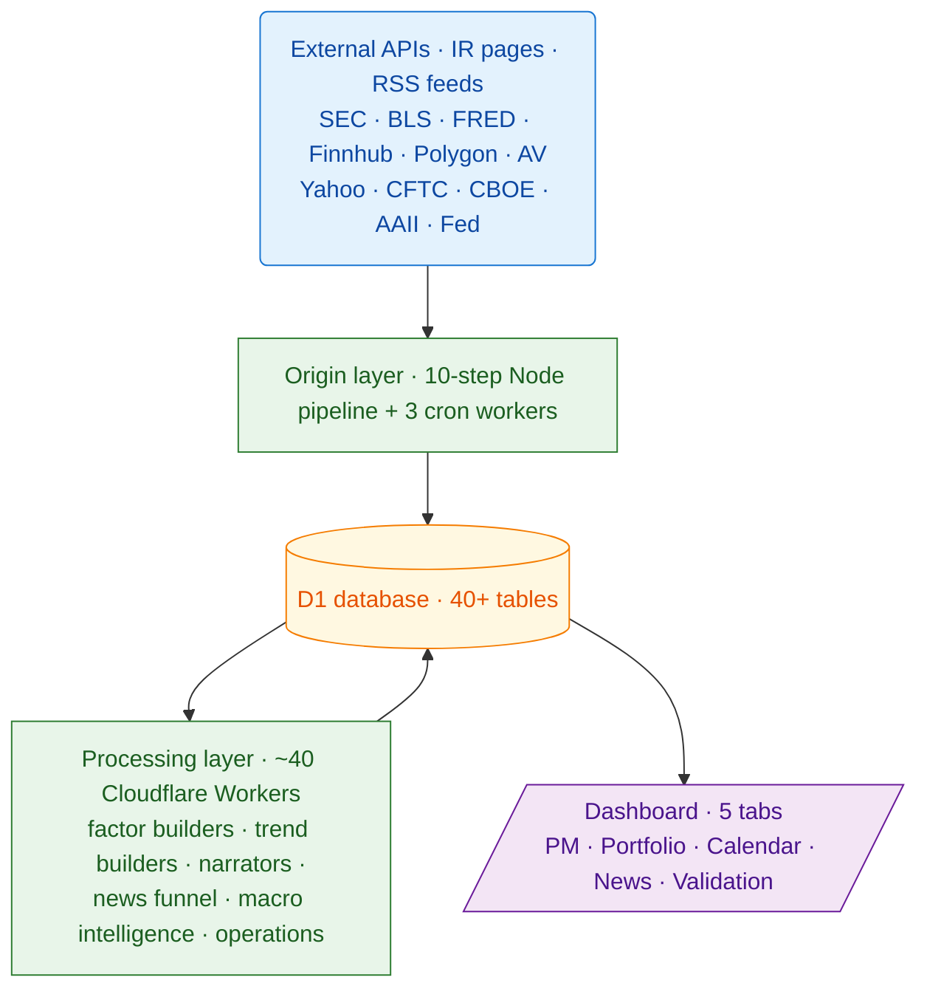
```mermaid
flowchart TD
    EXT(External APIs · IR pages · RSS feeds<br/>SEC · BLS · FRED · Finnhub · Polygon · AV<br/>Yahoo · CFTC · CBOE · AAII · Fed):::src
    ORI[Origin layer · 10-step Node pipeline + 3 cron workers]:::code
    DB[(D1 database · 40+ tables)]:::db
    PROC[Processing layer · ~40 Cloudflare Workers<br/>factor builders · trend builders · narrators ·<br/>news funnel · macro intelligence · operations]:::code
    DASH[/Dashboard · 5 tabs<br/>PM · Portfolio · Calendar · News · Validation/]:::ui

    EXT --> ORI --> DB --> PROC --> DB
    DB --> DASH

    classDef src fill:#e3f2fd,stroke:#1976d2,color:#0d47a1
    classDef code fill:#e8f5e9,stroke:#2e7d32,color:#1b5e20
    classDef db fill:#fff8e1,stroke:#f57c00,color:#e65100
    classDef ui fill:#f3e5f5,stroke:#6a1b9a,color:#4a148c
```

## Cron / cadence summary

| Time (UTC)  | Trigger                              | What happens                                                |
|-------------|--------------------------------------|-------------------------------------------------------------|
| `00:00`     | `economic-calendar-fetcher` cron     | Pulls Finnhub econ calendar → `MACRO_STATE_calendar`        |
| `00:00`     | `fomc-statement-fetcher` cron        | Refreshes FOMC statements → `MACRO_STATE_fomc`              |
| `00:10`     | `macro-state-fetcher` cron           | FRED + BLS → `MACRO_STATE_indicators`                       |
| `01:15`     | `valuation-curve-builder` cron       | Re-runs short-curve LLM if events fired                     |
| `01:30`     | `valuation-curve-builder` cron       | Re-runs long-curve LLM at floor cadence                     |
| `06:00`     | `narrator-dispatcher` safety sweep   | 7-day rebuild floor — re-runs any stale narrator            |
| `*/15 min`  | `narrator-dispatcher` event tick     | Polls source tables, fans out to narrator workers           |
| `22:30`     | `hedge-pipeline.timer` (Linux)       | Local 10-step pipeline — scrapers + ingest + workflow        |

The Linux pipeline at 22:30 fires the bulk of the daily refresh. Cloudflare cron workers cover macro releases (which AV/SEC publish at midnight UTC). The narrator dispatcher's 15-minute tick covers intra-day news + factor changes.

---

# Part 2 · Visual atlas

One Mermaid diagram per dashboard feature, plus a cross-reference at the end.

## Index of clusters

| #  | Feature                                               | Tab            |
|----|------------------------------------------------------|----------------|
| 1  | Regime card — verdict + lede + 4 macro chips          | Portfolio · L1 |
| 2  | Net-exposure gauge                                    | Portfolio · L1 |
| 3  | Style tilts                                           | Portfolio · L1 |
| 4  | Sector table + RRG + allocation bar                   | Portfolio · L2 |
| 5  | Stock shortlist + scatter                             | Portfolio · L3 |
| 6  | Portfolio book — KPIs · NAV · positions · weights · trail | PM · Portfolio |
| 7  | Attribution waterfall                                 | Portfolio · L5 |
| 8  | Calibration + closed trades                           | Portfolio · L5 |
| 9  | Calendar tab                                          | Calendar       |
| 10 | News stream                                           | News           |
| 11 | Top movers                                            | News           |
| 12 | Regime detail — 12-indicator board + events           | Regime detail  |

\pagebreak

## Cluster 1 · Regime card — verdict + lede + 4 macro chips

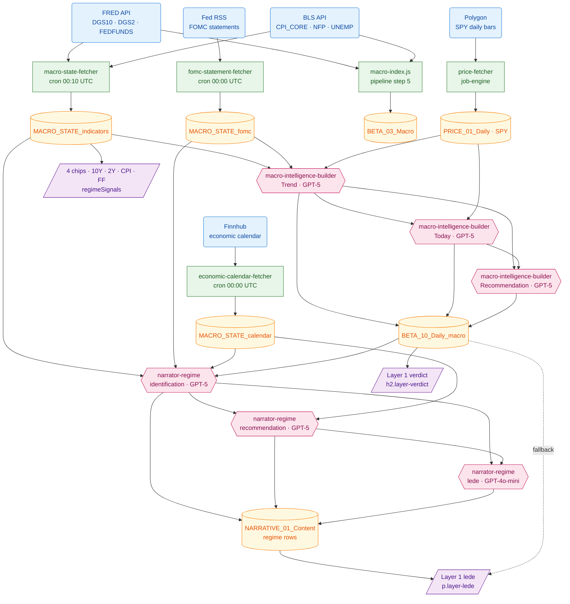
```mermaid
flowchart TD
    R1(FRED API<br/>DGS10 · DGS2 · FEDFUNDS):::src
    R2(BLS API<br/>CPI_CORE · NFP · UNEMP):::src
    R3(Fed RSS<br/>FOMC statements):::src
    R4(Finnhub<br/>economic calendar):::src
    R5(Polygon<br/>SPY daily bars):::src

    C1[macro-state-fetcher<br/>cron 00:10 UTC]:::code
    C2[fomc-statement-fetcher<br/>cron 00:00 UTC]:::code
    C3[economic-calendar-fetcher<br/>cron 00:00 UTC]:::code
    C4[price-fetcher<br/>job-engine]:::code
    C5[macro-index.js<br/>pipeline step 5]:::code

    T1[(MACRO_STATE_indicators)]:::db
    T2[(MACRO_STATE_fomc)]:::db
    T3[(MACRO_STATE_calendar)]:::db
    T4[(BETA_03_Macro)]:::db
    T5[(PRICE_01_Daily · SPY)]:::db

    A1{{macro-intelligence-builder<br/>Trend · GPT-5}}:::agentLLM
    A2{{macro-intelligence-builder<br/>Today · GPT-5}}:::agentLLM
    A3{{macro-intelligence-builder<br/>Recommendation · GPT-5}}:::agentLLM
    A4{{narrator-regime<br/>identification · GPT-5}}:::agentLLM
    A5{{narrator-regime<br/>recommendation · GPT-5}}:::agentLLM
    A6{{narrator-regime<br/>lede · GPT-4o-mini}}:::agentLLM

    T6[(BETA_10_Daily_macro)]:::db
    T7[(NARRATIVE_01_Content<br/>regime rows)]:::db

    D1[/Layer 1 verdict<br/>h2.layer-verdict/]:::ui
    D2[/Layer 1 lede<br/>p.layer-lede/]:::ui
    D3[/4 chips · 10Y · 2Y · CPI · FF<br/>regimeSignals/]:::ui

    R1 --> C1
    R2 --> C1
    R3 --> C2
    R4 --> C3
    R5 --> C4
    R1 --> C5
    R2 --> C5

    C1 --> T1
    C2 --> T2
    C3 --> T3
    C4 --> T5
    C5 --> T4

    T1 --> A1
    T2 --> A1
    T5 --> A1
    A1 --> A2
    T5 --> A2
    A1 --> A3
    A2 --> A3
    A1 --> T6
    A2 --> T6
    A3 --> T6

    T1 --> A4
    T2 --> A4
    T3 --> A4
    T6 --> A4
    A4 --> A5
    T3 --> A5
    A4 --> A6
    A5 --> A6
    A4 --> T7
    A5 --> T7
    A6 --> T7

    T6 --> D1
    T7 --> D2
    T6 -.fallback.-> D2
    T1 --> D3

    classDef src fill:#e3f2fd,stroke:#1976d2,color:#0d47a1
    classDef code fill:#e8f5e9,stroke:#2e7d32,color:#1b5e20
    classDef db fill:#fff8e1,stroke:#f57c00,color:#e65100
    classDef agentLLM fill:#fce4ec,stroke:#c2185b,color:#880e4f
    classDef agentDet fill:#f5f5f5,stroke:#616161,color:#212121
    classDef ui fill:#f3e5f5,stroke:#6a1b9a,color:#4a148c
```

| Tag | What |
|---|---|
| R1 | `api.stlouisfed.org/fred/series/observations` |
| R2 | `api.bls.gov/publicAPI/v2/timeseries/data/` |
| R3 | `federalreserve.gov/feeds/press_monetary.xml` |
| R4 | `finnhub.io/api/v1/calendar/economic` |
| R5 | `api.polygon.io/v2/aggs/ticker/SPY/...` |
| C1 | `workers/macro-state-fetcher/src/worker.js` |
| C2 | `workers/fomc-statement-fetcher/src/worker.js` |
| C3 | `workers/economic-calendar-fetcher/src/worker.js` |
| C4 | `workers/price-fetcher/src/worker.js` |
| C5 | `macro/index.js` (invoked by `src/steps/ingest-macro.js`) |
| A1–A3 | `workers/macro-intelligence-builder/src/worker.js` · prompts §6.8 |
| A4 | `workers/narrator/regime/identification.js` · prompt §6.9 |
| A5 | `workers/narrator/regime/recommendation.js` · prompt §6.10 |
| A6 | `workers/narrator/regime/lede.js` · prompt §6.11 |
| D1 | `dashboard/index.html:1663` `<h2 class="layer-verdict">` |
| D2 | `dashboard/index.html:1666` `<p class="layer-lede">` |
| D3 | `dashboard/index.html:1677` `#regimeSignals` (chips) |

\pagebreak

## Cluster 2 · Net-exposure gauge

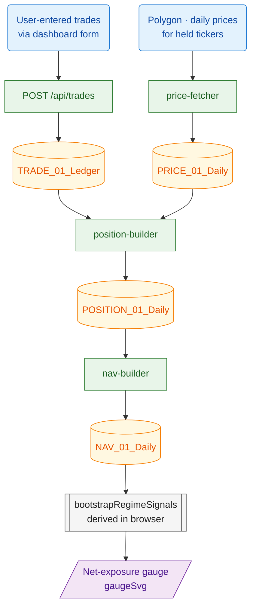
```mermaid
flowchart TD
    R1(User-entered trades<br/>via dashboard form):::src
    R2(Polygon · daily prices<br/>for held tickers):::src

    C1[POST /api/trades]:::code
    C2[price-fetcher]:::code
    C3[position-builder]:::code
    C4[nav-builder]:::code

    T1[(TRADE_01_Ledger)]:::db
    T2[(PRICE_01_Daily)]:::db
    T3[(POSITION_01_Daily)]:::db
    T4[(NAV_01_Daily)]:::db

    A1[[bootstrapRegimeSignals<br/>derived in browser]]:::agentDet

    D1[/Net-exposure gauge<br/>gaugeSvg/]:::ui

    R1 --> C1 --> T1
    R2 --> C2 --> T2
    T1 --> C3
    T2 --> C3
    C3 --> T3 --> C4 --> T4
    T4 --> A1 --> D1

    classDef src fill:#e3f2fd,stroke:#1976d2,color:#0d47a1
    classDef code fill:#e8f5e9,stroke:#2e7d32,color:#1b5e20
    classDef db fill:#fff8e1,stroke:#f57c00,color:#e65100
    classDef agentLLM fill:#fce4ec,stroke:#c2185b,color:#880e4f
    classDef agentDet fill:#f5f5f5,stroke:#616161,color:#212121
    classDef ui fill:#f3e5f5,stroke:#6a1b9a,color:#4a148c
```

| Tag | What |
|---|---|
| C1 | `dashboard/server.js POST /api/trades` proxy → `portfolio-ingestor /ingest/trades` |
| C2–C4 | `workers/{price-fetcher, position-builder, nav-builder}/src/worker.js` |
| T1 | `TRADE_01_Ledger` (migration 0025) |
| T3 | `POSITION_01_Daily` (0026) — `qty × close, weight_pct` |
| T4 | `NAV_01_Daily` (0026) — `gross_long, gross_short, net_value` |
| A1 | Browser-side: `(gross_long − gross_short) / net_value × 100`, clamped to `[0, 100]` |
| D1 | `dashboard/index.html:1681` `<svg id="gaugeSvg">` · `app.js renderGauge()` |

**No LLM in this cluster.** Pure arithmetic.

\pagebreak

## Cluster 3 · Style tilts (Quality, Low vol, Growth, Value, Momentum)

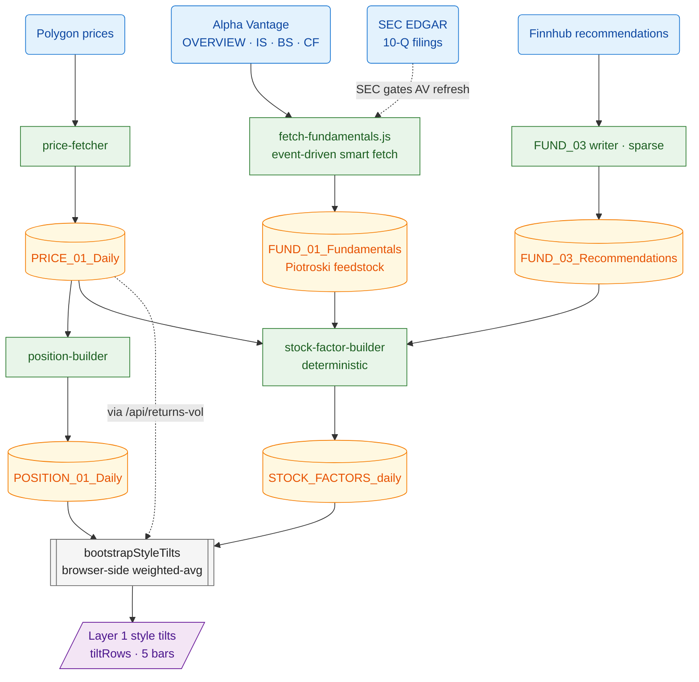
```mermaid
flowchart TD
    R1(Polygon prices):::src
    R2(Alpha Vantage<br/>OVERVIEW · IS · BS · CF):::src
    R3(Finnhub recommendations):::src
    R4(SEC EDGAR<br/>10-Q filings):::src

    C1[price-fetcher]:::code
    C2[fetch-fundamentals.js<br/>event-driven smart fetch]:::code
    C3[FUND_03 writer · sparse]:::code
    C4[position-builder]:::code
    C5[stock-factor-builder<br/>deterministic]:::code

    T1[(PRICE_01_Daily)]:::db
    T2[(FUND_01_Fundamentals<br/>Piotroski feedstock)]:::db
    T3[(FUND_03_Recommendations)]:::db
    T4[(POSITION_01_Daily)]:::db
    T5[(STOCK_FACTORS_daily)]:::db

    A1[[bootstrapStyleTilts<br/>browser-side weighted-avg]]:::agentDet

    D1[/Layer 1 style tilts<br/>tiltRows · 5 bars/]:::ui

    R1 --> C1 --> T1
    R2 --> C2 --> T2
    R3 --> C3 --> T3
    R4 -. SEC gates AV refresh .-> C2

    T1 --> C4 --> T4
    T1 --> C5
    T2 --> C5
    T3 --> C5
    C5 --> T5

    T4 --> A1
    T5 --> A1
    T1 -. via /api/returns-vol .-> A1
    A1 --> D1

    classDef src fill:#e3f2fd,stroke:#1976d2,color:#0d47a1
    classDef code fill:#e8f5e9,stroke:#2e7d32,color:#1b5e20
    classDef db fill:#fff8e1,stroke:#f57c00,color:#e65100
    classDef agentLLM fill:#fce4ec,stroke:#c2185b,color:#880e4f
    classDef agentDet fill:#f5f5f5,stroke:#616161,color:#212121
    classDef ui fill:#f3e5f5,stroke:#6a1b9a,color:#4a148c
```

| Tag | What |
|---|---|
| C2 | Smart-fetch: skips ticker if `T2.fiscal_period_ending ≥` SEC's latest 10-Q period |
| C5 | `workers/stock-factor-builder/src/worker.js` — emits 9 factors per ticker |
| A1 | `dashboard/app.js bootstrapStyleTilts()` — weighted average across positions: Quality (Piotroski), Low vol (returns-vol), Growth (eps_rev_4w × 20), Value (−rel_pe_sigma/2), Momentum (mom_12_1) |
| D1 | `dashboard/index.html:1686` `<div id="tiltRows">` · `app.js renderTilts()` |

\pagebreak

## Cluster 4 · Sector landscape — table, RRG, alloc bar, lede

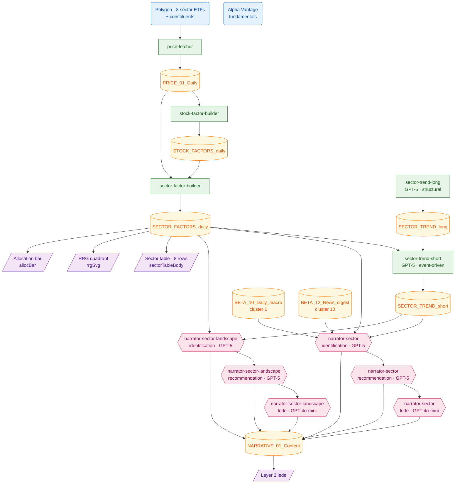
```mermaid
flowchart TD
    R1(Polygon · 8 sector ETFs<br/>+ constituents):::src
    R2(Alpha Vantage<br/>fundamentals):::src

    C1[price-fetcher]:::code
    C2[stock-factor-builder]:::code
    C3[sector-factor-builder]:::code
    C4[sector-trend-long<br/>GPT-5 · structural]:::code
    C5[sector-trend-short<br/>GPT-5 · event-driven]:::code

    T1[(PRICE_01_Daily)]:::db
    T2[(STOCK_FACTORS_daily)]:::db
    T3[(SECTOR_FACTORS_daily)]:::db
    T4[(SECTOR_TREND_long)]:::db
    T5[(SECTOR_TREND_short)]:::db
    T6[(NARRATIVE_01_Content)]:::db
    T7[(BETA_10_Daily_macro<br/>cluster 1)]:::db
    T8[(BETA_12_News_digest<br/>cluster 10)]:::db

    A1{{narrator-sector<br/>identification · GPT-5}}:::agentLLM
    A2{{narrator-sector<br/>recommendation · GPT-5}}:::agentLLM
    A3{{narrator-sector<br/>lede · GPT-4o-mini}}:::agentLLM
    A4{{narrator-sector-landscape<br/>identification · GPT-5}}:::agentLLM
    A5{{narrator-sector-landscape<br/>recommendation · GPT-5}}:::agentLLM
    A6{{narrator-sector-landscape<br/>lede · GPT-4o-mini}}:::agentLLM

    D1[/Sector table · 8 rows<br/>sectorTableBody/]:::ui
    D2[/RRG quadrant<br/>rrgSvg/]:::ui
    D3[/Allocation bar<br/>allocBar/]:::ui
    D4[/Layer 2 lede/]:::ui

    R1 --> C1 --> T1
    T1 --> C2 --> T2
    T1 --> C3
    T2 --> C3
    C3 --> T3
    T3 --> C5
    C4 --> T4
    T4 --> C5
    C5 --> T5

    T3 --> A1 --> A2 --> A3
    T5 --> A1
    T7 --> A1
    T8 --> A1
    A1 --> T6
    A2 --> T6
    A3 --> T6

    T3 --> A4 --> A5 --> A6
    T5 --> A4
    A4 --> T6
    A5 --> T6
    A6 --> T6

    T3 --> D1
    T3 --> D2
    T3 --> D3
    T6 --> D4

    classDef src fill:#e3f2fd,stroke:#1976d2,color:#0d47a1
    classDef code fill:#e8f5e9,stroke:#2e7d32,color:#1b5e20
    classDef db fill:#fff8e1,stroke:#f57c00,color:#e65100
    classDef agentLLM fill:#fce4ec,stroke:#c2185b,color:#880e4f
    classDef agentDet fill:#f5f5f5,stroke:#616161,color:#212121
    classDef ui fill:#f3e5f5,stroke:#6a1b9a,color:#4a148c
```

| Tag | What |
|---|---|
| C3 | `workers/sector-factor-builder/src/worker.js` — emits per-sector regime_fit, earn_momentum, valuation_sigma, rel_strength_13w, rs_ratio, rs_momentum, stance |
| C4–C5 | `sector-trend-{long,short}` workers · GPT-5 |
| A1–A3 | `workers/narrator/sector/*.js` · per-sector ×8 |
| A4–A6 | `workers/narrator/sector-landscape/*.js` · cross-sector once |
| D1 | sector table; per-column thresholds matched to factor scales (val column inverted: cheap = green) |
| D2 | RRG with dynamic `maxDev` auto-fit |
| D4 | Layer 2 lede (sector-landscape takes priority over per-sector lede when fresh) |

\pagebreak

## Cluster 5 · Stock shortlist + scatter

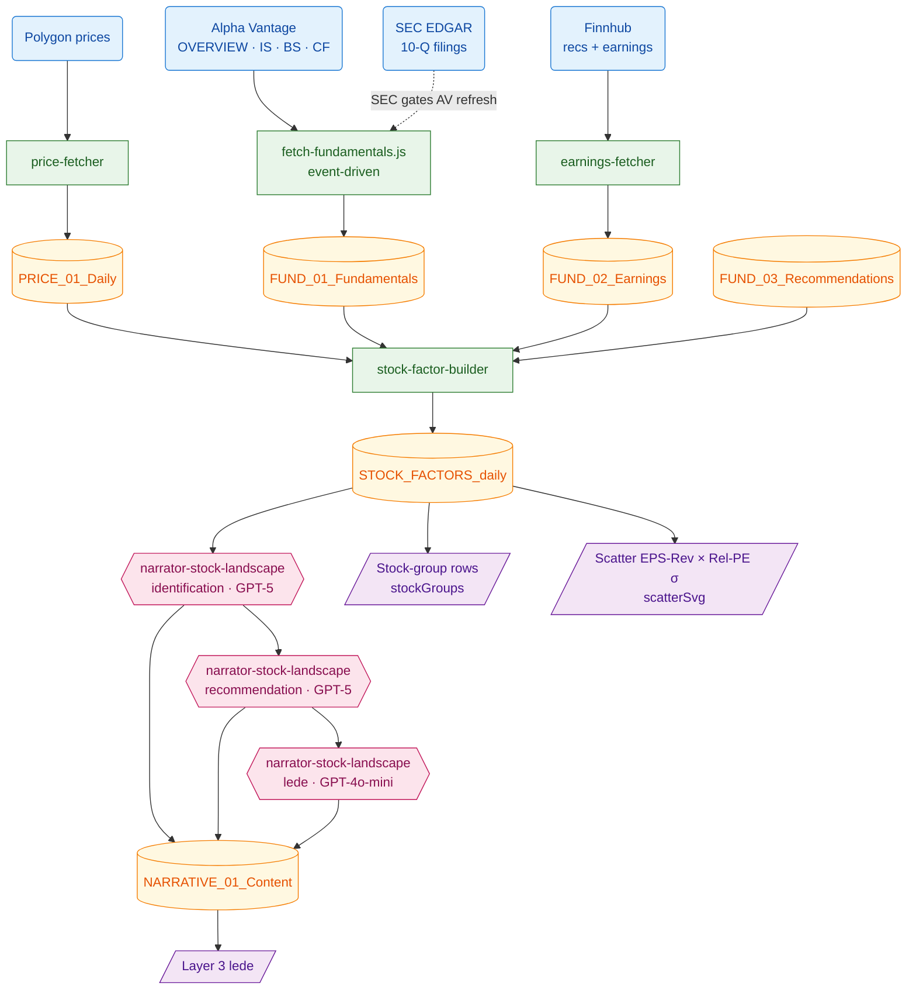
```mermaid
flowchart TD
    R1(Polygon prices):::src
    R2(Alpha Vantage<br/>OVERVIEW · IS · BS · CF):::src
    R3(Finnhub<br/>recs + earnings):::src
    R4(SEC EDGAR<br/>10-Q filings):::src

    C1[price-fetcher]:::code
    C2[fetch-fundamentals.js<br/>event-driven]:::code
    C3[earnings-fetcher]:::code
    C4[stock-factor-builder]:::code

    T1[(PRICE_01_Daily)]:::db
    T2[(FUND_01_Fundamentals)]:::db
    T3[(FUND_02_Earnings)]:::db
    T4[(FUND_03_Recommendations)]:::db
    T5[(STOCK_FACTORS_daily)]:::db
    T6[(NARRATIVE_01_Content)]:::db

    A1{{narrator-stock-landscape<br/>identification · GPT-5}}:::agentLLM
    A2{{narrator-stock-landscape<br/>recommendation · GPT-5}}:::agentLLM
    A3{{narrator-stock-landscape<br/>lede · GPT-4o-mini}}:::agentLLM

    D1[/Stock-group rows<br/>stockGroups/]:::ui
    D2[/Scatter EPS-Rev × Rel-PE σ<br/>scatterSvg/]:::ui
    D3[/Layer 3 lede/]:::ui

    R1 --> C1 --> T1
    R2 --> C2 --> T2
    R3 --> C3 --> T3
    R4 -. SEC gates AV refresh .-> C2

    T1 --> C4
    T2 --> C4
    T3 --> C4
    T4 --> C4
    C4 --> T5

    T5 --> A1 --> A2 --> A3
    A1 --> T6
    A2 --> T6
    A3 --> T6

    T5 --> D1
    T5 --> D2
    T6 --> D3

    classDef src fill:#e3f2fd,stroke:#1976d2,color:#0d47a1
    classDef code fill:#e8f5e9,stroke:#2e7d32,color:#1b5e20
    classDef db fill:#fff8e1,stroke:#f57c00,color:#e65100
    classDef agentLLM fill:#fce4ec,stroke:#c2185b,color:#880e4f
    classDef agentDet fill:#f5f5f5,stroke:#616161,color:#212121
    classDef ui fill:#f3e5f5,stroke:#6a1b9a,color:#4a148c
```

| Tag | What |
|---|---|
| C4 | Computes `fwd_pe`, `rel_pe_sigma`, `eps_rev_4w`, `rev_breadth_4w`, `sue`, `mom_12_1`, `rs_vs_sector_3m`, `piotroski_f`, `days_to_catalyst` |
| A1–A3 | `workers/narrator/stock-landscape/*.js` · prompts §6.9 (landscape variant) |
| D1 | `app.js renderStockGroups()` — exact-zero treated as flat (sentinel for missing data) |
| D2 | `app.js renderScatter()` — skips (0,0) sentinel; sector colour fallback when Piotroski null |

**Note:** `narrator/stock` (per-ticker) writes its own rows used by the **stock entity-detail view** when you click a ticker — separate from the Layer 3 grid above.

\pagebreak

## Cluster 6 · Portfolio book — KPIs · NAV · positions · weights · decision trail

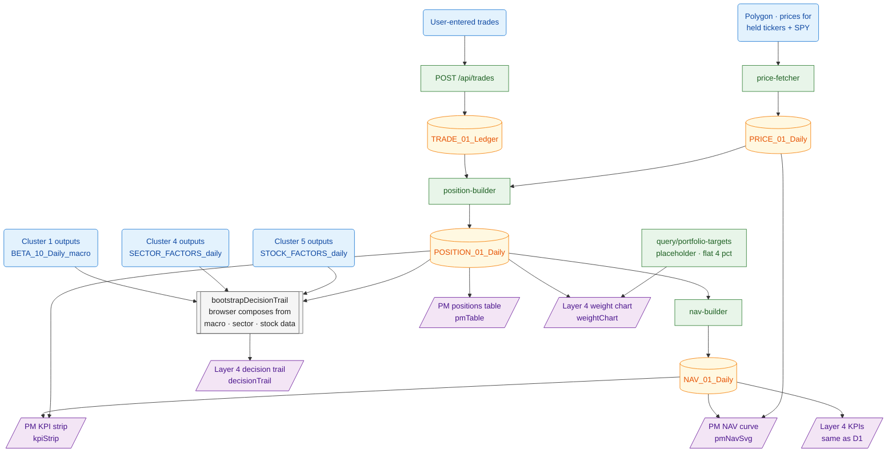
```mermaid
flowchart TD
    R1(User-entered trades):::src
    R2(Polygon · prices for<br/>held tickers + SPY):::src
    R3(Cluster 1 outputs<br/>BETA_10_Daily_macro):::src
    R4(Cluster 4 outputs<br/>SECTOR_FACTORS_daily):::src
    R5(Cluster 5 outputs<br/>STOCK_FACTORS_daily):::src

    C1[POST /api/trades]:::code
    C2[price-fetcher]:::code
    C3[position-builder]:::code
    C4[nav-builder]:::code
    C5[query/portfolio-targets<br/>placeholder · flat 4 pct]:::code

    T1[(TRADE_01_Ledger)]:::db
    T2[(PRICE_01_Daily)]:::db
    T3[(POSITION_01_Daily)]:::db
    T4[(NAV_01_Daily)]:::db

    A1[[bootstrapDecisionTrail<br/>browser composes from<br/>macro · sector · stock data]]:::agentDet

    D1[/PM KPI strip<br/>kpiStrip/]:::ui
    D2[/PM NAV curve<br/>pmNavSvg/]:::ui
    D3[/PM positions table<br/>pmTable/]:::ui
    D4[/Layer 4 KPIs<br/>same as D1/]:::ui
    D5[/Layer 4 weight chart<br/>weightChart/]:::ui
    D6[/Layer 4 decision trail<br/>decisionTrail/]:::ui

    R1 --> C1 --> T1
    R2 --> C2 --> T2
    T1 --> C3
    T2 --> C3
    C3 --> T3
    T3 --> C4 --> T4

    T4 --> D1
    T3 --> D1
    T4 --> D2
    T2 --> D2
    T3 --> D3
    T4 --> D4
    T3 --> D5
    C5 --> D5

    R3 --> A1
    R4 --> A1
    R5 --> A1
    T3 --> A1
    A1 --> D6

    classDef src fill:#e3f2fd,stroke:#1976d2,color:#0d47a1
    classDef code fill:#e8f5e9,stroke:#2e7d32,color:#1b5e20
    classDef db fill:#fff8e1,stroke:#f57c00,color:#e65100
    classDef agentLLM fill:#fce4ec,stroke:#c2185b,color:#880e4f
    classDef agentDet fill:#f5f5f5,stroke:#616161,color:#212121
    classDef ui fill:#f3e5f5,stroke:#6a1b9a,color:#4a148c
```

| Tag | What |
|---|---|
| C5 | Currently a placeholder — returns flat `target_pct: 4` per ticker until `wealth-distribution` produces real targets |
| A1 | Picks the ticker with the largest `\|current − target\|` weight gap; composes 4 steps (regime / sector / stock / sizing) from data already fetched |
| D1, D4 | Headers labelled `1d P&L` or `Nd P&L` based on the actual gap between the latest two NAV rows |
| D5 | Auto-fits x-axis from data (no longer hardcoded at 7%) |

\pagebreak

## Cluster 7 · Attribution waterfall (Layer 5)

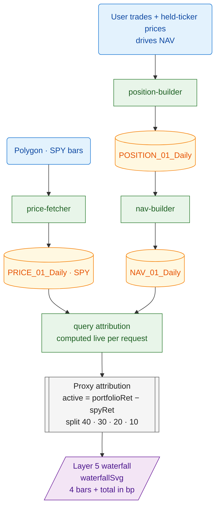
```mermaid
flowchart TD
    R1(Polygon · SPY bars):::src
    R2(User trades + held-ticker prices<br/>drives NAV):::src

    C1[price-fetcher]:::code
    C2[position-builder]:::code
    C3[nav-builder]:::code
    C4[query attribution<br/>computed live per request]:::code

    T1[(PRICE_01_Daily · SPY)]:::db
    T2[(POSITION_01_Daily)]:::db
    T3[(NAV_01_Daily)]:::db

    A1[[Proxy attribution<br/>active = portfolioRet − spyRet<br/>split 40 · 30 · 20 · 10]]:::agentDet

    D1[/Layer 5 waterfall<br/>waterfallSvg<br/>4 bars + total in bp/]:::ui

    R1 --> C1 --> T1
    R2 --> C2 --> T2
    T2 --> C3 --> T3
    T1 --> C4
    T3 --> C4
    C4 --> A1 --> D1

    classDef src fill:#e3f2fd,stroke:#1976d2,color:#0d47a1
    classDef code fill:#e8f5e9,stroke:#2e7d32,color:#1b5e20
    classDef db fill:#fff8e1,stroke:#f57c00,color:#e65100
    classDef agentLLM fill:#fce4ec,stroke:#c2185b,color:#880e4f
    classDef agentDet fill:#f5f5f5,stroke:#616161,color:#212121
    classDef ui fill:#f3e5f5,stroke:#6a1b9a,color:#4a148c
```

| Tag | What |
|---|---|
| C4 | `workers/portfolio-ingestor/src/worker.js · /query/attribution`. **No worker writes attribution**; computed on every read. |
| A1 | Fixed-split proxy until per-position attribution lands |
| D1 | `app.js renderWaterfall()` · caption reads "Proxy split (40/30/20/10) until per-position attribution lands" |

\pagebreak

## Cluster 8 · Calibration + closed trades (Layer 5)

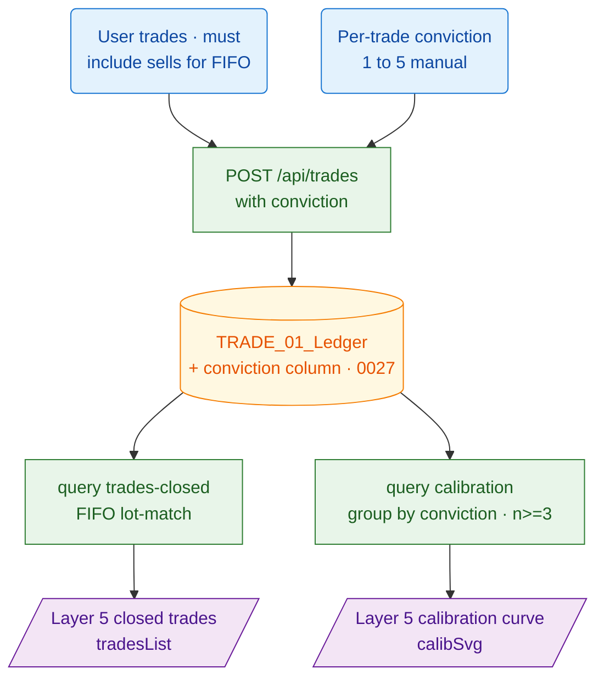
```mermaid
flowchart TD
    R1(User trades · must<br/>include sells for FIFO):::src
    R2(Per-trade conviction<br/>1 to 5 manual):::src

    C1[POST /api/trades<br/>with conviction]:::code
    C2[query trades-closed<br/>FIFO lot-match]:::code
    C3[query calibration<br/>group by conviction · n>=3]:::code

    T1[(TRADE_01_Ledger<br/>+ conviction column · 0027)]:::db

    D1[/Layer 5 calibration curve<br/>calibSvg/]:::ui
    D2[/Layer 5 closed trades<br/>tradesList/]:::ui

    R1 --> C1 --> T1
    R2 --> C1
    T1 --> C2 --> D2
    T1 --> C3 --> D1

    classDef src fill:#e3f2fd,stroke:#1976d2,color:#0d47a1
    classDef code fill:#e8f5e9,stroke:#2e7d32,color:#1b5e20
    classDef db fill:#fff8e1,stroke:#f57c00,color:#e65100
    classDef agentLLM fill:#fce4ec,stroke:#c2185b,color:#880e4f
    classDef agentDet fill:#f5f5f5,stroke:#616161,color:#212121
    classDef ui fill:#f3e5f5,stroke:#6a1b9a,color:#4a148c
```

| Tag | What |
|---|---|
| C2 | FIFO lot-matching of buys against sells per ticker |
| C3 | Buckets closed trades by conviction (1–5); suppresses bucket if `n < 3` |
| D1 | Always shows expected-prior dashed line; actual dots populate as trades close |
| D2 | Empty-state placeholder when no sells exist |

**Status:** `TRADE_01_Ledger` currently has 25 BUY rows (seed) and zero SELLs. Both panels show empty state — by design.

\pagebreak

## Cluster 9 · Calendar tab (rolling 6-week event grid)

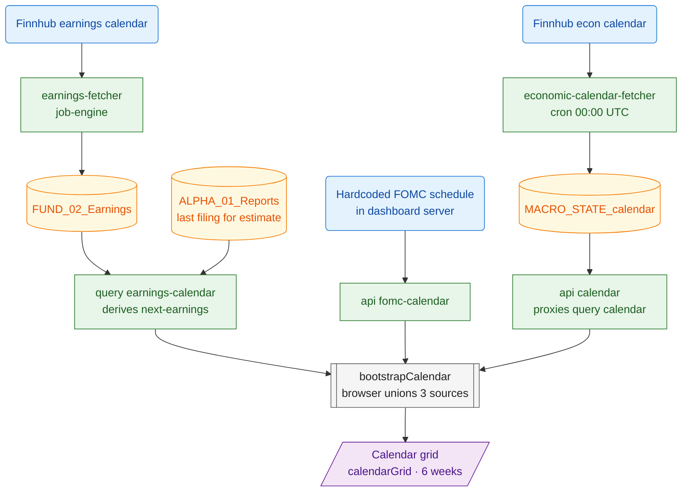
```mermaid
flowchart TD
    R1(Finnhub econ calendar):::src
    R2(Finnhub earnings calendar):::src
    R3(Hardcoded FOMC schedule<br/>in dashboard server):::src

    C1[economic-calendar-fetcher<br/>cron 00:00 UTC]:::code
    C2[earnings-fetcher<br/>job-engine]:::code
    C3[query earnings-calendar<br/>derives next-earnings]:::code
    C4[api fomc-calendar]:::code
    C5[api calendar<br/>proxies query calendar]:::code

    T1[(MACRO_STATE_calendar)]:::db
    T2[(FUND_02_Earnings)]:::db
    T3[(ALPHA_01_Reports<br/>last filing for estimate)]:::db

    A1[[bootstrapCalendar<br/>browser unions 3 sources]]:::agentDet

    D1[/Calendar grid<br/>calendarGrid · 6 weeks/]:::ui

    R1 --> C1 --> T1
    R2 --> C2 --> T2
    T2 --> C3
    T3 --> C3
    R3 --> C4
    T1 --> C5

    C3 --> A1
    C4 --> A1
    C5 --> A1
    A1 --> D1

    classDef src fill:#e3f2fd,stroke:#1976d2,color:#0d47a1
    classDef code fill:#e8f5e9,stroke:#2e7d32,color:#1b5e20
    classDef db fill:#fff8e1,stroke:#f57c00,color:#e65100
    classDef agentLLM fill:#fce4ec,stroke:#c2185b,color:#880e4f
    classDef agentDet fill:#f5f5f5,stroke:#616161,color:#212121
    classDef ui fill:#f3e5f5,stroke:#6a1b9a,color:#4a148c
```

| Tag | What |
|---|---|
| R3 | Static FOMC list in `dashboard/server.js` |
| A1 | `bootstrapCalendar()` filters to `today−14 days … today+28 days`, dedupes |
| D1 | Cells render up to 4 events + impact tag; weekend / today / past styling |

\pagebreak

## Cluster 10 · News stream

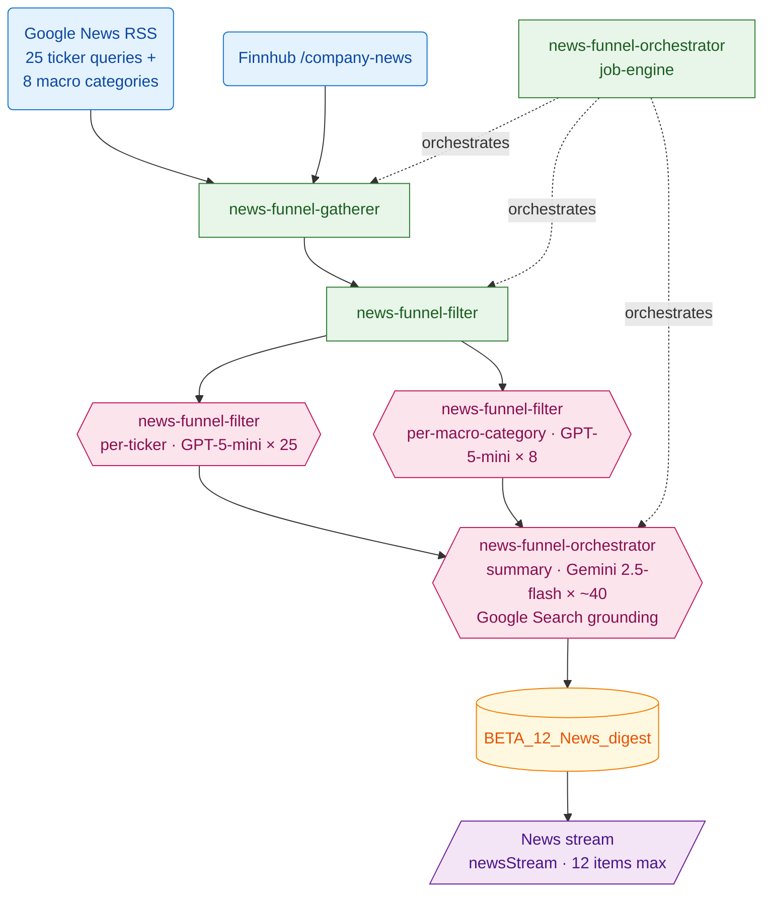
```mermaid
flowchart TD
    R1(Google News RSS<br/>25 ticker queries +<br/>8 macro categories):::src
    R2(Finnhub /company-news):::src

    C1[news-funnel-orchestrator<br/>job-engine]:::code
    C2[news-funnel-gatherer]:::code
    C3[news-funnel-filter]:::code

    A1{{news-funnel-filter<br/>per-ticker · GPT-5-mini × 25}}:::agentLLM
    A2{{news-funnel-filter<br/>per-macro-category · GPT-5-mini × 8}}:::agentLLM
    A3{{news-funnel-orchestrator<br/>summary · Gemini 2.5-flash × ~40<br/>Google Search grounding}}:::agentLLM

    T1[(BETA_12_News_digest)]:::db

    D1[/News stream<br/>newsStream · 12 items max/]:::ui

    R1 --> C2
    R2 --> C2
    C2 --> C3
    C3 --> A1
    C3 --> A2
    A1 --> A3
    A2 --> A3
    A3 --> T1
    T1 --> D1

    C1 -.orchestrates.-> C2
    C1 -.orchestrates.-> C3
    C1 -.orchestrates.-> A3

    classDef src fill:#e3f2fd,stroke:#1976d2,color:#0d47a1
    classDef code fill:#e8f5e9,stroke:#2e7d32,color:#1b5e20
    classDef db fill:#fff8e1,stroke:#f57c00,color:#e65100
    classDef agentLLM fill:#fce4ec,stroke:#c2185b,color:#880e4f
    classDef agentDet fill:#f5f5f5,stroke:#616161,color:#212121
    classDef ui fill:#f3e5f5,stroke:#6a1b9a,color:#4a148c
```

| Tag | What |
|---|---|
| C1–C3 | Three chained workers; orchestrator dispatches via service bindings |
| A1 | `filterTickerHeadlines()` · prompt §6.1 |
| A2 | `filterMacroHeadlines()` · prompt §6.2 |
| A3 | Gemini 2.5-flash summary loop · prompt §6.3 |
| T1 | `BETA_12_News_digest` (migration 0008) — `magnitude` is granular in `[-1, 1]` per the prompt |
| D1 | `app.js renderNewsStream()` — sorts by `\|magnitude\|` desc; `mat = round(\|mag\| × 10)` |

\pagebreak

## Cluster 11 · Top movers

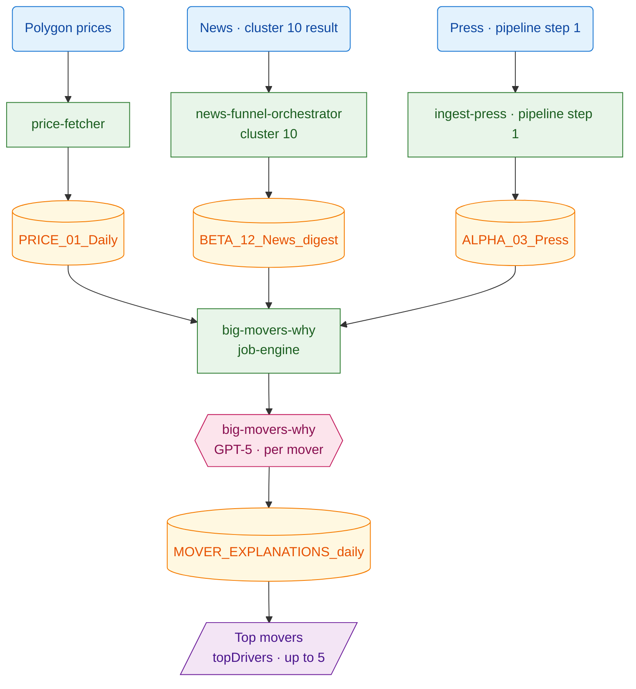
```mermaid
flowchart TD
    R1(Polygon prices):::src
    R2(News · cluster 10 result):::src
    R3(Press · pipeline step 1):::src

    C1[price-fetcher]:::code
    C2[news-funnel-orchestrator<br/>cluster 10]:::code
    C3[ingest-press · pipeline step 1]:::code
    C4[big-movers-why<br/>job-engine]:::code

    T1[(PRICE_01_Daily)]:::db
    T2[(BETA_12_News_digest)]:::db
    T3[(ALPHA_03_Press)]:::db
    T4[(MOVER_EXPLANATIONS_daily)]:::db

    A1{{big-movers-why<br/>GPT-5 · per mover}}:::agentLLM

    D1[/Top movers<br/>topDrivers · up to 5/]:::ui

    R1 --> C1 --> T1
    R2 --> C2 --> T2
    R3 --> C3 --> T3
    T1 --> C4
    T2 --> C4
    T3 --> C4
    C4 --> A1 --> T4 --> D1

    classDef src fill:#e3f2fd,stroke:#1976d2,color:#0d47a1
    classDef code fill:#e8f5e9,stroke:#2e7d32,color:#1b5e20
    classDef db fill:#fff8e1,stroke:#f57c00,color:#e65100
    classDef agentLLM fill:#fce4ec,stroke:#c2185b,color:#880e4f
    classDef agentDet fill:#f5f5f5,stroke:#616161,color:#212121
    classDef ui fill:#f3e5f5,stroke:#6a1b9a,color:#4a148c
```

| Tag | What |
|---|---|
| C4 | `workers/big-movers-why/src/worker.js` — picks top-5 up + top-5 down by `\|move%\|`, calls A1 per mover |
| A1 | GPT-5 prompt §6.7 — outputs thesis + bullets grounded in news/press |
| T4 | `MOVER_EXPLANATIONS_daily` (migration 0021) |
| D1 | `app.js renderTopDrivers()` — sorts by `\|move_pct\|`; renders ticker + move + reason |

\pagebreak

## Cluster 12 · Regime detail — 12-indicator board + latest events

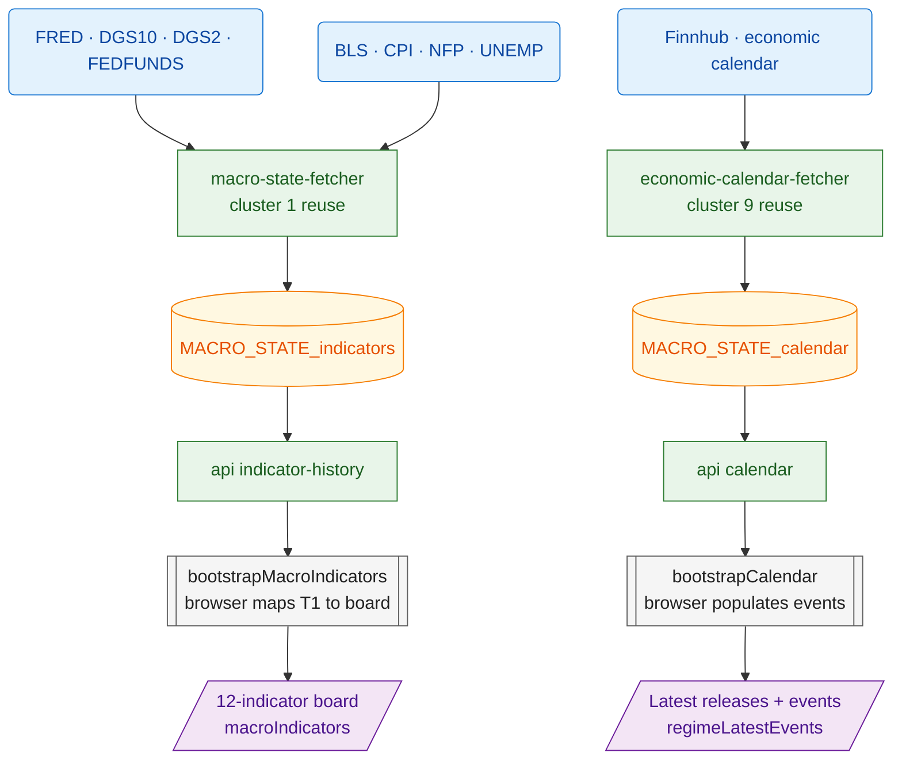
```mermaid
flowchart TD
    R1(FRED · DGS10 · DGS2 · FEDFUNDS):::src
    R2(BLS · CPI · NFP · UNEMP):::src
    R3(Finnhub · economic calendar):::src

    C1[macro-state-fetcher<br/>cluster 1 reuse]:::code
    C2[economic-calendar-fetcher<br/>cluster 9 reuse]:::code
    C3[api indicator-history]:::code
    C4[api calendar]:::code

    T1[(MACRO_STATE_indicators)]:::db
    T2[(MACRO_STATE_calendar)]:::db

    A1[[bootstrapMacroIndicators<br/>browser maps T1 to board]]:::agentDet
    A2[[bootstrapCalendar<br/>browser populates events]]:::agentDet

    D1[/12-indicator board<br/>macroIndicators/]:::ui
    D2[/Latest releases + events<br/>regimeLatestEvents/]:::ui

    R1 --> C1 --> T1
    R2 --> C1
    R3 --> C2 --> T2
    T1 --> C3 --> A1 --> D1
    T2 --> C4 --> A2 --> D2

    classDef src fill:#e3f2fd,stroke:#1976d2,color:#0d47a1
    classDef code fill:#e8f5e9,stroke:#2e7d32,color:#1b5e20
    classDef db fill:#fff8e1,stroke:#f57c00,color:#e65100
    classDef agentLLM fill:#fce4ec,stroke:#c2185b,color:#880e4f
    classDef agentDet fill:#f5f5f5,stroke:#616161,color:#212121
    classDef ui fill:#f3e5f5,stroke:#6a1b9a,color:#4a148c
```

| Tag | What |
|---|---|
| A1 | Maps `T1` rows to label set: 10Y, 2Y, derived 2s10s curve, Core CPI, CPI Headline, Fed Funds, NFP, Unemployment |
| A2 | Past 4 + upcoming 4 events sorted chronologically |
| D1 | `macroIndicators` shows 7+ chips with value + Δ + trend |
| D2 | `regimeLatestEvents` — "upcoming" pill on future dates |

\pagebreak

## Cross-reference 1 · One agent → many dashboard fields

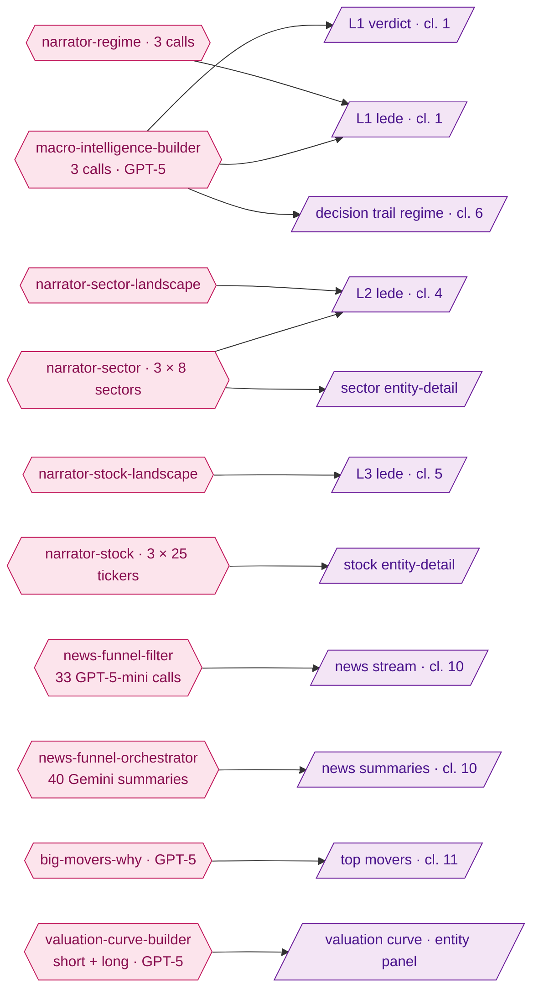
```mermaid
flowchart LR
    A1{{macro-intelligence-builder<br/>3 calls · GPT-5}}:::agentLLM
    A2{{narrator-regime · 3 calls}}:::agentLLM
    A3{{narrator-sector · 3 × 8 sectors}}:::agentLLM
    A4{{narrator-sector-landscape}}:::agentLLM
    A5{{narrator-stock-landscape}}:::agentLLM
    A6{{narrator-stock · 3 × 25 tickers}}:::agentLLM
    A7{{news-funnel-filter<br/>33 GPT-5-mini calls}}:::agentLLM
    A8{{news-funnel-orchestrator<br/>40 Gemini summaries}}:::agentLLM
    A9{{big-movers-why · GPT-5}}:::agentLLM
    A10{{valuation-curve-builder<br/>short + long · GPT-5}}:::agentLLM

    L1V[/L1 verdict · cl. 1/]:::ui
    L1L[/L1 lede · cl. 1/]:::ui
    L1T[/decision trail regime · cl. 6/]:::ui
    L2L[/L2 lede · cl. 4/]:::ui
    L3L[/L3 lede · cl. 5/]:::ui
    SED[/sector entity-detail/]:::ui
    STD[/stock entity-detail/]:::ui
    NS[/news stream · cl. 10/]:::ui
    NSU[/news summaries · cl. 10/]:::ui
    TM[/top movers · cl. 11/]:::ui
    VC[/valuation curve · entity panel/]:::ui

    A1 --> L1V
    A1 --> L1L
    A1 --> L1T
    A2 --> L1L
    A3 --> L2L
    A3 --> SED
    A4 --> L2L
    A5 --> L3L
    A6 --> STD
    A7 --> NS
    A8 --> NSU
    A9 --> TM
    A10 --> VC

    classDef agentLLM fill:#fce4ec,stroke:#c2185b,color:#880e4f
    classDef ui fill:#f3e5f5,stroke:#6a1b9a,color:#4a148c
```

## Cross-reference 2 · D1 table → consumers

| Table | Used in clusters / panels |
|---|---|
| `MACRO_STATE_indicators` | Cl 1 (chips D3), Cl 12 (12-indicator board D1) |
| `MACRO_STATE_calendar` | Cl 9 (grid D1), Cl 12 (events D2) |
| `MACRO_STATE_fomc` | Cl 1 (regime context — input to A1, A4) |
| `BETA_03_Macro` | Cl 1 (regime context); also `/api/macro/{date}` |
| `BETA_10_Daily_macro` | Cl 1 (verdict D1, lede fallback D2), Cl 6 (decision trail D6) |
| `NARRATIVE_01_Content` | Cl 1 D2, Cl 4 D4, Cl 5 D3, regime/sector/stock entity-detail panels |
| `BETA_12_News_digest` | Cl 10 (news stream D1) — also feeds narrators upstream |
| `MOVER_EXPLANATIONS_daily` | Cl 11 (top movers D1) |
| `STOCK_FACTORS_daily` | Cl 3 (style tilts D1), Cl 5 (D1+D2), Cl 6 (decision trail D6) |
| `SECTOR_FACTORS_daily` | Cl 4 (table D1, RRG D2, alloc D3), Cl 6 (decision trail D6) |
| `SECTOR_TREND_long` + `_short` | A1+A4 sector narrators (Cl 4) |
| `TICKER_TREND_long` + `_short` | stock entity-detail; A6 stock narrators |
| `POSITION_01_Daily` | Cl 2 (gauge D1), Cl 3 (tilts), Cl 6 (KPI/positions/weights) |
| `NAV_01_Daily` | Cl 2 (gauge), Cl 6 (KPI/NAV curve), Cl 7 (waterfall input) |
| `TRADE_01_Ledger` | Cl 6 (positions/NAV chain), Cl 8 (closed trades D2) |
| `PRICE_01_Daily` | Cl 2–11 — used everywhere |
| `FUND_01_Fundamentals` | Cl 3 (Piotroski), Cl 5 (rel_pe_sigma) |
| `FUND_02_Earnings` | Cl 5 (SUE), Cl 9 (calendar earnings dates) |
| `FUND_03_Recommendations` | Cl 3 + Cl 5 (eps_rev_4w, rev_breadth_4w) |
| `ALPHA_03_Press` | Cl 11 (mover ground-truth), narrator/stock |
| `ALPHA_01_Reports` | Cl 9 (last-filing for next-earnings), narrator/stock + ticker-trend-long |
| `BETA_02_WH` | A1+A4 regime narrators |

\pagebreak

# Part 3 · Origin layer

## 3.1 The 10-step Node pipeline (`src/pipeline.js`)

Run via `node src/pipeline.js` on the Linux server, fired by `hedge-pipeline.timer` at 22:30 UTC.

| #  | Step                    | Inputs                                          | Output                                              | LLM    |
|----|-------------------------|-------------------------------------------------|-----------------------------------------------------|--------|
| 1  | `ingest-press`          | 24 IR newsroom pages via Puppeteer              | `press/AA_press_summary.json` → `/ingest/press`     | Y      |
| 2  | `ingest-whitehouse`     | whitehouse.gov RSS + FOMC RSS                   | `whitehouse_summary.json` → `/ingest/whitehouse`    | Y      |
| 3  | `ingest-news`           | (no-op stub; real work server-side)             | logs handoff to `news-funnel-orchestrator`         | n/a    |
| 4  | `ingest-edgar`          | SEC EDGAR submissions API → HTML downloads     | `edgar_clustered_json/*.json` → `/ingest/reports`   | N      |
| 5  | `ingest-macro`          | BLS, FRED, UMich, Yahoo, Fed RSS                | `macro_summary.json` → `/ingest/macro`              | N      |
| 6  | `ingest-sentiment`      | AAII live + MHTML fallback, CFTC, CBOE          | `sentiment_summary.json` → `/ingest/sentiment`      | N      |
| 7  | `upload`                | the JSON files above + fundamentals             | POSTs `/ingest/*` + triggers workflow                | N      |
| 7b | `fetch-fundamentals`    | Alpha Vantage OVERVIEW (daily) + IS/BS/CF       | `/ingest/fundamentals`                              | N      |
| 8  | `summarize`             | validation results from steps 1–7               | `dashboard_<date>.json` → `/ingest/pipeline-validation` | N |
| 9  | `verify-facts`          | `press/AA_press_summary.json`                   | `/ingest/verification`                              | Y      |
| 10 | `sync-dashboard`        | polls workflow + queries D1                     | local cache JSON                                    | N      |

LLM steps: 1 (press summary, GPT-4o-mini), 2 (WH summary, GPT-4o-mini), 9 (hallucination check, GPT-4o-mini). All other LLM work happens server-side in Cloudflare Workers.

## 3.2 Standalone scrapers

| Module               | Tickers / Coverage             | Source                                               | Output                                          |
|----------------------|--------------------------------|------------------------------------------------------|-------------------------------------------------|
| `press/`             | 24 (TSLA excluded)             | Per-ticker IR Puppeteer crawlers                     | `AA_press_summary.json`                         |
| `edgar/`             | 25 incl. TSLA                  | SEC EDGAR submissions API + HTML archives            | `edgar_clustered_json/*.json`                   |
| `macro/`             | n/a (economy-wide)             | BLS, FRED, UMich, Yahoo VIX, Fed RSS                 | `macro_summary.json`                            |
| `sentiment/`         | n/a (broad market)             | AAII, CFTC COT (E-mini S&P/NQ), CBOE put/call        | `sentiment_summary.json`                        |
| `whitehouse/`        | n/a (policy)                   | whitehouse.gov RSS + per-article HTML                | `whitehouse_summary.json`                       |
| `news/index.js`      | dead — replaced server-side    | (none — kept for manual backfill only)               |                                                 |

**TSLA press gap:** Tesla newsroom is anti-bot-protected; Puppeteer is blocked. SEC and fundamentals coverage are unaffected.

\pagebreak

# Part 4 · Database (D1)

Single Cloudflare D1 database `portfolio-db`. Worker `portfolio-ingestor` is the single writer for raw scraped tables; other workers write directly via D1 binding.

## 4.1 Raw tables (written by scrapers via `/ingest/*`)

| Table                          | Writer                                          | Reader(s)                                              |
|--------------------------------|-------------------------------------------------|--------------------------------------------------------|
| `ALPHA_03_Press`               | step 1 → `/ingest/press`                        | narrator/stock, dashboard `/api/press/{date}`          |
| `ALPHA_01_Reports`             | step 4 → `/ingest/reports` (AA_ingestor.js)     | ticker-trend-long, valuation-curve-builder, narrator   |
| `BETA_02_WH`                   | step 2 → `/ingest/whitehouse`                   | narrator/regime, dashboard                             |
| `BETA_03_Macro`                | step 5 → `/ingest/macro`                        | macro-intelligence-builder, dashboard                  |
| `BETA_04_Sentiment`            | step 6 → `/ingest/sentiment`                    | dashboard `/api/sentiment/{date}`                       |
| `FUND_01_Fundamentals`         | step 7b → `/ingest/fundamentals`                | stock-factor-builder, valuation-curve-builder          |
| `FUND_02_Earnings`             | earnings-fetcher worker                         | stock-factor-builder, ticker-trend-long, narrator/stock |
| `FUND_03_Recommendations`      | (no recurring writer — sparse)                  | stock-factor-builder                                   |
| `PRICE_01_Daily`               | price-fetcher worker                            | factor builders, position-builder, valuation-curve     |
| `MACRO_STATE_indicators`       | macro-state-fetcher (00:10 UTC)                 | narrator/regime, dashboard `/api/indicator-history`     |
| `MACRO_STATE_calendar`         | economic-calendar-fetcher (00:00 UTC)           | narrator/* gather modules, dashboard `/api/calendar`    |
| `MACRO_STATE_fomc`             | fomc-statement-fetcher (00:00 UTC)              | narrator/regime, macro-intelligence-builder            |
| `BETA_12_News_digest`          | news-funnel-orchestrator                        | narrator/*, dashboard `/api/news-digest/{date}`         |

## 4.2 Derived tables (deterministic)

| Table                          | Writer                                  | Reader(s)                                             |
|--------------------------------|-----------------------------------------|-------------------------------------------------------|
| `STOCK_FACTORS_daily`          | stock-factor-builder                    | dashboard `/api/stock-factors`, narrator/stock        |
| `SECTOR_FACTORS_daily`         | sector-factor-builder                   | dashboard `/api/sector-factors`, narrator/sector      |
| `POSITION_01_Daily`            | position-builder                        | dashboard `/api/positions`, nav-builder               |
| `NAV_01_Daily`                 | nav-builder                             | dashboard `/api/nav`, attribution computation        |
| `TRADE_01_Ledger`              | dashboard `POST /api/trades`            | position-builder, nav-builder, dashboard              |
| `MOVER_EXPLANATIONS_daily`     | big-movers-why                          | dashboard `/api/movers`                               |
| `SIGNAL_01_Assessment`         | assessment-engine                       | narrator/stock, dashboard `/api/portfolio-signals`    |
| `SIGNAL_HISTORY_daily`         | signal-history-builder                  | ticker-trend-short, narrator/stock                    |
| `SIGNAL_03_ValuationCurve_*`   | valuation-curve-builder                 | dashboard valuation-curve panels                      |

## 4.3 LLM-narrative tables

| Table                          | Writer                                | Purpose                                                         |
|--------------------------------|---------------------------------------|-----------------------------------------------------------------|
| `BETA_10_Daily_macro`          | macro-intelligence-builder            | Daily macro blob — trend, today, recommendation, scenarios, sector_tilt |
| `TICKER_TREND_long`            | ticker-trend-long                     | Per-ticker fundamental thesis (refreshed on new 10-Q)           |
| `TICKER_TREND_short`           | ticker-trend-short                    | Per-ticker tactical thesis (event-triggered)                    |
| `SECTOR_TREND_long`            | sector-trend-long                     | Per-sector structural thesis                                    |
| `SECTOR_TREND_short`           | sector-trend-short                    | Per-sector tactical thesis                                      |
| `NARRATIVE_01_Content`         | narrator workers                      | Multi-row per entity: current_reading, identification, recommendation, lede |
| `OPERATION_01_Signals`         | operations-agent                      | Trade suggestions per sector                                    |

## 4.4 Audit / orphans

- `PIPELINE_VALIDATION` — step 8 writes; dashboard Validation tab reads (mostly mockup)
- `GAMMA_01_Verification` — step 9 writes; available for future audit UI
- `ALPHA_04_Trends` — orphan-write (`/ingest/trends`); decommissioned chain leftover

\pagebreak

# Part 5 · Processing layer (workers)

40+ workers grouped by family.

## 5.1 Ingestion / storage

| Worker | Trigger | Reads | Writes | LLM | Purpose |
|---|---|---|---|---|---|
| `portfolio-ingestor` | HTTP `/ingest/*` + `/query/*` | n/a | every raw-scraped table | No | Single ingest endpoint; serves dashboard `/api/*` queries |

## 5.2 Fetchers

| Worker | Trigger | External source | Writes |
|---|---|---|---|
| `price-fetcher` | job-engine | Polygon.io | `PRICE_01_Daily` |
| `earnings-fetcher` | job-engine | Finnhub | `FUND_02_Earnings` |
| `economic-calendar-fetcher` | cron `0 0 * * *` | Finnhub econ calendar | `MACRO_STATE_calendar` |
| `fomc-statement-fetcher` | cron `0 0 * * *` | Federal Reserve | `MACRO_STATE_fomc` |
| `macro-state-fetcher` | cron `10 0 * * *` | FRED + BLS | `MACRO_STATE_indicators` |

## 5.3 Factor builders (deterministic)

| Worker | Reads | Writes |
|---|---|---|
| `stock-factor-builder` | PRICE_01_Daily, FUND_01/02/03 | STOCK_FACTORS_daily |
| `sector-factor-builder` | PRICE_01_Daily, STOCK_FACTORS_daily, sector ETF prices | SECTOR_FACTORS_daily |
| `position-builder` | TRADE_01_Ledger, PRICE_01_Daily | POSITION_01_Daily |
| `nav-builder` | POSITION_01_Daily, TRADE_01_Ledger | NAV_01_Daily |
| `signal-history-builder` | BETA_12_News_digest, FUND_02_Earnings, PRICE_01_Daily | SIGNAL_HISTORY_daily |
| `event-attribution-engine` | PRICE_01_Daily, SIGNAL_01_Assessment, BETA_10_Daily_macro | event-attribution rows |

## 5.4 News funnel

| Worker | Reads | Writes | LLM |
|---|---|---|---|
| `news-funnel-orchestrator` | gatherer + filter (service binds) | BETA_12_News_digest | Gemini 2.5 Flash (~40 summaries with Google Search grounding) |
| `news-funnel-gatherer` | Google News RSS + Finnhub | (returns JSON) | No |
| `news-funnel-filter` | (orchestrator-supplied JSON) | (returns JSON) | GPT-5-mini · 33 parallel calls (25 tickers + 8 macro categories) |

## 5.5 Trend & narrative builders (LLM)

| Worker | Trigger | Reads | Writes | LLM |
|---|---|---|---|---|
| `ticker-trend-long` | HTTP /build | filings + earnings + fundamentals | TICKER_TREND_long | GPT-5 |
| `ticker-trend-short` | event-triggered | TICKER_TREND_long, news, price, press | TICKER_TREND_short | GPT-5 |
| `sector-trend-long` | HTTP /build | sector filings + earnings | SECTOR_TREND_long | GPT-5 |
| `sector-trend-short` | event-triggered | SECTOR_FACTORS_daily, ticker trends, macro | SECTOR_TREND_short | GPT-5 |
| `macro-intelligence-builder` | HTTP /build | 8w MACRO_STATE + SPY | BETA_10_Daily_macro | GPT-5 ×3 |
| `valuation-curve-builder` | cron + event | filings, earnings, price, news, baseline | SIGNAL_03_ValuationCurve_* | GPT-5 |
| `big-movers-why` | job-engine | PRICE_01_Daily, BETA_12_News_digest | MOVER_EXPLANATIONS_daily | GPT-5 |
| `assessment-engine` | job-engine | factors + news | SIGNAL_01_Assessment | GPT-4o-mini (explanation only) |
| `operations-agent` | event-triggered | sector + ticker trends, macro | OPERATION_01_Signals | GPT-5 |
| `consensus-validator` | event-triggered | TICKER_TREND_short | external-grounding rows | Gemini 2.5 Flash + Google Search |

## 5.6 Narrators (8 sub-workers)

| Sub-worker | Trigger | LLM | Output |
|---|---|---|---|
| `dispatcher` | cron `*/15 * * * *` + `0 6 * * *` | none | NARRATIVE_02_Triggers log |
| `regime` | called by dispatcher | GPT-5 ×2 + GPT-4o-mini ×1 | 4 rows in NARRATIVE_01_Content |
| `sector` | per-sector ×8 | GPT-5 ×2 + GPT-4o-mini ×1 | 4 rows × 8 sectors |
| `sector-landscape` | once | same | 4 rows |
| `stock` | per-ticker ×25 | same | 4 rows × 25 tickers |
| `stock-landscape` | once | same | 4 rows |
| `lede` | called by entity narrators | GPT-4o-mini | top-of-page summary |

## 5.7 Workflow orchestration

| Worker | Trigger | Purpose |
|---|---|---|
| `job-engine-workflow` | HTTP `/run` (Durable Object workflow) | Calls fetchers, factor builders, signals/news in waves |
| `news-funnel-orchestrator` | HTTP /run-news-funnel | 3-stage news pipeline |
| `narrator-dispatcher` | cron + HTTP | Polls source-table changes, fans out to narrators |

## 5.8 Reporting (LLM, used by `report-orchestrator` — not yet on a schedule)

| Worker | LLM (likely) | Purpose |
|---|---|---|
| `report-orchestrator` | (orchestrator) | Coordinates QK report pipeline |
| `qk-structure-builder` | GPT-5 | Splits 10-K/10-Q into structured sections |
| `qk-summarizer` | GPT-5 | Per-section summaries |
| `qk-report-summarizer` | GPT-5 | Final investor-facing narrative |
| `8k-summarizer` | GPT-5 / 4o-mini | Material 8-K event extraction |
| `form4-summarizer` | GPT-4o-mini | Insider-transaction summary |
| `macro-summarizer` | GPT-5 | Investor-summary version of macro state |
| `sentiment-summarizer` | GPT-5 / 4o-mini | Aggregated sentiment summary |
| `gen-orchestrator`, `gen-builder` | GPT-5 | Generic LLM generation utility |
| `beta-trend-orchestrator`, `beta-trend-builder` | GPT-5 | Experimental ticker-trend variant |

\pagebreak

# Part 6 · LLM prompts (verbatim)

`{VARIABLE}` placeholders show interpolations. The text below is **what the model receives**.

## 6.1 News-funnel filter — per-ticker

`workers/news-funnel-filter/src/worker.js` · GPT-5-mini · 25 calls per run

System: `You are an equity analyst selecting the most market-moving headlines for a specific US stock. Output JSON only.`

User:
```
TICKER: {TICKER}
TODAY: {TODAY}
HEADLINES: {COMPACT_HEADLINE_LIST}

TASK: Pick the 1 to 4 most market-relevant headlines for {TICKER}.

RULES:
- Pick 1 minimum (even on slow days, pick the best available).
- Pick up to 4 ONLY if multiple genuinely material events happened (rare).
- Prefer today's news. Older news only if high frequency (3+).
- Focus on: earnings, product launches, M&A, regulatory, executive changes,
  lawsuits, guidance, analyst actions.
- IGNORE: generic conferences, SEO content, irrelevant geographies, opinions.
- Do not invent headlines. Use EXACT titles from the list.

MAGNITUDE — be granular, not categorical. Sign matches sentiment.
  0.05 - 0.20 = trivial (analyst tweak, minor color)
  0.25 - 0.45 = mild
  0.50 - 0.70 = moderate (clear meaningful event)
  0.75 - 0.90 = strong (earnings beat/miss with raised/cut guide, major M&A)
  0.91 - 1.00 = exceptional (existential — accounting fraud, takeover, recall)
  Pick a SPECIFIC value, not a bucket midpoint. Avoid defaulting to ±0.5.

OUTPUT (strict JSON, no markdown):
{ "headlines": [{ "rank":1, "title":"...", "source":"...", "date":"YYYY-MM-DD",
                  "frequency":1, "relevance":"...",
                  "sentiment":"bullish|bearish|neutral",
                  "magnitude":-1.0..1.0 }] }
```

## 6.2 News-funnel filter — per-macro-category

Same file · GPT-5-mini · 8 calls per run · same magnitude scale as 6.1.

User:
```
CATEGORY: {CATEGORY_LABEL} ({CATEGORY_ID})
TODAY: {TODAY}
HEADLINES: {COMPACT_HEADLINE_LIST}

TASK: Pick the 1 to 2 most impactful headlines in this category.

RULES:
- Headlines that would meaningfully move indices, sectors, or stocks.
- Prefer today's news. Older news only if high frequency (3+) or unresolved.
- IGNORE: local politics with no US impact, routine diplomacy, opinion pieces.
- Think: how does this affect tech, pharma, oil/energy, banks, consumer, industrial?

(magnitude scale identical to 6.1, but bands relabelled for macro)

OUTPUT: { "headlines": [...] }
```

## 6.3 News-funnel orchestrator — Gemini summary

`workers/news-funnel-orchestrator/src/worker.js` · Gemini 2.5 Flash with Google Search grounding · ~40 calls per run.

```
Summarize the following news in 2-3 sentences. {CONTEXT_LINE} Be factual and concise.
Headline: {SEARCH_QUERY}
Date: {ITEM_DATE}
```

`{CONTEXT_LINE}` for ticker headlines = `Focus on market impact for {TICKER} stock.`
For macro = `Focus on how this affects US equity markets, specifically these sectors: tech, pharma, oil/energy, banks, consumer, industrial.`

## 6.4 Press summary

`press/summary.js` · GPT-4o-mini · per press release.

```
Analyze the following press release. Output JSON ONLY, no commentary.

TASK 1: Write a short factual summary (plain English, no opinions, no spin,
no analysis — just key facts).

TASK 2: Classify the EVENT TYPE (not the tone):
- "sentiment": one of "bullish", "bearish", "neutral"
- "magnitude": 0.0 to 1.0, how material this event is for shareholders

CRITICAL RULES:
- IGNORE the press release's tone. Companies always spin positively.
- Judge the underlying EVENT, not the wording.
- "Layoffs", "restructuring", "guidance cut", "product recall", "SEC investigation"
  → bearish (regardless of positive spin).
- "Earnings beat", "new major contract", "FDA approval", "flagship product launch",
  "large buyback" → bullish.
- "Minor product update", "routine leadership appointment", "conference attendance"
  → neutral with low magnitude.
- Magnitude reflects market impact: 0.1 = routine, 0.5 = notable, 0.9 = very material.

OUTPUT (strict JSON, no markdown):
{ "summary":"...", "sentiment":"bullish|bearish|neutral", "magnitude":0.0 }

TEXT: {RAW_PRESS_TEXT}
```

## 6.5 White House summary

`whitehouse/index.js` · GPT-4o-mini.

```
Summarize this White House press release in plain, neutral, factual English.
No opinions. No speculation. Only key facts.

TEXT: {ARTICLE_TEXT}
```

## 6.6 Hallucination checker

`validation/agents/hallucination-checker.js` · GPT-4o-mini · per press summary in step 9.

```
You are a fact-checking agent. Compare the SUMMARY against the SOURCE CONTENT.

SOURCE CONTENT: """ {TRUNCATED_SOURCE} """
SUMMARY: """ {SUMMARY} """

Respond with ONLY valid JSON (no markdown):
{ "hasHallucinations": true/false,
  "score": 0-100,
  "verifiedFacts": [{ "fact":"...", "evidence":"..." }],
  "issues":         [{ "claim":"...", "problem":"..." }],
  "analysis": "..." }

Always populate verifiedFacts with the key claims you checked, even when there
are no hallucinations.
```

## 6.7 Big-movers-why

`workers/big-movers-why/src/worker.js` · GPT-5 · top-5 up + top-5 down per day.

```
You are a senior equity analyst. Explain why {TICKER} moved {ARROW}{PCT}% today
({DATE}). Ground the explanation in the ticker-specific news and press below.

TICKER: {TICKER}
MOVE: {MOVE_PCT}%  (direction: {DIRECTION}, rank #{RANK})
DATE: {DATE}
TODAY'S HEADLINES: {HEADLINES_BLOCK}
RECENT PRESS: {PRESS_BLOCK}

TASK
Output EXACTLY this JSON — no markdown, no prose outside:
{ "thesis":"one sentence: the single reason this stock moved today",
  "headline":"the single most relevant headline title from the list above (or empty)",
  "bullets":[{"text":"short bullet","bias":"bull|bear|neutral"}] }

RULES
- thesis < 25 words, concrete
- bullets: 2-4 items, sorted by explanatory power, each < 20 words
- Ground in headlines/press above. If NO news explains the move, say so
  (e.g. "No material news — likely broad market / sector flows").
- DO NOT invent events.
```

## 6.8 Macro-intelligence — three sequential GPT-5 calls

**Call A · Trend (8-week regime):**

```
You are a senior macro analyst. Read the 8-week macro state below and output a
STRUCTURED JSON verdict on the current market regime.
{TREND_INPUT_TEXT}

TASK
Identify the regime driving markets across the last 8 weeks. CHOOSE the time
window inside those 8 weeks that best frames the current regime ... The window
you pick MUST be justified by a specific event or shift visible in the data.

Output EXACTLY:
{ "regime":"bullish|cautious_bullish|neutral|cautious_bearish|bearish",
  "window_start":"YYYY-MM-DD","window_end":"YYYY-MM-DD","window_rationale":"...",
  "drivers":[{"text":"...","bias":"..."}],
  "narrative":[{"text":"...","bias":"..."}],
  "sp500_direction":{"p_up":0.0,"p_flat":0.0,"p_down":0.0},
  "confidence":0.0 }

RULES
- Base every conclusion on the data above. Do not invent numbers.
- p_up + p_flat + p_down must sum to 1.0.
- drivers + narrative: 3-5 items each, sorted by impact.
- If data is sparse, pick "neutral" and say so in window_rationale.
```

**Call B · Today (consistency check):**

```
Yesterday's regime verdict is below. Today's SPY move and headlines follow.
Explain today, and explicitly flag whether today challenges the regime.

REGIME VERDICT: {TREND_JSON}
TODAY: {TODAY}, SPY open {SPY_OPEN}, close {SPY_CLOSE}, intraday {SPY_MOVE_PCT}%
TOP MACRO HEADLINES TODAY: {TODAY_HEADLINES_TEXT}

Output EXACTLY:
{ "spy_move_pct":..., "spy_direction":"up|down|flat",
  "drivers":[...], "narrative":[...],
  "regime_tension":"none|mild|strong",
  "tension_note":"only if regime_tension != none",
  "confidence":0.0 }

RULES
- regime_tension: "none" = consistent; "mild" = opposite sign < 0.75%;
  "strong" = opposite sign and >= 0.75%.
- A +1% day in a bearish regime is "strong". A +0.2% day in a bearish regime is "none".
```

**Call C · Recommendation + scenarios + sector tilt:**

```
Now produce an actionable recommendation, three-scenario outlook, and sector tilt.

REGIME VERDICT: {TREND_JSON}
TODAY CONTEXT: {TODAY_OUT_JSON}
MARKET REFERENCE: SPY {CURRENT_SPY}, horizon 4 weeks from {TODAY}

Output EXACTLY:
{ "recommendation":{
    "headline":"< 12 words","action":"add_risk|trim_risk|hold|rotate|hedge",
    "confidence":"low|medium|high",
    "bullets":[...] },
  "scenarios":{ "horizon_weeks":4, "current_spy":...,
    "bull":{"probability":0.0,"target_spy":0.0,"thesis":"..."},
    "base":{...},
    "bear":{...} },
  "sector_tilt":{ "overweight":[...], "underweight":[...] } }

RULES
- recommendation.bullets: 3-5 sorted by importance.
- Allowed sector names (case-sensitive): Technology, ConsDisc, Communication,
  Finance, Energy, Healthcare, Staples, Industrial.
- DO NOT generate an economic calendar — that lives in MACRO_STATE_calendar
  and is read directly by narrator gatherers.
- bull > base > bear targets in a bullish regime; probabilities sum to 1.0.
```

## 6.9 Narrator family — identification (cross-entity pattern)

The five entity-narrator workers (regime, sector, sector-landscape, stock, stock-landscape) share an identification skeleton: produce 3-5 bullets with `headline`, `number`, `event`, `interpretation`, `source`. All identification prompts enforce:

```
1. Every number cited MUST appear verbatim in the DATA block. Do not invent.
2. Bullets that fail the comparison/scope rule are dropped.
3. The INTERPRETATION field is MANDATORY. Bullets that only restate the number
   will be rejected.
4. Return missing_factors: concrete signals that would change your read but
   are not in the input.

Output:
{ "bullets":[{ "headline":"...", "number":"...", "event":"...",
    "interpretation":"...", "source":{"table":"...","id":"..."} }],
  "missing_factors":["..."] }
```

The differences:
- **regime**: bullets are macro drivers; sources from MACRO_STATE_indicators, FOMC, news.
- **sector**: single-sector deep-read; tickers must be from `input.constituents`.
- **sector-landscape**: comparative — bullets must reference at least 2 sectors.
- **stock**: per-ticker long-term diagnosis; only this ticker's data.
- **stock-landscape**: comparative — bullets must reference at least 2 tickers.

## 6.10 Narrator family — recommendation (regime + sector)

**Regime:**

```
Given the regime identification + economic calendar + current book positioning,
produce a crisp stance and forward-looking signposts.

stance (one sentence): must contain
  - net exposure (%, or "long"/"neutral"/"short")
  - key tilts (sectors, factors, duration)
  - conviction score [0–1]
  - edge vs. consensus: what the market is pricing vs. what we think

signposts (3-5): trigger, threshold (numeric), dated_event (from calendar OR
  future ISO date), action (specific, not "reassess").

RULES (HARD)
1. Dated events must come from the economic_calendar input or be ISO dates > {as_of}.
2. Do NOT invent numbers or events.
3. Stance MUST include explicit edge-vs-consensus.
4. No hedging prose. This is a trade sheet.

{ "stance":"...", "signposts":[{...}] }
```

**Sector** adds: stance must name at least one ADD ticker AND one CUT ticker, both from `input.constituents`. Tickers outside the sector forbidden.

## 6.11 Narrator family — lede (3-4 line summary)

GPT-4o-mini, all entity narrators:

```
You are writing the 3–4 line opening summary of a daily {SCOPE} note.

STRICT RULES
1. Lead with the single most telling number from the note.
2. One sentence of diagnosis (pull from identification top bullet).
3. One sentence of stance (pull from recommendation).
4. End with the next dated test / trigger (pull from recommendation signposts).
5. Max 45 words. No preamble. No hedging. No adjectives.
6. Do NOT introduce any number not already in the note.

CURRENT READING: {currentReading.text}
IDENTIFICATION (top bullet): {bullet1}
RECOMMENDATION STANCE: {recommendation.stance}
NEXT SIGNPOST: {signpost1}

Output: plain text, no JSON, no quotes. Just the 3–4 line summary.
```

Sector lede adds: name ≥1 ADD and ≥1 CUT ticker; stay inside the sector. Stock lede stays inside the ticker.

## 6.12 Ticker-trend long

`workers/ticker-trend-long/src/worker.js` · GPT-5 · refreshed when a new 10-Q lands.

```
You are a senior equity analyst. Build a long-term trend for {TICKER} ({SECTOR})
from its 4 latest SEC filings, 4 latest quarterly earnings, and current
fundamentals. This trend is the SLOW baseline — it changes only when new reports
or earnings land, not when daily news moves the stock.

FILINGS (chronological): {REPORTS_BLOCK}
EARNINGS HISTORY:        {EARNINGS_BLOCK}
FUNDAMENTALS:            {FUND_BLOCK}

Output EXACTLY:
{ "regime":"bullish|cautious_bullish|neutral|cautious_bearish|bearish",
  "score":-1.0..1.0,
  "thesis":"one sentence",
  "drivers":[...], "narrative":[...] }

RULES
- regime = long-horizon conviction, fundamentals-driven (NOT recent price).
- score: bullish > 0.4, cautious_bullish 0.1..0.4, neutral -0.1..0.1, etc.
- drivers + narrative: 3-5 items each.
- Do NOT reference daily news or current price.
```

## 6.13 Valuation-curve — short and long (GPT-5 both)

**Short** (price-blind):

```
You are a buy-side analyst producing a SHORT-TERM fair value for {TICKER}.

THE STOCK PRICE IS INTENTIONALLY NOT PROVIDED. Do not estimate or infer it.
Derive fair value strictly from fundamental anchors + the recent event stack.

ANCHORS: sector, fwd_eps, peer-median P/E, naive peer anchor, eps_rev_4w, breadth.
BASELINE: long-term fair value (reviewed {BASELINE_DATE}): ${BASELINE_FAIR}
RECENT EVENTS (last 7d, empty sections are genuinely empty): news + press

RULES
1. short_fair_value MUST be a single $ number. No range.
2. If event stack is empty, short_fair_value MUST equal baseline.
3. contributing_events must reference event ids from the lists above.

Output:
{ "short_fair_value":0.00, "baseline_fair_value":{BASELINE},
  "rationale_short":"...",
  "contributing_events":[{"event_type":"news|press|revision","event_id":"...","delta_pct":0.0,"reason":"..."}] }
```

**Long** (price-aware, anchor-constrained):

```
You are a senior equity analyst producing a LONG-TERM fair value for {TICKER}.
This is a structural review. The valuation will set the baseline for all
tactical short-term valuations until the next review.

FUNDAMENTAL ANCHORS:   sector, fwd_eps, peer-median P/E, rel_pe_sigma,
                       margins, eps_rev_4w
MACRO/SECTOR CONTEXT:  current regime, sector alignment, recent FOMC
STRUCTURAL EVENTS:     earnings prints, SEC filings
PREVIOUS REVIEW:       {PREVIOUS_REVIEW_BLOCK}
MARKET PRICE (deviation narrative ONLY — DO NOT COPY): ${MARKET_PRICE}

RULES
1. long_fair_value MUST be derived from fundamentals + events. DO NOT anchor
   on market price. If your answer rubber-bands to within 2% of market price
   without explicit justification, you're doing it wrong.
2. If long_fair_value lands within 2% of market, "would_change_mind_if" MUST
   name specific triggers that would separate you from market consensus.
3. Ground every piece of rationale in a cited event id or indicator.
4. Frozen until the next structural event or 60 days pass.

Output:
{ "long_fair_value":0.00, "rationale":"2-3 sentences",
  "key_events_cited":["..."], "deviation_narrative":"...",
  "would_change_mind_if":["...","..."] }
```

## 6.14 Operations agent

`workers/operations-agent/src/worker.js` · GPT-5 · per sector when sector-trend changes.

```
You are a senior portfolio manager at a hedge fund. Generate suggested
OPERATIONS for the {SECTOR} sector based on the ticker-level trends and macro
context below.

MACRO CONTEXT: regime, window, drivers
SECTOR TICKER TRENDS: {TICKER_BLOCK}
PREVIOUS OPERATIONS (for stability): {PREVIOUS_OPS_BLOCK}

Output:
{ "operations":[{ "action":"buy|sell|short", "ticker":"SYM",
    "action_counter":"short|sell|buy|null",
    "counter_ticker":"SYM or SPY|null",
    "risk":"low|medium|high",
    "thesis":"...", "bullets":[...] }],
  "sector_view":"...",
  "changes_from_previous":"..." }

RULES
- 1-4 operations per sector. Quality over quantity.
- Each can be: simple long, market-paired (X / short Y in sector), or hedged
  vs SPY.
- "sell" means close an existing long, NOT short-sell.
- Stability: if previous operations still hold, KEEP THEM.
- It is LEGITIMATE to have zero operations.
```

## 6.15 Assessment engine — explanation only

`workers/assessment-engine/src/worker.js` · GPT-4o-mini. The composite score is **deterministic math**; this prompt only generates the 2-sentence explanation.

```
Given these factor scores for {TICKER}:
{FACTOR_LINES}
Composite score: {COMPOSITE_SCORE}

Write exactly 2 sentences explaining what is driving this stock. Focus on the
strongest factors. Do not invent any numbers not listed above. Do not add
caveats or disclaimers.
```

## 6.16 Consensus validator

`workers/consensus-validator/src/worker.js` · Gemini 2.5 Flash with Google Search grounding · fired when `TICKER_TREND_short` flips conviction. Asks the model to actively search for counter-narratives that contradict the internal trend, returning evidence + a confidence delta. Anti-confirmation-bias gate.

\pagebreak

# Part 7 · Known gaps, dead code, accepted mockups

## 7.1 Conceptual gaps (data does not exist anywhere)

| Item                              | What's missing                                                  |
|-----------------------------------|-----------------------------------------------------------------|
| Validation tab — Anomalies log    | No anomaly detector worker. UI shows hardcoded examples.        |
| Validation tab — Monthly check    | No monthly-cadence orchestrator. UI shows hardcoded checklist.  |
| Validation tab — Feed status      | Could be wired to PIPELINE_VALIDATION, not done yet.            |
| `SECTOR_FACTORS_daily.flow_5d`    | ETF inflow source doesn't exist. Column always NULL.            |
| Real `portfolio-targets`          | `wealth-distribution` returns flat 4% per ticker placeholder.    |
| TSLA press releases               | Tesla newsroom anti-bot. Press never lands.                     |

## 7.2 Latent / event-driven holes (will fill over time)

| Item                              | When it fills                                                   |
|-----------------------------------|-----------------------------------------------------------------|
| `piotroski_f` — 22/25 null today  | Smart-fetch back-fills as 10-Qs land + AV indexes them; ~5 nights |
| `eps_rev_4w` / `rev_breadth_4w` zeroes | Fill when analyst-recs data refreshes for those tickers     |
| `short_pct_float` — all 25 null   | Yahoo blocks Cloudflare worker egress; permanent until alt source |
| Calibration actuals — all null    | Populates as trades close; needs realized P&L                   |
| `DATA.releases` — hardcoded       | Used in indicator-detail "Most recent release" section          |

## 7.3 Orphans / dead code

| Item                              | Status                                                          |
|-----------------------------------|-----------------------------------------------------------------|
| `news/index.js`                   | Local script, never called. Real news work is server-side.     |
| `ALPHA_04_Trends`                 | `/ingest/trends` writes; nothing reads. Decommissioned chain.   |
| `dashboard/archive/`              | Old "research-brief" UI; superseded.                            |
| `workers/probability-curve-builder/` | Wired but not yet invoked. Future.                          |

## 7.4 Robustness watchlist

| Item                                                          | Severity |
|---------------------------------------------------------------|----------|
| `macro-state-fetcher` lacks per-series try/catch              | medium   |
| `news-funnel-filter` magnitude calibration                    | low — recent prompt fix in place |
| `fomc-statement-fetcher` and `economic-calendar-fetcher` both at 00:00 UTC | low — different tables, Cloudflare serializes |
| Layer 5 waterfall split is a fixed proxy                      | medium — caption flags it |

\pagebreak

# Part 8 · Glossary

Plain-language definitions of every acronym, technical term, and pipeline-specific concept used in this document and the dashboard. Grouped by category.

## 8.1 Regulators, sources, and standards

| Term | Meaning |
|---|---|
| **SEC** | US Securities and Exchange Commission. Regulator. Hosts EDGAR (the filings database) at `data.sec.gov`. |
| **EDGAR** | The SEC's electronic filing system. We pull `/submissions/CIK{cik}.json` for filing dates and accession numbers. |
| **CIK** | Central Index Key. The 10-digit identifier SEC assigns each registered company. AAPL = `0000320193`. |
| **10-K** | Annual report a US public company files with the SEC. Audited financials, management discussion, risk factors. |
| **10-Q** | Quarterly report. Less detail than 10-K, unaudited, filed 3× per year (Q4 numbers come out in the 10-K). |
| **8-K** | Material-event report — anything that would materially affect the company between regular reports (major contracts, executive changes, mergers). |
| **Form 4** | Insider transaction report. Filed by officers, directors, and 10%+ owners when they buy or sell company stock. |
| **FOMC** | Federal Open Market Committee. The Fed's monetary-policy committee. Sets interest rates ~8 times a year. |
| **Federal Reserve / Fed** | The US central bank. Publishes rate decisions and statements via RSS feeds we scrape. |
| **FRED** | Federal Reserve Economic Data. Free public API at `api.stlouisfed.org` for treasury yields, Fed funds rate, etc. |
| **BLS** | US Bureau of Labor Statistics. Free API for CPI, employment, PPI, etc. |
| **BEA** | US Bureau of Economic Analysis. GDP, personal income, etc. |
| **CFTC** | Commodity Futures Trading Commission. Publishes the Commitments of Traders (COT) report on futures positions. |
| **CBOE** | Chicago Board Options Exchange. Source of put/call ratios and the VIX. |
| **AAII** | American Association of Individual Investors. Publishes the AAII Sentiment Survey (retail bullish/bearish/neutral percentages). |
| **UMich** | University of Michigan Consumer Sentiment Index. Monthly survey. |
| **Polygon / Alpha Vantage / Finnhub / Yahoo Finance** | Commercial / freemium financial-data APIs. We use each for different things (prices, fundamentals, earnings, recommendations). |
| **RSS** | Really Simple Syndication. XML feed format used by news sites and the Fed. |

## 8.2 Macro indicators

| Term | Meaning |
|---|---|
| **CPI** | Consumer Price Index. Core CPI excludes food and energy; Headline CPI is the all-items number. Reported monthly. |
| **PPI** | Producer Price Index. Wholesale-level inflation. |
| **NFP** | Non-Farm Payrolls. Monthly US jobs report (number of jobs added). |
| **UNEMP** | Unemployment rate. |
| **DGS10** / **DGS2** | FRED codes for the 10-year and 2-year US Treasury yields. |
| **FEDFUNDS** | Effective Federal Funds Rate. The benchmark short-term US interest rate. |
| **PCE** | Personal Consumption Expenditures price index. The Fed's preferred inflation gauge. |
| **GDP** | Gross Domestic Product. Total output of an economy. |
| **VIX** | "Fear gauge". Implied volatility of S&P 500 options over the next 30 days. High VIX = panic. |
| **DXY** | US Dollar Index. Strength of the USD vs a basket of major currencies. |
| **HY spread** | High-yield (junk-bond) spread over Treasuries. Wider = credit stress; tighter = risk-on. |
| **2s10s curve** | Difference between 10-year and 2-year yields. Inverted (negative) historically precedes recessions. |
| **Beige Book** | Anecdotal Fed report on regional economic conditions. |
| **JOLTS** | Job Openings and Labor Turnover Survey. |
| **ISM** | Institute for Supply Management. Publishes manufacturing and services PMIs. |
| **PMI** | Purchasing Managers' Index. Survey-based; >50 = expansion. |

## 8.3 Portfolio / trading terms

| Term | Meaning |
|---|---|
| **Long / Short** | Long = own the stock, profit if price rises. Short = borrow & sell, profit if price falls. |
| **NAV** | Net Asset Value. Total portfolio value (positions + cash). |
| **Gross exposure** | Sum of absolute values of long + short positions. |
| **Net exposure** | Long − Short, expressed as % of NAV. 100% = fully invested long. |
| **Leverage** | Gross exposure ÷ NAV. >1 means borrowed money. |
| **OW / EW / UW** | Overweight / Equal-weight / Underweight. Stance vs benchmark allocation. |
| **Tilt** | Bias toward a factor (Quality, Growth, Value, Momentum, Low-vol). |
| **Conviction** | 1–5 self-rating of how strongly you believe in a trade. |
| **Hedge** | Position that offsets risk on another. e.g. long XOM + short SPY = bet XOM beats market. |
| **Drawdown** | Peak-to-trough decline. Max DD = worst peak-to-trough loss in the period. |
| **Basis points / bp** | 1 bp = 0.01%. A 100 bp move = 1%. |
| **Active return** | Portfolio return minus benchmark return (e.g., NAV change minus SPY change). |
| **FIFO lot-matching** | First-In-First-Out method to match sells against earlier buys when computing realized P&L per closed trade. |
| **Calibration** | Hit-rate by conviction bucket. "How often do my conviction-5 trades actually win?" |
| **SPY** | The largest S&P 500 ETF. Standard benchmark for US equity exposure. |
| **Sector ETF** | XLK (Tech), XLY (Discretionary), XLC (Communication), XLF (Finance), XLE (Energy), XLV (Healthcare), XLP (Staples), XLI (Industrial). SPDR series. |

## 8.4 Equity factors (used in Layer 2/3)

| Term | Meaning |
|---|---|
| **fwd P/E** | Forward Price-to-Earnings ratio. Stock price ÷ next-12-months expected EPS. Lower = cheaper. |
| **Peer-median P/E** | Median forward P/E across the 25-ticker portfolio's same-sector peers. |
| **rel_pe_sigma** | Z-score of a ticker's fwd P/E vs its sector peers' median, in σ units. Negative = cheap, positive = expensive. |
| **EPS** | Earnings Per Share. Net income divided by shares outstanding. |
| **eps_rev_4w** | 4-week change in the bullish-recommendation ratio (proxy for analyst EPS revisions). Live values typically ±0.02 (=±2pp). |
| **rev_breadth_4w** | 4-week change in (bullish − bearish) recommendation ratio. Direction confirmation for revisions. |
| **SUE** | Standardized Unexpected Earnings. (Actual EPS − consensus estimate) ÷ σ of last 8 surprises. |
| **mom_12_1** | Jegadeesh-Titman 12-1 momentum: return from 12 months ago to 1 month ago, skipping the most recent month (avoids short-term reversal noise). |
| **rs_vs_sector_3m** | 3-month relative strength vs the ticker's sector ETF. Positive = outperforming sector. |
| **rs_ratio / rs_momentum** | Inputs to the Relative Rotation Graph. Both centered at 100. |
| **Piotroski F-score** | 0–9 financial-health score (Joseph Piotroski, 2000). Sum of 9 binary fundamental signals: ROA>0, CFO>0, ΔROA>0, CFO>NI, Δleverage<0, Δcurrent ratio>0, no share issuance, Δgross margin>0, Δasset turnover>0. **8–9 = strong, 0–2 = weak.** |
| **ROA** | Return on Assets. Net income ÷ total assets. |
| **CFO** | Cash Flow from Operations. Cash generated by the core business (vs reported earnings, which can be inflated by accounting choices). |
| **Net Income / NI** | Bottom-line profit. Revenue − all expenses including taxes. |
| **Asset turnover** | Revenue ÷ total assets. Higher = more revenue per dollar of assets. |
| **Gross margin** | (Revenue − Cost of Goods Sold) ÷ Revenue. Pricing power proxy. |
| **Current ratio** | Current assets ÷ current liabilities. Short-term liquidity health. |
| **Operating margin** | Operating income ÷ revenue. Operational profitability. |
| **days_to_catalyst** | Days until the ticker's next earnings report (estimate). |
| **short_pct_float** | % of a stock's free float that is sold short. High short interest = bearish positioning. |
| **valuation_sigma** | Sector-level analog of rel_pe_sigma. Negative = sector cheap vs history. |
| **regime_fit** | Sector-level score for how well a sector fits the current macro regime (−1..+1). |
| **earn_momentum** | Sector-level change in aggregated earnings revisions. |
| **rel_strength_13w** | 13-week relative strength of a sector vs the broad market. |
| **stance / stance_score** | Sector OW/EW/UW classification, derived from a weighted sum of `regime_fit + earn_momentum + valuation_sigma + rel_strength_13w`. |

## 8.5 Diagrams / charts

| Term | Meaning |
|---|---|
| **RRG (Relative Rotation Graph)** | Plot of sector ETFs in (rs_ratio × rs_momentum) space, both centered at 100. Quadrants: **Leading** (top-right, both >100), **Improving** (top-left, ratio<100, momentum>100), **Lagging** (bottom-right), **Weakening** (bottom-left). |
| **Scatter (Layer 3)** | Per-stock plot: x = `eps_rev_4w` (analyst momentum), y = `rel_pe_sigma` (cheapness — inverted axis so cheap = top). The "ideal long" zone is upper-right (cheap + improving estimates). |
| **Waterfall (Layer 5)** | Bar chart attributing total return to components (Regime / Sector / Stock / Sizing). Currently a fixed-proxy split; see Part 7. |
| **Calibration curve** | Expected hit rate (dashed) vs realized hit rate (filled dots) per conviction bucket. Empty until trades close. |
| **NAV curve** | Portfolio value over time, plotted against SPY benchmark normalized to start at the same level. |
| **Allocation bar** | Horizontal stacked bar of sector weights summing to 100%. |
| **Drawdown chart** | Time-series of peak-to-current decline. |
| **Gauge** | Half-circle showing net exposure 0–100%. |
| **Decision trail** | 4-step explanation of why the system is suggesting a particular trade (Regime → Sector → Stock → Sizing). |

## 8.6 Pipeline / system terms

| Term | Meaning |
|---|---|
| **Pipeline** | The sequence of scrape → process → store → display steps. Run by `src/pipeline.js` nightly. |
| **Cron** | Scheduled task. `0 0 * * *` = run at midnight UTC daily. |
| **Idempotent** | Running the same operation twice gives the same result. We use this to avoid re-fetching data already on disk. |
| **Smart-fetch** | Event-driven fetcher. Skips refresh if upstream data hasn't changed. Used for fundamentals (only re-fetch when SEC has a new 10-Q). |
| **Cluster (in this doc)** | A group of related dashboard panels sharing a data origin. There are 12. |
| **Service binding** | Cloudflare Worker → Worker direct call. Used in narrator dispatcher and news funnel. |
| **D1** | Cloudflare's serverless SQLite database. Where every persisted table lives. |
| **Wrangler** | Cloudflare's CLI for deploying Workers and managing D1. |
| **Workflow** | Cloudflare Durable-Object orchestration primitive. `job-engine-workflow` is one. |
| **Tunnel** | Cloudflare Tunnel — exposes a service running on the Linux box to the public internet without opening firewall ports. |
| **Stability gate** | Pre-LLM check inside narrator workers. If source data hasn't changed enough vs prior run, skip the LLM call. |
| **Sentinel value** | A value that means "no data" rather than its literal numeric meaning. Some upstream tables write `0` as a sentinel; the dashboard now treats exact-zero on revision factors as "missing". |

## 8.7 LLM-pipeline-specific terms

| Term | Meaning |
|---|---|
| **Narrator** | Family of workers that produce human-readable analysis: regime, sector, sector-landscape, stock, stock-landscape, plus a lede-only worker. All write to `NARRATIVE_01_Content`. |
| **Identification (narrator stage 1)** | Bullets describing **what is happening** in this entity right now, with citations. |
| **Recommendation (narrator stage 2)** | Stance + signposts. **What to do** + **what would change the call**. |
| **Lede (narrator stage 3)** | 3–4 line opening summary of the entity's note. The headline that appears on the dashboard. |
| **Drivers** | Bullets of forces pushing markets/stocks in a direction (with bias bull/bear/neutral). |
| **Signposts** | Forward-looking events with thresholds and actions. "If CPI > 3.5%, trim duration." |
| **Trend (long vs short)** | Per-ticker or per-sector thesis. Long = fundamentals-only, refreshed at filings (slow baseline). Short = tactical, event-driven, 7-day floor. |
| **Regime** | Macro state classifier output of `macro-intelligence-builder`. One of: bullish / cautious_bullish / neutral / cautious_bearish / bearish. |
| **Regime tension** | Today's market move vs the prevailing regime. "Strong" tension = market moving against the regime by ≥0.75%. |
| **Sentiment / magnitude** | Sentiment ∈ {bullish, bearish, neutral}; magnitude ∈ [-1, +1] (sign matches sentiment, abs value scales 0.05 trivial → 1.0 exceptional). |
| **Materiality** | How much an event matters to share price. The press summarizer outputs a 0–1 magnitude score; the dashboard converts to 0–10 mat-pill. |
| **Hallucination check** | Step 9 of the pipeline. Compares each press summary's claims against the source text via GPT-4o-mini. |

## 8.8 LLM models used

| Model | Provider | Cost tier | Where used |
|---|---|---|---|
| **GPT-5** | OpenAI | high | Macro-intelligence (×3), narrator identification + recommendation (×5 entities), ticker/sector trend long+short, big-movers-why, valuation-curve, operations-agent |
| **GPT-5-mini** | OpenAI | mid | News-funnel-filter (33 calls per run) |
| **GPT-4o-mini** | OpenAI | low | Press summary, white-house summary, narrator lede (3 entities), assessment-engine explanation, hallucination check |
| **Gemini 2.5 Flash** | Google | mid · with Google Search grounding | News-funnel-orchestrator summaries (~40 per run), consensus-validator |

## 8.9 Currency, units, and notation

| Notation | Meaning |
|---|---|
| **bp** | Basis point. 1 bp = 0.01%. |
| **σ / sigma** | Standard deviation. Used in z-scores (rel_pe_sigma, valuation_sigma). |
| **Δ / delta** | Change. ΔROA = current-year ROA minus prior-year ROA. |
| **YoY** | Year-over-year. Compare to same period one year earlier (e.g., Q1-2026 vs Q1-2025). |
| **QoQ** | Quarter-over-quarter. Compare consecutive quarters. |
| **MoM** | Month-over-month. |
| **TTM** | Trailing twelve months. Sum of last 4 quarters. |
| **Fwd / Forward** | Looking ahead — typically next 12 months of estimates. |
| **NTM** | Next twelve months (same as Forward). |
| **K / k** | Thousands. NFP printed in thousands. |
| **M / mn** | Millions. |
| **B / bn** | Billions. |

\pagebreak

# Part 9 · File index

```
src/pipeline.js                          10-step Node orchestrator
src/steps/*.js                           one per pipeline step
press/, edgar/, macro/, sentiment/       scrapers
whitehouse/                              policy + FOMC
workers/portfolio-ingestor/              D1 ingest + query proxy
workers/<family>-builder/                deterministic factor / narrative writers
workers/narrator/<entity>/               LLM narrators (regime, sector, stock, ...)
workers/news-funnel-*/                   3-stage news pipeline
workers/macro-intelligence-builder/      3-call macro regime
workers/valuation-curve-builder/         dual-mode fair-value
workers/big-movers-why/                  daily mover explanations
workers/operations-agent/                trade suggestions per sector
workers/assessment-engine/               composite score + 2-sentence explainer
workers/event-attribution-engine/        macro/sector/company classification
workers/{position|nav|wealth-distribution}-builder  portfolio composition
dashboard/server.js                      Express proxy → portfolio-ingestor
dashboard/app.js                         frontend renderers + bootstrappers
dashboard/index.html                     5 tabs + entity detail view
docs/SYSTEM_REFERENCE.md                 this document — single source of truth
docs/STRUCTURE.md                        repo architecture + dead-code log
```

## What this document does NOT cover

- Wrangler / Cloudflare deploy details (see `wrangler.jsonc` per worker).
- Per-line code semantics (this is functional, not implementation).
- The Linux server's systemd configuration (see `/etc/systemd/system/hedge-pipeline.*` on hedge-server).
- Cloudflare Tunnel routing (the public dashboard URL is served by `cloudflared` running on the Linux server).

---

**End of reference.** Generated against repo at commit `8d9a83c`. Re-generate this document when the worker topology changes (new workers, new prompts, new tables) — it is the load-bearing source of truth for trust audits.
