# Hedge Portfolio · v2 Pipeline Draft

Diagrams + tables for the data + processing pipeline that would be required to power the v2 dashboard mockup (`dashboard/mockup/index.html`). This is a proposal — no schema, worker boundaries, or prompts are committed yet. The single most important difference from v1 is that **news flows directly into conclusions** for macro, sector, and per-name readings.

## Diagram conventions

| Tag prefix | Shape                   | Layer                | Meaning                                          |
|------------|-------------------------|----------------------|--------------------------------------------------|
| `R<n>`     | rounded `(…)`           | source               | external data source or static config            |
| `C<n>`     | rectangle `[…]`         | code module          | ingestion / fetcher / orchestrator               |
| `T<n>`     | cylinder `[(…)]`        | D1 table             | persisted state — `★` marks **new** in v2         |
| `A<n>`     | hexagon `{{…}}`         | LLM agent            | prompt-based step                                |
| `A<n>`     | subroutine `[[…]]`      | deterministic agent  | SQL / numeric / rule-based step                  |
| `E<n>`     | subroutine `[[…]]`      | engine reuse         | call into a cross-cutting engine (Part 2)        |
| `D<n>`     | parallelogram `[/…/]`   | dashboard field      | rendered element on the v2 mockup                |

Tag numbering resets per cluster.

---

# Part 1 · System overview

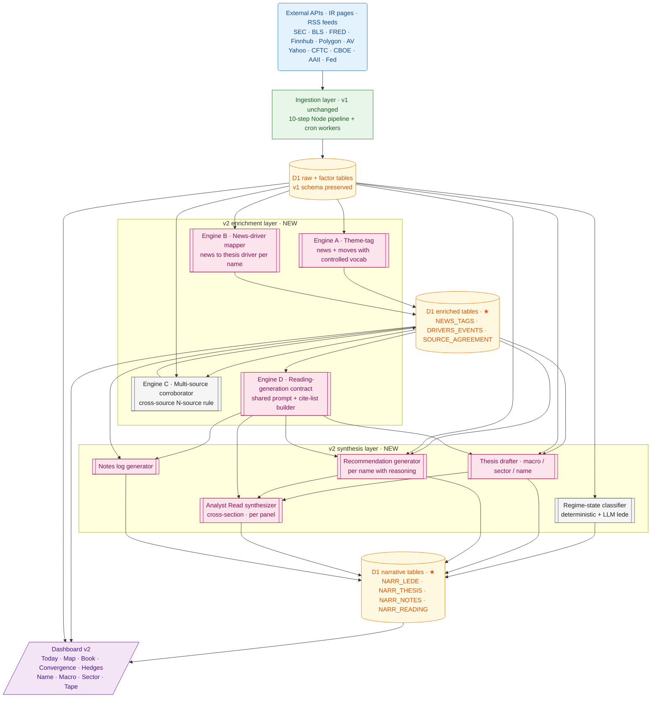

| Layer            | v1 today                                        | v2 adds                                                                        |
|------------------|-------------------------------------------------|--------------------------------------------------------------------------------|
| Ingestion        | 10-step Node + cron workers                      | unchanged                                                                       |
| Raw + factor     | ~40 D1 tables                                    | unchanged                                                                       |
| Enrichment       | Per-name news funnel · macro-intel summary       | Theme-tag · News-driver mapper · Multi-source corroborator                     |
| Synthesis        | Per-entity narrator (3-stage)                    | Reading-engine contract · Thesis drafter · Recommendation · Notes · Read       |
| Narrative tables | `NARRATIVE_01_Content`                           | `NARR_LEDE` · `NARR_THESIS` · `NARR_NOTES` · `NARR_READING` (5 reading types)   |

---

# Part 2 · Cross-cutting engines

## Engine A · Theme-tag · news + moves with controlled vocabulary

Foundation for the Tape and for theme-aware readings. Every news item and every >2σ move gets tagged from a small fixed vocabulary so colors stay scannable.

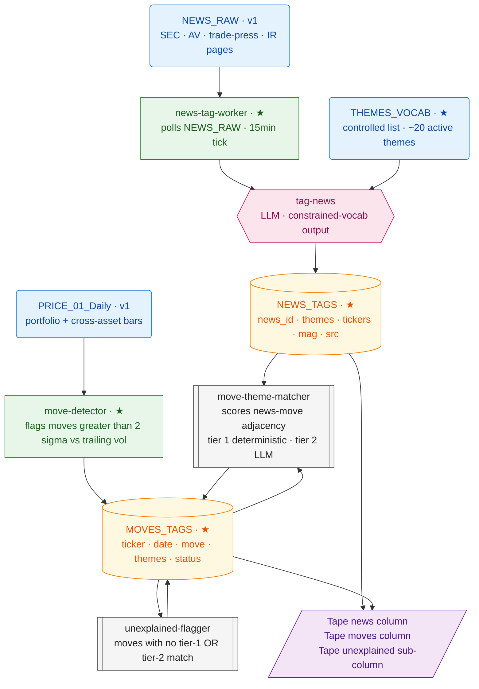

| Tag | Notes                                                                                           |
|-----|-------------------------------------------------------------------------------------------------|
| R3  | Hand-curated, ~20 themes max, versioned. Examples: `tariffs`, `oil`, `ai-capex`, `rates`, `china`, `earnings`, `ev-transition`, `geopolitics`. |
| A1  | LLM tag step. Output: `{ themes, tickers, mag, dir }`. Constrained vocabulary — themes outside R3 are rejected. |
| A2  | Tier 1 (deterministic): for each move, find news in prior 14d touching same ticker with mag > 0.3. Tier 2 (LLM): if Tier 1 finds nothing, propose a likely theme. |
| A3  | A move is **unexplained** when no Tier-1 OR Tier-2 match exists. Surfaced, not hidden.            |
| T1  | The foundation table for the Tape and for all news-aware readings.                                |
| T2  | One row per >2σ move. Status: `tagged-tier-1` / `tagged-tier-2` / `unexplained`.                  |

| Inputs                    | Processing                                | Outputs (mockup fields)                            |
|---------------------------|-------------------------------------------|----------------------------------------------------|
| News raw text             | LLM tag (constrained vocab)               | `NEWS_TAGS` rows                                   |
| Price daily bars + vol    | Move detector                             | `MOVES_TAGS` rows                                  |
| Theme vocabulary          | Tier 1 + Tier 2 matcher                   | Tape news + moves columns                          |
|                           | Unexplained flagger                       | Tape unexplained sub-column                        |

---

## Engine B · News-driver mapper · news → thesis driver per name

Makes claims like *"DC growth confirming +4 events"* or *"third independent inventory signal"* into deterministic counts rather than LLM imagination.

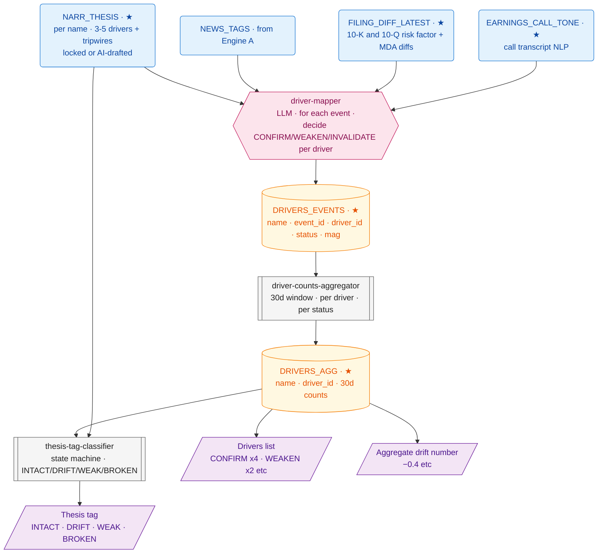

| Tag | Notes                                                                                       |
|-----|---------------------------------------------------------------------------------------------|
| A1  | Inputs: locked driver list of the name + the news/filing/call event. Output: `{ driver_id, status, mag, evidence_quote }`. Items not mapping to any driver are dropped. |
| A2  | Deterministic 30-day rolling aggregator. Produces the `CONFIRM ×4 / WEAKEN ×2` counts.       |
| A3  | Rule-based state machine. Any INVALIDATE → `BROKEN`; WEAKEN with no offsetting CONFIRMS → `WEAK`; ≥ 2 drivers softening → `DRIFT`; else `INTACT`. |
| T1  | One row per (name, event, driver). Stores the evidence quote so the dashboard can show *why* a count moved. |

---

## Engine C · Multi-source corroborator · the N-source rule

A note that says "third independent signal" is only honest if the system actually checks across sources. Pure-deterministic guard against fabrication.

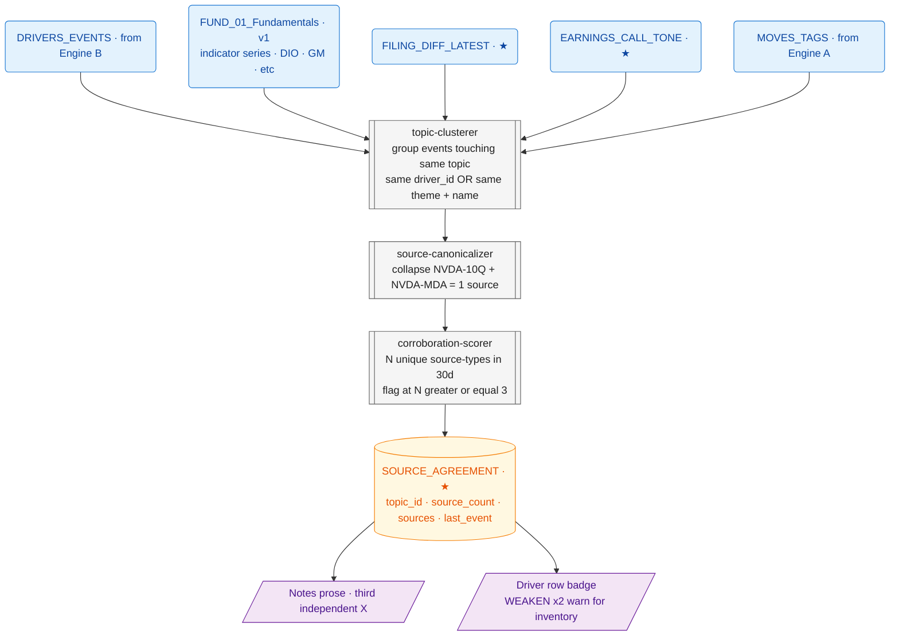

| Tag | Notes                                                                                                  |
|-----|--------------------------------------------------------------------------------------------------------|
| A1  | Joins items across `DRIVERS_EVENTS`, `FUND_01`, `FILING_DIFF_LATEST`, `EARNINGS_CALL_TONE`, `MOVES_TAGS`. |
| A2  | Filings + their MDA passages = one source; trade press from the same outlet across days = one source. Prevents N-count over-counting tightly correlated reports. |
| A3  | Counts unique canonical sources per topic over 30d. Topics with N ≥ 3 are eligible for "multi-source" claims in readings. |

The corroboration is computed *before* the synthesis layer. Synthesis prompts are *given* the topic + source list and only write prose around it.

---

## Engine D · Reading-generation contract · shared prompt + cite-list builder

Every "reading" in the v2 mockup (per-section + Analyst Read lede) is produced by this engine. Contract enforces the writing principles in `DASHBOARD_AI_INTEGRATION.md` Section 16.

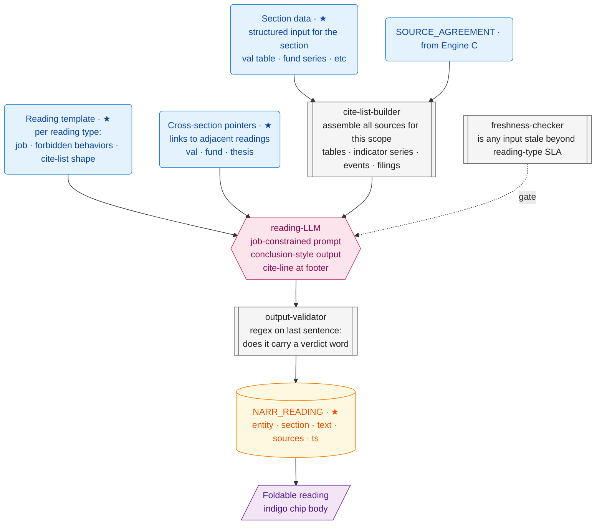

Reading template fields per reading type:

| Template field          | Example for Fundamentals reading                                                              |
|-------------------------|-----------------------------------------------------------------------------------------------|
| **Job**                 | Land on a company verdict — peaking / accelerating / harvesting / transitioning / declining   |
| **Must end on**         | A verdict label                                                                                |
| **Forbidden**           | Listing comma-separated values · Wall Street metaphors · uncited claims                       |
| **Required cross-refs** | Thesis driver-N · Valuation reading                                                            |
| **Cite-list shape**     | 20q series IDs + composite scores + cross-references                                          |
| **Output validator**    | Last sentence must contain one of: *peaking, accelerating, harvesting, intact, watch, etc.*   |

---

# Part 3 · Surface clusters

## Cluster 1 · Today notification surface

Notification only — no AI essay. Every tile is a deterministic count or list; clicking opens the Tape pre-filtered.

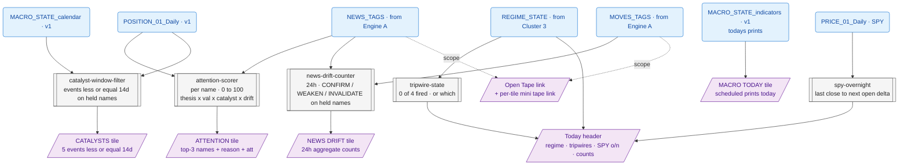

| Inputs                                            | Processing                                  | Outputs                                |
|---------------------------------------------------|---------------------------------------------|----------------------------------------|
| Position book · thesis · val z · drift             | Attention scorer                            | ATTENTION tile rows                    |
| Calendar · held tickers                            | Catalyst window filter                      | CATALYSTS tile rows                    |
| Macro release schedule for today                   | Direct fetch                                | MACRO TODAY tile rows                  |
| Tagged news + moves over 24h on held names         | News-drift counter                          | NEWS DRIFT counts                      |
| Regime + tripwires + SPY o/n                       | Tripwire monitor · SPY o/n calc             | Today header state strip               |
| Theme + ticker scope per tile                      | (passthrough)                               | Per-tile + global Tape links           |

The only AI involvement is upstream (Engine A's tagging). The Today surface itself is deterministic and re-renders on every page load.

---

## Cluster 2 · Tape slide-out

Pure presentation of Engine A output, with filter chips on top. **No causal AI text in this surface.**

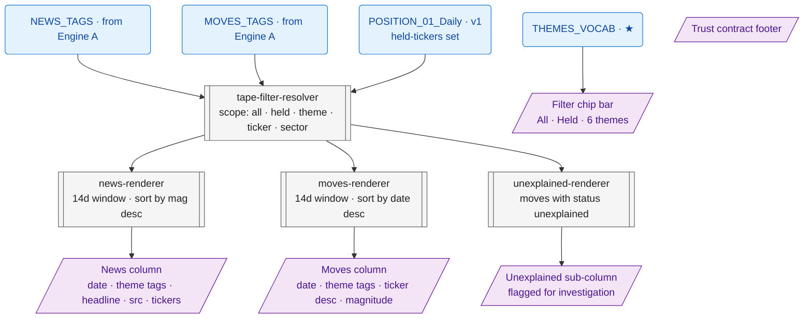

| Inputs                       | Processing                       | Outputs                                       |
|------------------------------|----------------------------------|-----------------------------------------------|
| Tagged news + moves (14d)     | Filter resolver · scope-aware     | News + Moves columns                          |
| Held-tickers set              | Held-only sub-filter              |                                                |
| Theme vocabulary              | Filter chip rendering             | Filter chip bar                                |
| Move status (unexplained)     | Unexplained renderer              | Unexplained moves sub-column                   |

---

## Cluster 3 · Map · regime state badge + sector + cross-asset

Big shift from v1: the MAP READ essay is gone; in its place a single-line **regime state badge** with all-deterministic state. Per-panel readings stay (foldable, Engine D).

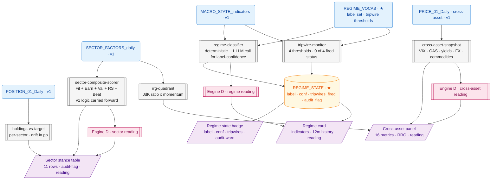

| Inputs                          | Processing                                          | Outputs                                          |
|---------------------------------|-----------------------------------------------------|--------------------------------------------------|
| 12 macro indicators · vocab      | Regime classifier · tripwire monitor                 | Regime state badge · Regime card                 |
| Sector factors · book            | Composite scorer · holdings-vs-target                | Sector stance table · audit-flag                 |
| Cross-asset prices               | Snapshot · RRG quadrant                              | Cross-asset panel · RRG note                     |
| Engine D                         | Per-panel reading generation                         | 3 foldable readings                              |

---

## Cluster 4 · Convergence

8-signal alignment per name. Action verb when ≥ 3 align same direction.

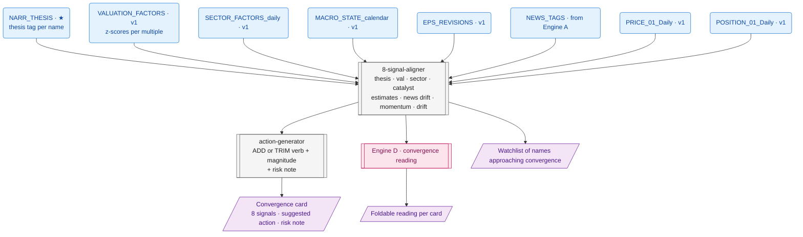

| Inputs                                            | Processing                            | Outputs                                  |
|---------------------------------------------------|---------------------------------------|------------------------------------------|
| 8 signal sources                                   | Aligner · firing-count                | Card signal list                          |
| Aligner output                                     | Action generator                       | Verb · magnitude · risk note              |
| Engine D                                           | Convergence reading                    | Foldable per-card reading                 |
| Aligner output (≥ 2 of 8)                          | Watchlist filter                       | Approaching-convergence footer            |

---

## Cluster 5 · Hedges

Position aggregation + beta-adjusted exposure. Light surface.

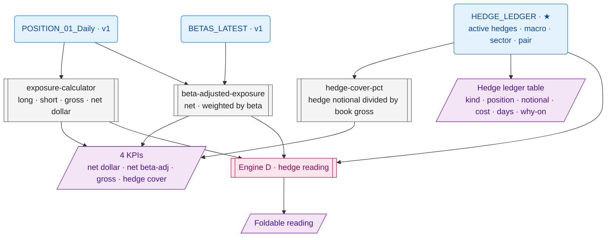

---

## Cluster 6 · Name slide-out

The biggest surface — and where the news-into-conclusions wiring matters most. Lede + 5 per-section readings + thesis + recommendation + notes.

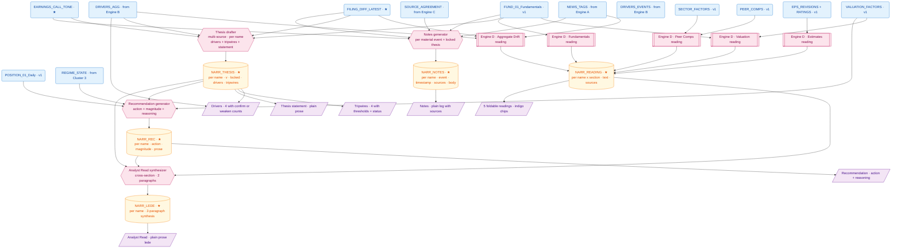

| Output (mockup field)            | Inputs                                                                          | Processing                          |
|----------------------------------|---------------------------------------------------------------------------------|-------------------------------------|
| Analyst Read (plain lede)         | All per-section readings · thesis · recommendation                               | A4 cross-section synthesizer         |
| Thesis statement (plain)          | Driver counts · filing diffs · call tone · fundamentals                           | A1 Thesis drafter                    |
| Drivers (CONFIRM ×N etc.)         | `DRIVERS_AGG` (deterministic counts)                                             | Engine B counts                      |
| Tripwires (status)                | Driver thresholds (locked) · current values                                       | Deterministic threshold check         |
| Recommendation                    | Thesis · valuation · position vs target · regime fit                              | A2 Recommendation generator          |
| Notes (plain log)                 | Tagged events · multi-source agreement · filing/call deltas                       | A3 Notes generator                   |
| Valuation reading                 | 12 multiples + DCF + cross-refs to Fundamentals + Peer Comps                      | Engine D (Valuation template)         |
| Fundamentals reading              | 20q series + composite scores + cross-ref to Thesis driver-N                       | Engine D (Fundamentals template)       |
| Estimates reading                 | Consensus + revisions + 8q surprise + PT dispersion                                | Engine D (Estimates template)          |
| Aggregate Drift reading           | Tagged events + driver counts + cross-refs to Thesis + Fundamentals                | Engine D (Drift template)             |
| Peer Comps reading                | Peer rows + sector median + book pair-hedge context                                | Engine D (Peer template)              |

**News dependency:** 4 of the 7 AI outputs above (Thesis, Notes, Aggregate Drift reading, Analyst Read) collapse to nothing if news is not wired into Engine B.

---

## Cluster 7 · Macro slide-out

Macro thesis + drivers + tripwires + signposts + positioning + notes, with the same plain-format treatment as the Name panel. Tape strip on top is filtered to macro themes.

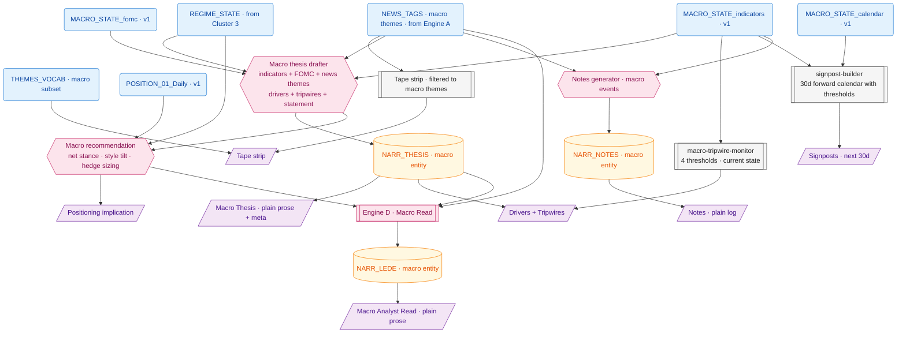

| Output (mockup field)            | Inputs                                                          | Processing                  |
|----------------------------------|------------------------------------------------------------------|-----------------------------|
| Tape strip                        | News + moves filtered to macro themes                             | Engine A passthrough         |
| Macro Analyst Read                | Thesis · positioning · macro news drift                            | Engine D (Macro Read)        |
| Macro Thesis                      | Indicators · FOMC · regime state · macro-themed news               | A1 Macro thesis drafter      |
| Drivers + Tripwires               | Threshold table + current values                                   | A2 deterministic monitor     |
| Signposts (next 30d)              | Forward calendar + indicator thresholds                             | A3 signpost builder           |
| Positioning implication           | Thesis + position book + hedge ledger                               | A4 Macro recommendation      |
| Notes (plain log)                 | Macro-themed news + indicator prints                                | A5 Notes generator            |

**News dependency:** macro thesis claims like *"stagflation-light flavor strengthening"* or *"HY OAS tightened — single largest piece of evidence the regime is not the front-edge of a recession"* are interpretations of indicator series in light of macro news. Without `NEWS_TAGS` filtered to macro themes, the thesis drafter has no way to surface "FOMC speakers more hawkish" or "tariff escalation" as inputs.

---

## Cluster 8 · Sector slide-out

Same structural treatment as macro, per sector. Drivers/tripwires are sector-specific (Energy: WTI, OPEC discipline, US rig count, EM demand). Implementation table maps thesis → per-name actions.

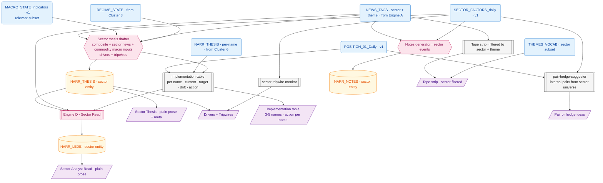

| Output (mockup field)             | Inputs                                                       | Processing                     |
|-----------------------------------|--------------------------------------------------------------|--------------------------------|
| Tape strip · sector-filtered       | Sector tickers + sector themes                                | Engine A passthrough            |
| Sector Analyst Read                | Thesis · implementation · per-name convergence cross-ref       | Engine D (Sector Read)          |
| Sector Thesis                      | Sector composite · macro relevant subset · sector-themed news  | A1 Sector thesis drafter        |
| Drivers + Tripwires                | Per-sector thresholds + current values                          | A2 deterministic monitor        |
| Implementation table               | Per-name positions + per-name thesis state                       | A3 deterministic table builder    |
| Pair / hedge ideas                 | Sector universe + book composition                               | A4 deterministic suggester       |

**News dependency:** the Energy sector thesis claim that *"OPEC+ discipline + capital-return-focused US shale management together support a higher floor under WTI than consensus models"* requires news — OPEC+ outcomes are filings, US shale capex discipline is news + earnings calls, EM stockpiling is news. Without sector-themed news in `NEWS_TAGS`, the thesis collapses to "WTI is at $78".

---

# Part 4 · Pipeline tree summary

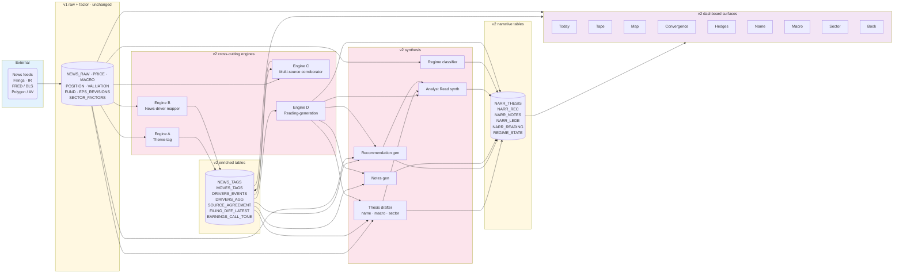
